<!-- generated by crew diagram_doc.py; edit the .mmd sources, not this file -->
# Diagrams

Every diagram in this directory, with what it shows and whether it is readable. The `.mmd` files are the source; `out/` holds renders. Regenerate with `diagram_doc.py --write` after `render.sh`.

| Diagram | Readability |
|---|---|
| [Architecture](#architecture) | PASS |
| [Data flow crew config autoclear](#data-flow-crew-config-autoclear) | PASS |
| [Data flow crew config menu](#data-flow-crew-config-menu) | PASS |
| [Data flow crew config no python](#data-flow-crew-config-no-python) | PASS |
| [Data flow crew config ratchet](#data-flow-crew-config-ratchet) | PASS |
| [Data flow crew config read](#data-flow-crew-config-read) | PASS |
| [Data flow crew config shell route](#data-flow-crew-config-shell-route) | PASS |
| [Data flow crew config split](#data-flow-crew-config-split) | PASS |
| [Data flow crew config two files](#data-flow-crew-config-two-files) | PASS |
| [Data flow crew config write](#data-flow-crew-config-write) | PASS |
| [Data flow crew config](#data-flow-crew-config) | PASS |
| [Data flow search](#data-flow-search) | PASS |
| [Data flow](#data-flow) | PASS |
| [Process bitbucket svg check](#process-bitbucket-svg-check) | PASS |
| [Process bitbucket svg collect](#process-bitbucket-svg-collect) | PASS |
| [Process bitbucket svg publish](#process-bitbucket-svg-publish) | PASS |
| [Process bitbucket svg render](#process-bitbucket-svg-render) | PASS |
| [Process bitbucket svg resolve](#process-bitbucket-svg-resolve) | PASS |
| [Process bitbucket svg up to date](#process-bitbucket-svg-up-to-date) | PASS |
| [Process bitbucket svg](#process-bitbucket-svg) | PASS |
| [Process crew brief crew context](#process-crew-brief-crew-context) | PASS |
| [Process crew brief handoff read](#process-crew-brief-handoff-read) | PASS |
| [Process crew brief platform sync](#process-crew-brief-platform-sync) | PASS |
| [Process crew brief status](#process-crew-brief-status) | PASS |
| [Process crew brief](#process-crew-brief) | PASS |
| [Process crew lifecycle approve](#process-crew-lifecycle-approve) | PASS |
| [Process crew lifecycle brainstorm](#process-crew-lifecycle-brainstorm) | PASS |
| [Process crew lifecycle done](#process-crew-lifecycle-done) | PASS |
| [Process crew lifecycle implement](#process-crew-lifecycle-implement) | PASS |
| [Process crew lifecycle review](#process-crew-lifecycle-review) | PASS |
| [Process crew lifecycle spec plan](#process-crew-lifecycle-spec-plan) | PASS |
| [Process crew lifecycle](#process-crew-lifecycle) | PASS |
| [Process qa audit](#process-qa-audit) | PASS |
| [Process qa gates](#process-qa-gates) | PASS |
| [Process qa ladder](#process-qa-ladder) | PASS |
| [Process](#process) | PASS |

## Architecture

localgpu: two independent process trees, plus a one-shot CLI, sharing one Ollama. Verified against source on 2026-09-06; see comments for path:line. Tree A redrawn at ac93221d: setup step 6 no longer hand-substitutes

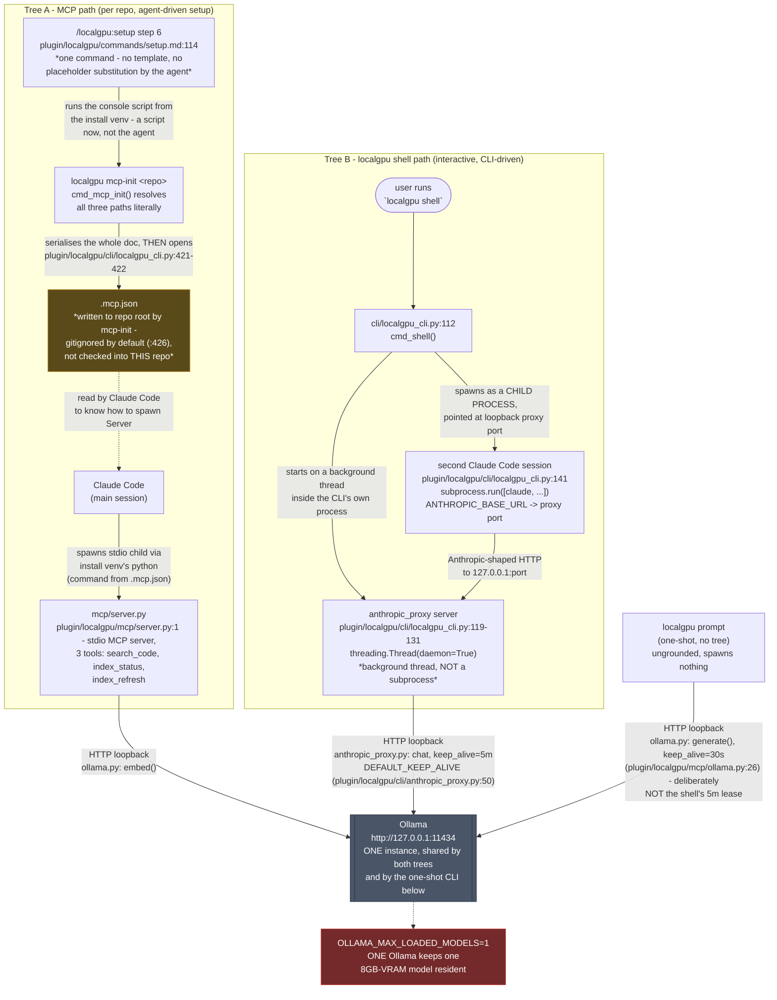
```mermaid
flowchart TB

    subgraph TreeA["Tree A - MCP path (per repo, agent-driven setup)"]
        direction TB
        CC1["Claude Code<br/>(main session)"]
        Setup["/localgpu:setup step 6<br/>plugin/localgpu/commands/setup.md:114<br/>*one command - no template, no<br/>placeholder substitution by the agent*"]
        McpInit["localgpu mcp-init &lt;repo&gt;<br/>cmd_mcp_init() resolves<br/>all three paths literally"]
        MCPJson[".mcp.json<br/>*written to repo root by mcp-init -<br/>gitignored by default (:426),<br/>not checked into THIS repo*"]
        Server["mcp/server.py<br/>plugin/localgpu/mcp/server.py:1 - stdio MCP server,<br/>3 tools: search_code, index_status,<br/>index_refresh"]

        CC1 -- "spawns stdio child via<br/>install venv's python<br/>(command from .mcp.json)" --> Server
        Setup -- "runs the console script from<br/>the install venv - a script now, not the agent" --> McpInit
        McpInit -- "serialises the whole doc, THEN opens<br/>plugin/localgpu/cli/localgpu_cli.py:421-422" --> MCPJson
        MCPJson -. "read by Claude Code<br/>to know how to spawn Server" .-> CC1
    end

    subgraph TreeB["Tree B - localgpu shell path (interactive, CLI-driven)"]
        direction TB
        User(["user runs<br/>`localgpu shell`"])
        CLI["cli/localgpu_cli.py:112<br/>cmd_shell()"]
        ProxyThread["anthropic_proxy server<br/>plugin/localgpu/cli/localgpu_cli.py:119-131<br/>threading.Thread(daemon=True)<br/>*background thread, NOT a subprocess*"]
        CC2["second Claude Code session<br/>plugin/localgpu/cli/localgpu_cli.py:141<br/>subprocess.run([claude, ...])<br/>ANTHROPIC_BASE_URL -> proxy port"]

        User --> CLI
        CLI -- "starts on a background thread<br/>inside the CLI's own process" --> ProxyThread
        CLI -- "spawns as a CHILD PROCESS,<br/>pointed at loopback proxy port" --> CC2
        CC2 -- "Anthropic-shaped HTTP<br/>to 127.0.0.1:port" --> ProxyThread
    end

    Ollama[["Ollama<br/>http://127.0.0.1:11434<br/>ONE instance, shared by both trees<br/>and by the one-shot CLI below"]]

    OneShot["localgpu prompt<br/>(one-shot, no tree)<br/>ungrounded, spawns nothing"]

    Server -- "HTTP loopback<br/>ollama.py: embed()" --> Ollama
    ProxyThread -- "HTTP loopback<br/>anthropic_proxy.py: chat, keep_alive=5m<br/>DEFAULT_KEEP_ALIVE (plugin/localgpu/cli/anthropic_proxy.py:50)" --> Ollama
    OneShot -- "HTTP loopback<br/>ollama.py: generate(), keep_alive=30s<br/>(plugin/localgpu/mcp/ollama.py:26) - deliberately<br/>NOT the shell's 5m lease" --> Ollama

    Constraint["OLLAMA_MAX_LOADED_MODELS=1<br/>ONE Ollama keeps one<br/>8GB-VRAM model resident"]
    Ollama -.-> Constraint

    style Ollama fill:#4a5568,stroke:#2d3748,color:#fff
    style Constraint fill:#742a2a,stroke:#c53030,color:#fff
    style MCPJson fill:#5a4a1a,stroke:#b7861a,color:#fff
```

| Box | Details |
|---|---|
| `McpInit` | plugin/localgpu/cli/localgpu_cli.py:339 cmd_mcp_init() _entry() (:317) resolves all three paths literally refuses to write if either path is missing (:361) merges into an existing file; a DIFFERING entry is shown and left alone unless --force (:397) |
| `OneShot` | plugin/localgpu/cli/localgpu_cli.py:224 cmd_prompt() added ac93221d - runs in the CLI's OWN process, spawns nothing, exits after one answer *ungrounded: nothing is retrieved first, so the answer cannot be checked against sources* |
| `Constraint` | plugin/localgpu/bootstrap.sh:11,645-716 + embed keep_alive=30s (plugin/localgpu/mcp/ollama.py:26) vs chat keep_alive=5m (plugin/localgpu/cli/anthropic_proxy.py:50) -- because ONE Ollama can only keep one 8GB-VRAM model resident at a time |

- **Source:** `architecture.mmd`
- **Drawn from:** `plugin/localgpu/bootstrap.sh`, `plugin/localgpu/cli/anthropic_proxy.py`, `plugin/localgpu/cli/localgpu_cli.py`, `plugin/localgpu/commands/setup.md`, `plugin/localgpu/mcp/ollama.py`, `plugin/localgpu/mcp/server.py`
- **Readability:** PASS: 12 nodes, no crossings, nothing drawn through a node

## Data flow crew config autoclear

context.autoClear: how its settings are read straight from both raw files (not through resolve_config), and how its writer refuses a malformed machine file before handing off to the shared writer.

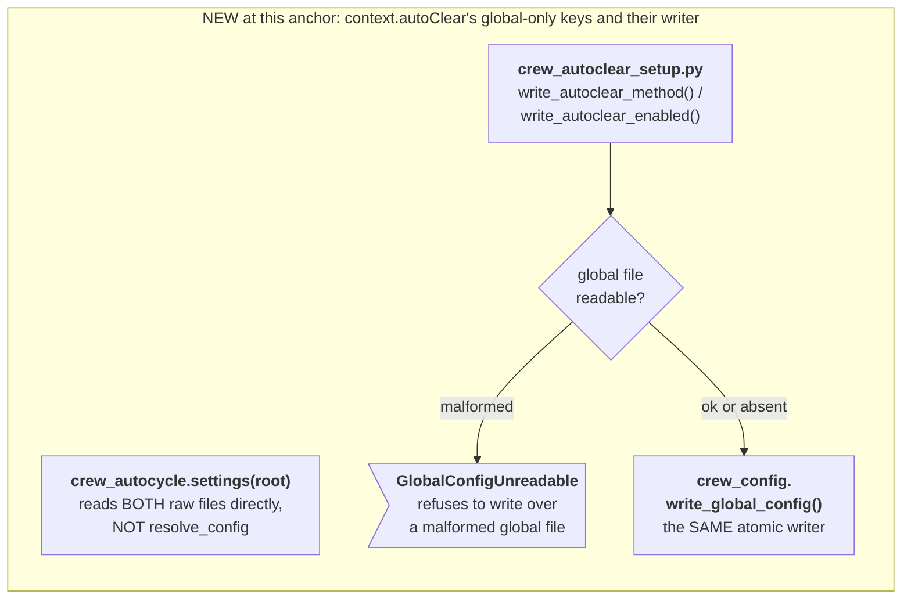
```mermaid
flowchart TB

    subgraph AutoClear["NEW at this anchor: context.autoClear's global-only keys and their writer"]
        direction TB
        ACREAD["<b>crew_autocycle.settings(root)</b><br/>reads BOTH raw files directly,<br/>NOT resolve_config"]
        ACWRITE["<b>crew_autoclear_setup.py</b><br/>write_autoclear_method() /<br/>write_autoclear_enabled()"]
        ACCHECK{"global file<br/>readable?"}
        ACRAISE>"<b>GlobalConfigUnreadable</b><br/>refuses to write over<br/>a malformed global file"]
        ACGO["<b>crew_config.</b><br/><b>write_global_config()</b><br/>the SAME atomic writer"]
    end
    ACWRITE --> ACCHECK
    ACCHECK -->|malformed| ACRAISE
    ACCHECK -->|ok or absent| ACGO
```

| Box | Details |
|---|---|
| `ACREAD` | crew_autocycle.settings(root) plugin/crew/hooks/scripts/crew_autocycle.py:139-184 reads BOTH raw config files directly - this is NOT resolve_config, and never goes through it. enabled = machine.enabled is True AND repo.enabled is not False :175 - a repo may turn auto-clear OFF and never ON. onlyRepos/onlySessions read from the MACHINE layer only :177-178 - a repo's own copy is never consulted even though it is a settable leaf |
| `ACWRITE` | crew_autoclear_setup.py write_autoclear_method() / write_autoclear_enabled() :239-269, both call _require_global_readable() :107-114 FIRST |
| `ACCHECK` | _global_file_problem() :69-104 - absent is fine (None); unreadable / not JSON / not an object is a named reason |
| `ACRAISE` | GlobalConfigUnreadable refuses to write over a malformed global file rather than replacing it |
| `ACGO` | crew_config.write_global_config() (the SAME atomic writer the Write subgraph above uses - not a second mechanism) |

- **Source:** `data-flow-crew-config-autoclear.mmd`
- **Drawn from:** `plugin/crew/hooks/scripts/crew_autocycle.py`, `plugin/crew/hooks/scripts/crew_autoclear_setup.py`, `plugin/crew/hooks/scripts/crew_config.py`
- **Readability:** PASS: 5 nodes, no crossings, nothing drawn through a node

## Data flow crew config menu

The /crew:config menu (its rows, choices, Save, and repo-file delete and restore) and the one file layer every crew config write goes through: lock, compare-and-swap update, no-clobber move.

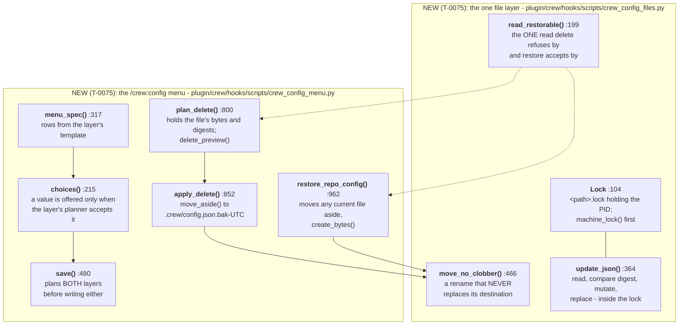
```mermaid
flowchart TB

    subgraph Files["NEW (T-0075): the one file layer - plugin/crew/hooks/scripts/crew_config_files.py"]
        direction TB
        FLOCK["<b>Lock</b> :104<br/>&lt;path&gt;.lock holding the PID;<br/>machine_lock() first"]
        FUPD["<b>update_json()</b> :364<br/>read, compare digest, mutate,<br/>replace - inside the lock"]
        FMOVE["<b>move_no_clobber()</b> :466<br/>a rename that NEVER<br/>replaces its destination"]
        FREST["<b>read_restorable()</b> :199<br/>the ONE read delete refuses by<br/>and restore accepts by"]
        FLOCK --- FUPD
    end
    subgraph Menu["NEW (T-0075): the /crew:config menu - plugin/crew/hooks/scripts/crew_config_menu.py"]
        direction TB
        MSPEC["<b>menu_spec()</b> :317<br/>rows from the layer's template"]
        MCHOICE["<b>choices()</b> :215<br/>a value is offered only when<br/>the layer's planner accepts it"]
        MSAVE["<b>save()</b> :480<br/>plans BOTH layers<br/>before writing either"]
        MPLAN["<b>plan_delete()</b> :800<br/>holds the file's bytes and digests;<br/>delete_preview()"]
        MDEL["<b>apply_delete()</b> :852<br/>move_aside() to<br/>.crew/config.json.bak-UTC"]
        MREST["<b>restore_repo_config()</b> :962<br/>moves any current file aside,<br/>create_bytes()"]
        MSPEC --> MCHOICE
        MCHOICE --> MSAVE
        MPLAN --> MDEL
    end
    MDEL --> FMOVE
    MREST --> FMOVE
    FREST -.-> MPLAN
    FREST -.-> MREST
```

| Box | Details |
|---|---|
| `FLOCK` | Lock :104 - O_CREAT/O_EXCL &lt;path&gt;.lock holding the PID (a failed PID write removes it, :134-141); Busy :63 after LOCK_WAIT_SECONDS :43. Serialises crew's writers, not a hand edit. machine_lock() :273 is the machine file's Lock, ALWAYS taken (creates ~/.claude/crew/, never the file), before any repo Lock - one nesting order |
| `FUPD` | update_json() :364 - inside the lock: read_strict() :181 (absent / unparsable / empty / notobject), state_digest() :243 (ABSENT :50 for no file) compared with expect (Conflict :67), mutate, replace_text() :352 (sibling, fsync, os.replace, CRLF and BOM kept) |
| `FMOVE` | move_no_clobber() :466 - a rename that NEVER replaces its destination: os.link, then _unlink_source() :418 renames the source to a reserved name and removes it only when it IS the linked inode; a foreign file is linked back and its *.moving name KEPT (Displaced :71, exit 1; the link to the backup is never undone after the rename). move_aside() :508 (the backup IS the inode), create_bytes() :517 |
| `FREST` | read_restorable() :199 - a REGULAR file that restorable() :171 accepts: the ONE read delete refuses by and restore accepts by |
| `MSPEC` | menu_spec() :317 rows = leaf_paths(default_global_config()) (machine, plus platform.* and schema read-only) / leaf_paths(default_config()) (repo); returns the layer file's digest |
| `MCHOICE` | choices() :215 - a value is offered only when _probe_for() :168 accepts it: the layer's own planner on one snapshot, with the --pending set plus the candidate; all refused = a read-only row naming the key to fix |
| `MSAVE` | save() :480 _plan_both() :446 plans BOTH layers before writing either (the repo against the machine as this Save leaves it), prints the machine digest whenever anything changes, checks every given --expect-* before either write and binds each writer, the repo write to the machine digest too |
| `MPLAN` | plan_delete() :800 - holds the file's bytes, its digest, the machine digest and machinePath; refuses what read_restorable() refuses (a symlink included); delete_preview() :637 walks the file's OWN leaves too (removed / re-detected - only the platform keys platform-sync writes, _redetected() :629 - / held by the ratchet) |
| `MDEL` | apply_delete() :852 - typed repo name AND both preview digests (_unbound() :836), then under machine_lock and then the repo Lock the machine digest AGAIN (changed: exit 2, nothing deleted), move_aside() to .crew/config.json.bak-UTC, compare with the held bytes (changed: moved back no-clobber, nothing deleted); prints three restore lines, sh / cmd / PowerShell (restore_lines :773) |
| `MREST` | restore_repo_config() :962 - _valid_backup() :946 then read_restorable(); under the Lock moves any current file aside (Displaced: exit 1, every path named), create_bytes() (never over a file that appeared), reads back |

- **Source:** `data-flow-crew-config-menu.mmd`
- **Drawn from:** `plugin/crew/hooks/scripts/crew_config_menu.py`, `plugin/crew/hooks/scripts/crew_config_files.py`, `plugin/crew/hooks/scripts/crew_config.py`
- **Readability:** PASS: 10 nodes, no crossings, nothing drawn through a node

## Data flow crew config no python

What role-write-guard.sh does when it cannot find python: it cannot read guards.roleWrites, so it always blocks a restricted role.

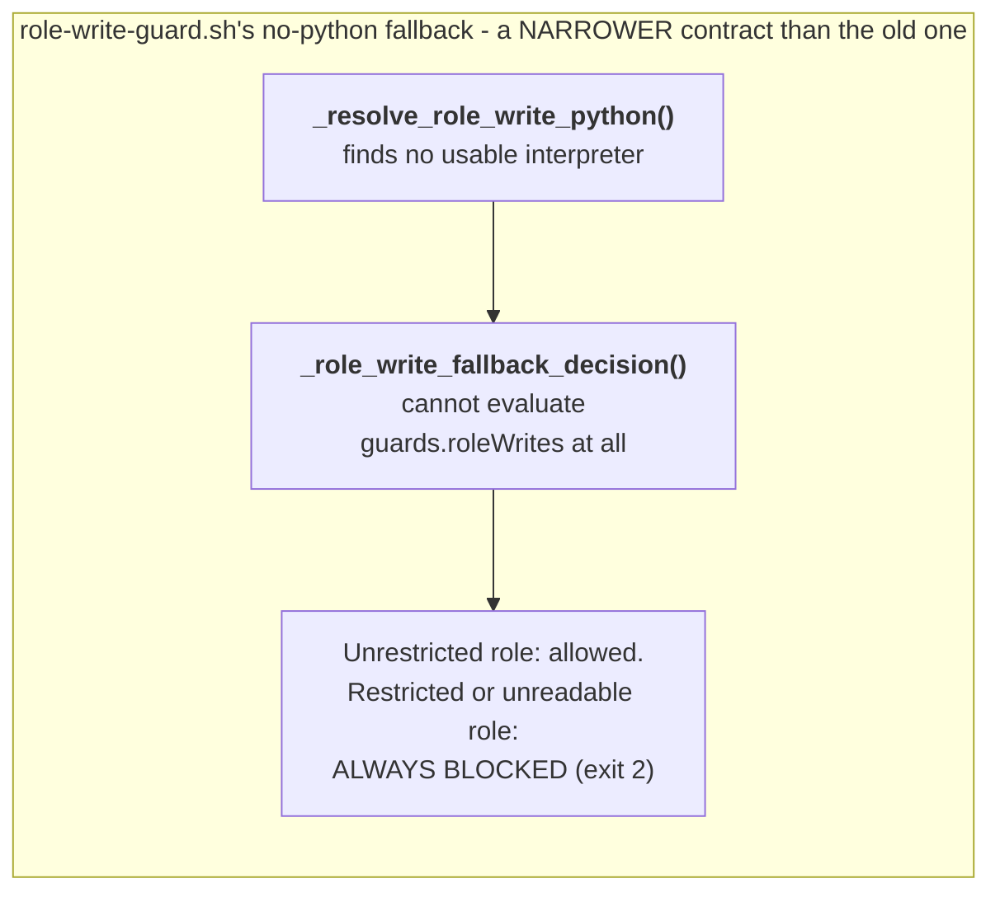
```mermaid
flowchart LR

    subgraph NoPython["role-write-guard.sh's no-python fallback - a NARROWER contract than the old one"]
        direction TB
        NP1["<b>_resolve_role_write_python()</b><br/>finds no usable interpreter"]
        NP2["<b>_role_write_fallback_decision()</b><br/>cannot evaluate<br/>guards.roleWrites at all"]
        NP3["Unrestricted role: allowed.<br/>Restricted or unreadable role:<br/>ALWAYS BLOCKED (exit 2)"]
        NP1 --> NP2 --> NP3
    end
```

| Box | Details |
|---|---|
| `NP1` | _resolve_role_write_python() plugin/crew/hooks/scripts/role-write-guard.sh:44- fails to find a usable interpreter |
| `NP2` | _role_write_fallback_decision() :326-346. Cannot evaluate guards.roleWrites (off/report/pm's own path allowances) at all - only tells a restricted role from an unrestricted one via the deny-list mirror |
| `NP3` | Unrestricted role: allowed unjudged. Restricted role (pm or _DENY_ROLES) OR a role this fallback could not even read: ALWAYS BLOCKED (exit 2), regardless of what guards.roleWrites actually says :339-345 |

- **Source:** `data-flow-crew-config-no-python.mmd`
- **Drawn from:** `plugin/crew/hooks/scripts/role-write-guard.sh`
- **Readability:** PASS: 3 nodes, no crossings, nothing drawn through a node

## Data flow crew config ratchet

The keys that do not follow repo-beats-global: the two ratchet tables (read side and write side), the thirteen keys that resolve by the lower rank, and how a corrupt config file forces the role-write guard to block.

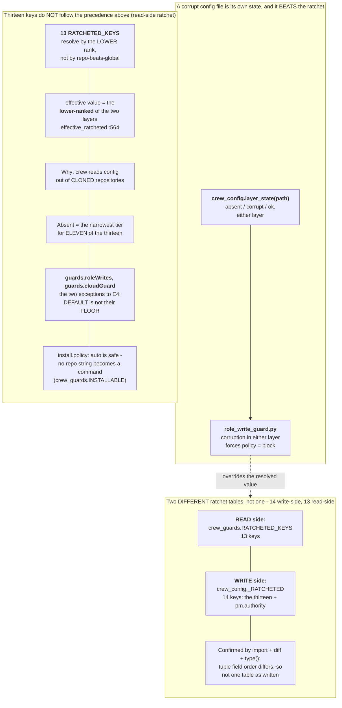
```mermaid
flowchart TB

    subgraph Ratchet["Two DIFFERENT ratchet tables, not one - 14 write-side, 13 read-side"]
        direction TB
        RG["<b>READ side:</b><br/>crew_guards.RATCHETED_KEYS<br/>13 keys"]
        RC["<b>WRITE side:</b><br/>crew_config._RATCHETED<br/>14 keys: the thirteen + pm.authority"]
        RSHAPE["Confirmed by import + diff + type():<br/>tuple field order differs, so<br/>not one table as written"]
        RG --- RC --- RSHAPE
    end
    subgraph Corrupt["A corrupt config file is its own state, and it BEATS the ratchet"]
        direction TB
        LS["<b>crew_config.layer_state(path)</b><br/>absent / corrupt / ok,<br/>either layer"]
        FORCE["<b>role_write_guard.py</b><br/>corruption in either layer<br/>forces policy = block"]
        LS --> FORCE
    end
    FORCE -.->|"overrides the resolved value"| Ratchet
    subgraph Except["Thirteen keys do NOT follow the precedence above (read-side ratchet)"]
        direction TB
        E1["<b>13 RATCHETED_KEYS</b><br/>resolve by the LOWER rank,<br/>not by repo-beats-global"]
        E2["effective value = the<br/><b>lower-ranked</b> of the two layers<br/>effective_ratcheted :564"]
        E3["Why: crew reads config<br/>out of CLONED repositories"]
        E4["Absent = the narrowest tier<br/>for ELEVEN of the thirteen"]
        E5["<b>guards.roleWrites, guards.cloudGuard</b><br/>the two exceptions to E4:<br/>DEFAULT is not their FLOOR"]
        E6["install.policy: auto is safe -<br/>no repo string becomes a command<br/>(crew_guards.INSTALLABLE)"]
        E1 --- E2 --- E3 --- E4 --- E5 --- E6
    end
```

| Box | Details |
|---|---|
| `RG` | READ side: crew_guards.RATCHETED_KEYS plugin/crew/hooks/scripts/crew_guards.py:522-549 13 keys (executed + len()'d, this pass): install.policy, change.requireForProduction, environments.prodUnattended (T-0005), and all TEN guards.* - terraformApply, forcePush, adminMerge, mergeGate, cloudDestructive, sqlDestructive, prodDatabase, prodServer, roleWrites, cloudGuard (new). Consumed by crew_config.resolve_ratcheted() :831 via crew_guards.effective_ratcheted() :564, called at crew_config.py:875 |
| `RC` | WRITE side: crew_config._RATCHETED plugin/crew/hooks/scripts/crew_config.py:2527 (extended through :2622) 14 keys: the same thirteen PLUS pm.authority. pm.authority is still NOT in RATCHETED_KEYS - it resolves by ordinary precedence and only needs a widening NOTE when /crew:config writes it |
| `RSHAPE` | Confirmed by import + diff + type(), not asserted: 13-key intersection, pm.authority the only difference (`set(_RATCHETED) - set(RATCHETED_KEYS) == {'pm.authority'}`), and the tuple field order STILL differs -- (function, function, dict) here, (tuple, function, function) there -- so the two still cannot be collapsed into one table as written |
| `LS` | crew_config.layer_state(path) plugin/crew/hooks/scripts/crew_config.py:937 classifies ONE config file, either layer (cloud=True / environments=True - the cloud guard's reads only - also call a malformed cloud / environments block corrupt): absent - nothing there (os.path.lexists false, so a DANGLING SYMLINK is corrupt, not absent). corrupt - present but not the shape this key needs: unreadable, invalid JSON, not an object, or an object where "guards" in parsed and guards is not itself a dict (an EXPLICIT null is corrupt, not an unset key). ok - everything else |
| `FORCE` | plugin/crew/hooks/scripts/role_write_guard.py calls layer_state for BOTH layers at :760-761, ORs them into forced_by_corruption :762, and sets policy = "block" UNCONDITIONALLY at :764-765 -- BEFORE the elif policy == "off": return 0 early exit at :766-767 |
| `E1` | Every key in crew_guards.RATCHETED_KEYS :522-549 -- install.policy, change.requireForProduction, environments.prodUnattended and all TEN guards.* -- resolves by the LOWER rank, not by repo-beats-global. CONFIG.md section 15 covers install.policy, section 16 the guards, section 18 guards.roleWrites; environments.* is a subsection of section 16. |
| `E2` | The effective value at each key is the lower-ranked of the two layers - crew_guards.effective_ratcheted :564, reached through crew_config.resolve_ratcheted :831. |
| `E3` | Why: crew reads config out of CLONED repositories. A repo shipping install.policy: auto, or guards.cloudGuard: report, would, under precedence, override a machine owner who chose manual or off. |
| `E4` | Absent counts as the narrowest tier on either side for ELEVEN of the thirteen, so the WIDEST grant requires BOTH layers to agree. |
| `E5` | guards.roleWrites and guards.cloudGuard are the two exceptions to E4, and the only keys here whose DEFAULT is not their FLOOR. ROLE_WRITE_POLICIES is (block, report, off); ROLE_WRITE_DEFAULT is off, the WIDEST tier, for both names - cloudGuard reuses roleWrites' own normalise/rank functions rather than growing a second copy (crew_guards.py:450-487, guard_tiers() :490-504). |
| `E6` | install.policy: auto is safe only because no repo-controlled string can become a command - crew_guards.INSTALLABLE maps a name to a literal argv tuple, consulted BEFORE the policy. Asserted in tests/test_install_policy.py. |

- **Source:** `data-flow-crew-config-ratchet.mmd`
- **Drawn from:** `plugin/crew/hooks/scripts/crew_guards.py`, `plugin/crew/hooks/scripts/crew_config.py`, `plugin/crew/hooks/scripts/role_write_guard.py`, `plugin/crew/CONFIG.md`, `plugin/crew/tests/test_install_policy.py`
- **Readability:** PASS: 11 nodes, no crossings, nothing drawn through a node

## Data flow crew config read

The read side: the three config sources (built-in defaults, the machine file, the repo file), how the machine layer is pruned to its template before merging, and how resolve_config() merges them.

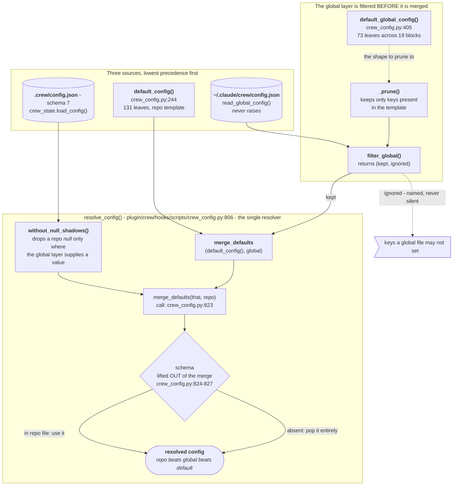
```mermaid
flowchart TB

    subgraph Sources["Three sources, lowest precedence first"]
        direction TB
        DEF["<b>default_config()</b><br/>crew_config.py:244<br/>131 leaves, repo template"]
        GLB[("<b>~/.claude/crew/config.json</b><br/>read_global_config()<br/><i>never raises</i>")]
        REPO[("<b>.crew/config.json</b> - schema 7<br/>crew_state.load_config()")]
    end

    subgraph Gate["The global layer is filtered BEFORE it is merged"]
        direction TB
        TMPL["<b>default_global_config()</b><br/>crew_config.py:405<br/>73 leaves across 19 blocks"]
        PRUNE["<b>_prune()</b><br/>keeps only keys present<br/>in the template"]
        FILT["<b>filter_global()</b><br/>returns (kept, ignored)"]
    end

    subgraph Merge["resolve_config() - plugin/crew/hooks/scripts/crew_config.py:806 - the single resolver"]
        direction TB
        NULLS["<b>without_null_shadows()</b><br/>drops a repo <i>null</i> only where<br/>the global layer supplies a value"]
        M1["<b>merge_defaults</b><br/>(default_config(), global)"]
        M2["merge_defaults(that, repo)<br/>call: crew_config.py:823"]
        SCHEMA{"schema<br/>lifted OUT of the merge<br/>crew_config.py:824-827"}
        OUT(["<b>resolved config</b><br/><i>repo beats global beats default</i>"])
    end

    DEF --> M1
    GLB --> FILT
    TMPL -.->|"the shape to prune to"| PRUNE
    PRUNE --> FILT
    FILT -->|kept| M1
    FILT -.->|"ignored - named, never silent"| IGN>"keys a global file may not set"]
    REPO --> NULLS
    NULLS --> M2
    M1 --> M2
    M2 --> SCHEMA
    SCHEMA -->|"in repo file: use it"| OUT
    SCHEMA -->|"absent: pop it entirely"| OUT
```

| Box | Details |
|---|---|
| `DEF` | default_config() plugin/crew/hooks/scripts/crew_config.py:245 131 leaves (executed, this pass) composed from crew_state's PM_DEFAULTS :1108, QA_DEFAULTS :1160, DEV_DEFAULTS :1170, WORKTREE_DEFAULTS :1198, CONTEXT_DEFAULTS :735, RESUME_DEFAULTS :698, AUTOPILOT_DEFAULTS :1097 - repo-only (re-exported from crew_guards: INSTALL_DEFAULTS :48, GUARD_DEFAULTS :198, PRODUCTION_DEFAULTS :222, CLOUD_DEFAULTS :239 - repo-only, ENVIRONMENTS_DEFAULTS :251 - nonProd repo-only), and crew_upgrade's GRAPH_BLOCK :48 / DOCS_BLOCK :107 / BITBUCKET_BLOCK :150 / GITHUB_BLOCK :173 / CHANGE_BLOCK :203 |
| `GLB` | ~/.claude/crew/config.json read_global_config() plugin/crew/hooks/scripts/crew_config.py:753 never raises - absent, malformed or non-object all return {}, because this is reached from a SessionStart hook |
| `REPO` | .crew/config.json - schema 7 crew_state.load_config() plugin/crew/hooks/scripts/crew_state.py:267 NOT the same file crew_context.py reads first - see the TwoFiles section below |
| `TMPL` | default_global_config() plugin/crew/hooks/scripts/crew_config.py:422 73 leaves (executed, this pass) across 19 blocks: qa, dev, worktree, secondOpinion, memory (2 of 5 repo leaves), notify, pm, context.autoClear (8 of 9 - unsafeFocus is excluded, see AutoClear below), resume, docs, bitbucket, github, install, guards (all TEN names), environments (prodUnattended only), change, git, route, shellRoute - the single definition both rules below are enforced against |
| `PRUNE` | _prune() plugin/crew/hooks/scripts/crew_config.py:685 keeps only keys present in the template. Descends structurally, so naming a block grants only the leaves under it. |
| `FILT` | filter_global() plugin/crew/hooks/scripts/crew_config.py:711 returns (kept, ignored) |
| `NULLS` | without_null_shadows() plugin/crew/hooks/scripts/crew_config.py:662 drops a repo null ONLY where the global layer supplies a real value. |
| `M1` | merge_defaults(default_config(), global) call: crew_config.py:822 def: plugin/crew/hooks/scripts/crew_state.py:1348 |
| `OUT` | resolved config repo beats global beats default this is ONLY .crew/config.json's precedence - autoClear's own read path bypasses it, below |

- **Source:** `data-flow-crew-config-read.mmd`
- **Drawn from:** `plugin/crew/hooks/scripts/crew_config.py`, `plugin/crew/hooks/scripts/crew_state.py`, `plugin/crew/hooks/scripts/crew_guards.py`
- **Readability:** PASS: 12 nodes, no crossings, nothing drawn through a node

## Data flow crew config shell route

shellRoute: the two config keys read through resolve_config, beside the machine-local probe cache that is not a config layer, both feeding crew_shell.decide().

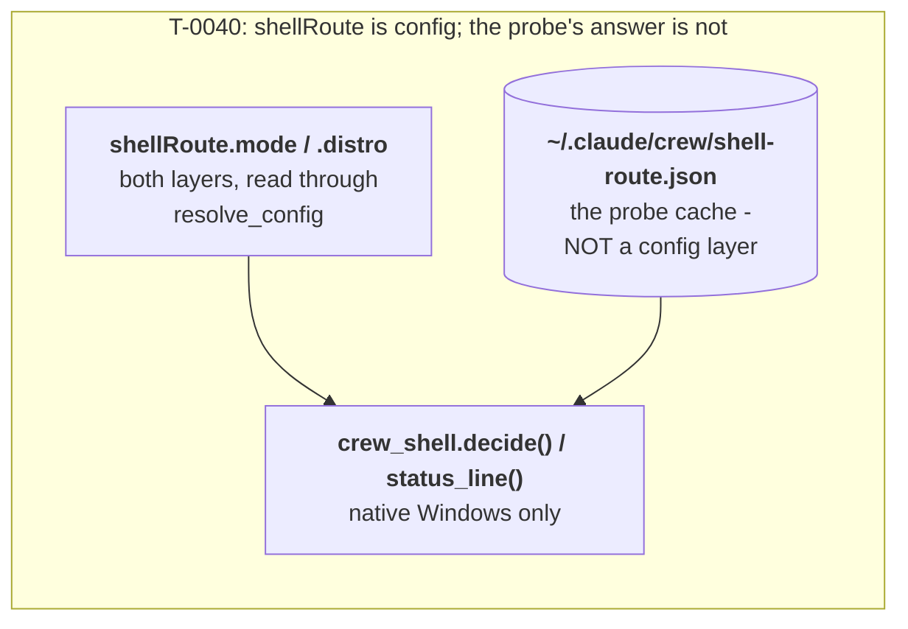
```mermaid
flowchart LR

    subgraph ShellRoute["T-0040: shellRoute is config; the probe's answer is not"]
        direction TB
        SR["<b>shellRoute.mode / .distro</b><br/>both layers, read through<br/>resolve_config"]
        SRC[("<b>~/.claude/crew/shell-route.json</b><br/>the probe cache -<br/>NOT a config layer")]
        SRD["<b>crew_shell.decide() / status_line()</b><br/>native Windows only"]
        SR --> SRD
        SRC --> SRD
    end
```

| Box | Details |
|---|---|
| `SR` | shellRoute.mode / shellRoute.distro both layers, plugin/crew/hooks/scripts/crew_config.py:340 / :579 read by crew_shell.settings through resolve_config; an unrecognised mode reads as auto and is named |
| `SRC` | ~/.claude/crew/shell-route.json crew_shell.probe_path() - the machine-local probe cache written only by probe --write and measure --write; NOT a config layer, never merged |
| `SRD` | crew_shell.decide() / status_line() plugin/crew/hooks/scripts/crew_shell.py:560 / :923 native Windows only - off Windows, plain bash -c |

- **Source:** `data-flow-crew-config-shell-route.mmd`
- **Drawn from:** `plugin/crew/hooks/scripts/crew_config.py`, `plugin/crew/hooks/scripts/crew_shell.py`
- **Readability:** PASS: 3 nodes, no crossings, nothing drawn through a node

## Data flow crew config split

What may be set in the machine file versus only in the repo file (measured leaf counts), and the one asymmetry between the read rule and the write rule.

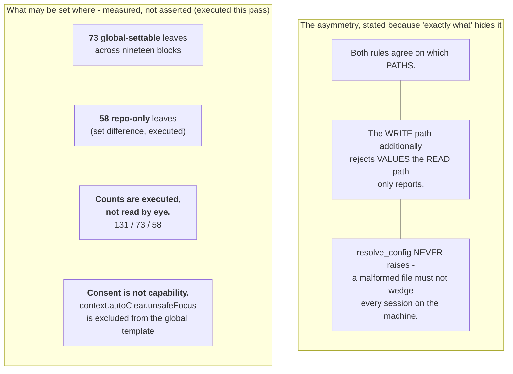
```mermaid
flowchart TB

    subgraph Asym["The asymmetry, stated because 'exactly what' hides it"]
        direction TB
        A1["Both rules agree on which PATHS."]
        A2["The WRITE path additionally<br/>rejects VALUES the READ path<br/>only reports."]
        A3["resolve_config NEVER raises -<br/>a malformed file must not wedge<br/>every session on the machine."]
        A1 --- A2 --- A3
    end

    subgraph Split["What may be set where - measured, not asserted (executed this pass)"]
        direction TB
        S1["<b>73 global-settable</b> leaves<br/>across nineteen blocks"]
        S2["<b>58 repo-only</b> leaves<br/>(set difference, executed)"]
        S3["<b>Counts are executed,</b><br/><b>not read by eye.</b><br/>131 / 73 / 58"]
        S4["<b>Consent is not capability.</b><br/>context.autoClear.unsafeFocus<br/>is excluded from the global template"]
        S1 --- S2 --- S3 --- S4
    end
```

| Box | Details |
|---|---|
| `A2` | The WRITE path additionally rejects VALUES the READ path only reports. |
| `A3` | resolve_config NEVER raises - a malformed file must not wedge every session on the machine. |
| `S1` | 73 global-settable leaves, across nineteen blocks: qa, dev, worktree, secondOpinion, memory, notify, pm, context.autoClear, docs, bitbucket, github, install, guards (all TEN), change, resume (T-0006: machine opt-in, repo may only veto), environments (prodUnattended only, T-0005), route (T-0023: route.enabled, repo beats machine - read by crew_route.settings through resolve_config), shellRoute (T-0040: mode + distro, both layers), git (T-0066: forbiddenTrailers, both layers, combined by UNION in crew_trailers.forbidden, not precedence) |
| `S2` | 58 repo-only leaves (set difference, executed), environments.nonProd (T-0005), tickets.baseBranch (T-0061), autopilot.deploy (T-0072) and autopilot.approval/questions (T-0010) among them. Whole blocks absent from the global template: autopilot, cloud, emergency, graph, jira, obsidian, platform, production, roles, schema, scope, sdp, tier, tracker, verifyGate - cloud and scope are NEW repo-only blocks since the previous anchor (cloud identity pins, the T3 scope guard); autopilot is NEW at 07ca3972 (T-0004, mode + maxPhases, CONFIG.md §20; deploy added by T-0072, approval + questions by T-0010) |
| `S3` | Counts are executed, not read by eye. 131 repo-template / 73 global / 58 repo-only on T-0066 after merging main c9263465 (130 / 72 / 58 on T-0061 after main 34d9f267, 129 / 72 / 57 on T-0040-land's merge of main 844bfc36, 127 / 70 / 57 on its merge of 6a8c60b1, 125 / 70 / 55 on T-0040's branch, 125 / 68 / 57 at d7c7c75c, T-0010-solo's merge of 6387ab49, 123 / 68 / 55 on T-0072's merge of main, 124 / 68 / 56 at c817782f on T-0010-solo, 122 / 68 / 54 on T-0023's merge of main, 121 / 67 / 54 on the T-0005 landing merge, 120 / 67 / 53 at T-0023's eba11657, 119 / 66 / 53 at 07ca3972, 118 / 66 / 52 at fc54def6, 117 / 66 / 51 at 6d35ef8c, 116 / 65 / 51 at 6c497a14); .crew/codemap/crew.md agrees and gives the re-measure command. |
| `S4` | Consent is not capability. context.autoClear.unsafeFocus is excluded from the global template on purpose (AUTOCLEAR_CONSENT_KEYS, crew_state.py:711) - a Wayland focus-typing risk accepted once must not arm for every repo. |

- **Source:** `data-flow-crew-config-split.mmd`
- **Drawn from:** `plugin/crew/hooks/scripts/crew_config.py`, `plugin/crew/hooks/scripts/crew_state.py`
- **Readability:** PASS: 7 nodes, no crossings, nothing drawn through a node

## Data flow crew config two files

An open question: crew_config.py reads .crew/config.json while crew_context.py reads .crew/crew.json first, so which file governs depends on which module asks.

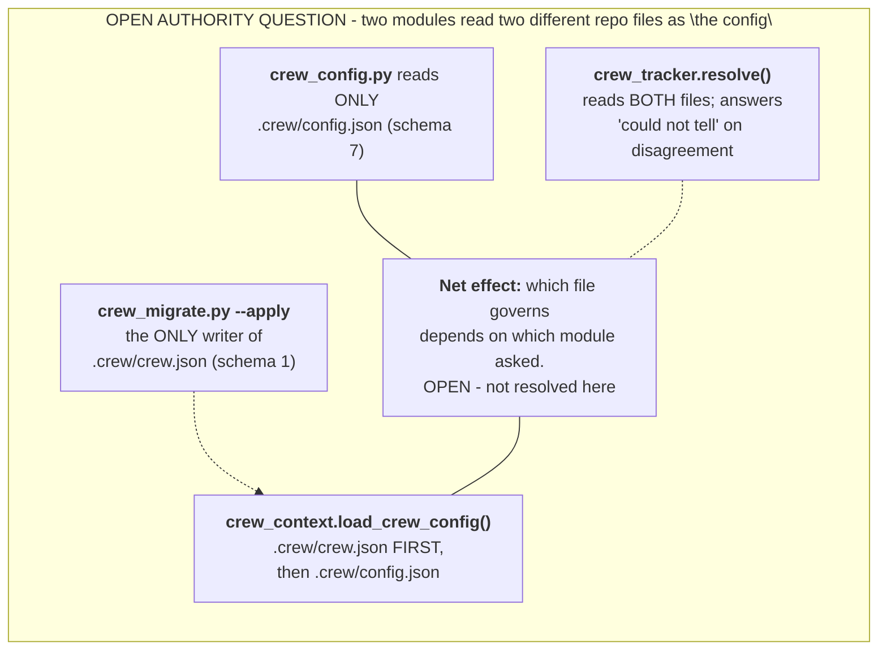
```mermaid
flowchart TB

    subgraph TwoFiles["OPEN AUTHORITY QUESTION - two modules read two different repo files as \"the config\""]
        direction TB
        CFGREAD["<b>crew_config.py</b> reads ONLY<br/>.crew/config.json (schema 7)"]
        CTXREAD["<b>crew_context.load_crew_config()</b><br/>.crew/crew.json FIRST,<br/>then .crew/config.json"]
        MIGRATE["<b>crew_migrate.py --apply</b><br/>the ONLY writer of<br/>.crew/crew.json (schema 1)"]
        OPEN["<b>Net effect:</b> which file governs<br/>depends on which module asked.<br/>OPEN - not resolved here"]
        TRKREAD["<b>crew_tracker.resolve()</b><br/>reads BOTH files; answers<br/>'could not tell' on disagreement"]
        MIGRATE -.-> CTXREAD
        CFGREAD --- OPEN --- CTXREAD
        TRKREAD -.- OPEN
    end
```

| Box | Details |
|---|---|
| `CFGREAD` | crew_config.py reads ONLY .crew/config.json (schema 7) module docstring :1; ratchet, guards, verify-gate.sh, /crew:config, /crew:model all route through this module |
| `CTXREAD` | crew_context.load_crew_config() plugin/crew/hooks/scripts/crew_context.py:122-133 tries .crew/crew.json FIRST, falls back to .crew/config.json only if crew.json is absent |
| `MIGRATE` | crew_migrate.py --apply the ONLY writer of .crew/crew.json (schema 1). Never touches config.json's runtime read path - crew_config.py keeps reading config.json regardless |
| `OPEN` | Net effect: a repo that has run --apply has BOTH files, and which one governs a given read depends on which module asked. Not resolved by this diagram - a decision for scribe to record, not this note's to make. |
| `TRKREAD` | crew_tracker.resolve() plugin/crew/hooks/scripts/crew_tracker.py:212 tracker key only: reads BOTH files (crew.json tracker.kind, config.json tracker) and answers 'could not tell' when they disagree - on the kind, on the vault, boardDir, board or lane names each yields (defaults and memory.vaultPath fallback applied; a value only one file yields counts), or on a jira/sdp block - refuses rather than picks |

- **Source:** `data-flow-crew-config-two-files.mmd`
- **Drawn from:** `plugin/crew/hooks/scripts/crew_config.py`, `plugin/crew/hooks/scripts/crew_context.py`, `plugin/crew/hooks/scripts/crew_migrate.py`, `plugin/crew/hooks/scripts/crew_tracker.py`
- **Readability:** PASS: 5 nodes, no crossings, nothing drawn through a node

## Data flow crew config write

The two writers behind /crew:config --set: the machine-file planner and the repo-file planner, the per-leaf and merged-file checks both share, and where each refuses.

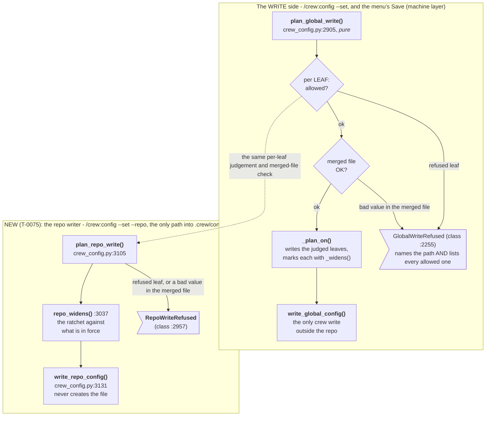
```mermaid
flowchart TB

    subgraph Write["The WRITE side - /crew:config --set, and the menu's Save (machine layer)"]
        direction TB
        PLAN["<b>plan_global_write()</b><br/>crew_config.py:2905, <i>pure</i>"]
        ISG{"per LEAF:<br/>allowed?"}
        REFUSE>"GlobalWriteRefused (class :2255)<br/>names the path AND lists every allowed one"]
        MERGED{"merged file<br/>OK?"}
        WIDEN["<b>_plan_on()</b><br/>writes the judged leaves,<br/>marks each with _widens()"]
        WRITE["<b>write_global_config()</b><br/>the only crew write<br/>outside the repo"]
    end

    PLAN --> ISG
    ISG -->|"refused leaf"| REFUSE
    ISG -->|ok| MERGED
    MERGED -->|"bad value in the merged file"| REFUSE
    MERGED -->|ok| WIDEN
    WIDEN --> WRITE
    subgraph RepoWrite["NEW (T-0075): the repo writer - /crew:config --set --repo, the only path into .crew/config.json"]
        direction TB
        RPLAN["<b>plan_repo_write()</b><br/>crew_config.py:3105"]
        RREF>"<b>RepoWriteRefused</b><br/>(class :2957)"]
        RWIDEN["<b>repo_widens()</b> :3037<br/>the ratchet against<br/>what is in force"]
        RWRITE["<b>write_repo_config()</b><br/>crew_config.py:3131<br/>never creates the file"]
        RPLAN -->|"refused leaf, or a bad value in the merged file"| RREF
        RPLAN --> RWIDEN --> RWRITE
    end
    ISG -.->|"the same per-leaf judgement and merged-file check"| RPLAN
    MERGED ~~~ RPLAN
```

| Box | Details |
|---|---|
| `PLAN` | plan_global_write() plugin/crew/hooks/scripts/crew_config.py:2922 pure; on global_snapshot() :2856, which REFUSES an unparsable or non-object machine file instead of merging onto {} (absent = ABSENT) |
| `ISG` | per LEAF: leaf_updates() :2643, value_allowed() :2759 MACHINE_REFUSED :2679 (consent keys, inside a whole-block value too), is_global_path() :717, a block emptied or replaced, null_means() :2716 (an enum key's null refused), enum_values() :2625; round 5: a path under a leaf or an object at a leaf :2766-2776 |
| `MERGED` | merged_problems() :2818 - the FILE the write produces, every known leaf by _content_problem() :2791: an enum value outside its values, a consent key (machine), an armed veto key (repo), a key under or an object at a leaf :2804-2807 refuses an unrelated write (pre-existing), then validate_providers() :178 on the merged file (qa.order a list, qa/dev.roles and each pin an object or null :206-237) |
| `WIDEN` | _plan_on() :2872 writes assignments() :2662 - the judged leaves (a block's siblings survive; one whole pin per role) - marking each leaf with _widens() plugin/crew/hooks/scripts/crew_config.py:2343. RANK, not equality. |
| `WRITE` | write_global_config() plugin/crew/hooks/scripts/crew_config.py:2941 the only function in crew that writes outside the repo. Re-plans on the bytes read under the lock; --expect DIGEST/absent refuses a changed file (GlobalWriteConflict :2259); any other OSError (directory, lock, write) is GlobalWriteRefused :2947, exit 2 |
| `RPLAN` | plan_repo_write() plugin/crew/hooks/scripts/crew_config.py:3122 on repo_snapshot() :3093 (refuses a missing or malformed file rather than creating one) and machine_view() :3124 (the machine file and its digest, one read) |
| `RREF` | RepoWriteRefused (class :2957) REPO_REFUSED :2972 - platform, schema, scope.mode, scope.allowCliApproval, the machine-only autoClear paths; a block emptied or replaced is refused (is_repo_path :3029); REPO_VETO_ONLY :2993 takes only false / null (by identity, is_repo_veto :2996) |
| `RWIDEN` | repo_widens() :3037 - the ratchet against what is in force, plus _REPO_WIDENING :3006; a repo value held down by the machine layer is named, not marked as a widening |
| `RWRITE` | write_repo_config() plugin/crew/hooks/scripts/crew_config.py:3148 the same compare-and-swap (RepoWriteConflict :2961), and --expect-global binds the machine file under its lock; never creates the file; an OSError is RepoWriteRefused :3162, exit 2 |

- **Source:** `data-flow-crew-config-write.mmd`
- **Drawn from:** `plugin/crew/hooks/scripts/crew_config.py`
- **Readability:** PASS: 10 nodes, no crossings, nothing drawn through a node

## Data flow crew config

How one crew config value reaches a run, and what may set it where, as a map of the part diagrams (each box is one data-flow-crew-config-<part>.mmd); only the main flows between parts are drawn. no-python is a standalone fallback with no link to any other part, see data-flow-crew-config-no-python.mmd.

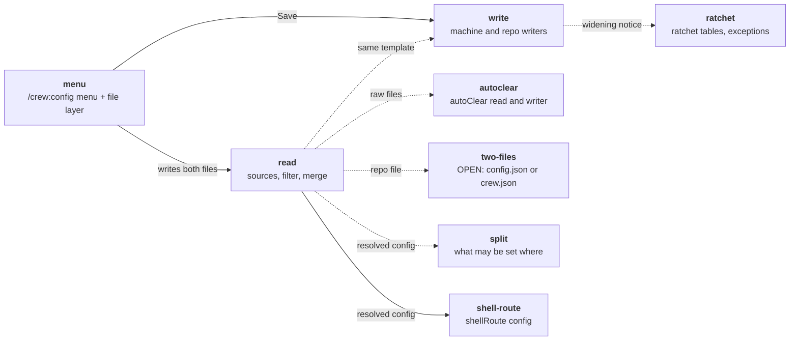
```mermaid
flowchart LR
    menu["<b>menu</b><br/>/crew:config menu + file layer"]
    read["<b>read</b><br/>sources, filter, merge"]
    write["<b>write</b><br/>machine and repo writers"]
    ratchet["<b>ratchet</b><br/>ratchet tables, exceptions"]
    autoclear["<b>autoclear</b><br/>autoClear read and writer"]
    twofiles["<b>two-files</b><br/>OPEN: config.json or crew.json"]
    split["<b>split</b><br/>what may be set where"]
    shell["<b>shell-route</b><br/>shellRoute config"]

    menu -->|"writes both files"| read
    menu -->|"Save"| write
    read -.->|"same template"| write
    write -.->|"widening notice"| ratchet
    read -.->|"raw files"| autoclear
    read -.->|"repo file"| twofiles
    read -.->|"resolved config"| split
    read -->|"resolved config"| shell
```

- **Source:** `data-flow-crew-config.mmd`
- **Drawn from:** `plugin/crew/hooks/scripts/crew_config.py`, `plugin/crew/hooks/scripts/crew_config_menu.py`, `plugin/crew/hooks/scripts/crew_config_files.py`, `plugin/crew/hooks/scripts/crew_state.py`, `plugin/crew/hooks/scripts/crew_guards.py`, `plugin/crew/hooks/scripts/role_write_guard.py`, `plugin/crew/hooks/scripts/role-write-guard.sh`, `plugin/crew/hooks/scripts/crew_autoclear_setup.py`
- **Readability:** PASS: 8 nodes, no crossings, nothing drawn through a node

## Data flow search

How search_code turns a query into hits read from the on-disk vector store. How that store is filled, index_refresh, is data-flow.mmd.

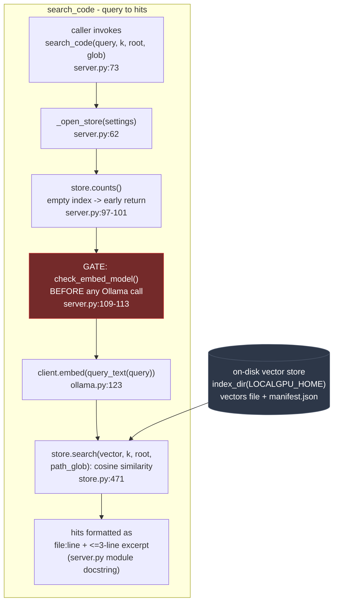
```mermaid
flowchart TB

    subgraph Search["search_code - query to hits"]
        direction TB
        S0["caller invokes<br/>search_code(query, k, root, glob)<br/>server.py:73"]
        S1["_open_store(settings)<br/>server.py:62"]
        S2["store.counts()<br/>empty index -> early return<br/>server.py:97-101"]
        GATE1["GATE: check_embed_model()<br/>BEFORE any Ollama call<br/>server.py:109-113"]
        S3["client.embed(query_text(query))<br/>ollama.py:123"]
        S4["store.search(vector, k, root,<br/>path_glob): cosine similarity<br/>store.py:471"]
        S5["hits formatted as<br/>file:line + <=3-line excerpt<br/>(server.py module docstring)"]

        S0 --> S1 --> S2 --> GATE1 --> S3 --> S4 --> S5
    end

    Disk[("on-disk vector store<br/>index_dir(LOCALGPU_HOME)<br/>vectors file + manifest.json")]

    Disk --> S4

    style GATE1 fill:#742a2a,stroke:#c53030,color:#fff
    style Disk fill:#2d3748,stroke:#4a5568,color:#fff
```

| Box | Details |
|---|---|
| `S0` | plugin/localgpu/mcp/server.py:73 |
| `S1` | plugin/localgpu/mcp/server.py:62 |
| `S2` | plugin/localgpu/mcp/server.py:97-101 |
| `GATE1` | *fires BEFORE any Ollama call*; store.read_manifest() vs settings.embed_model; plugin/localgpu/mcp/server.py:109-113; prevents cross-model cosine similarity on mismatched vectors |
| `S3` | plugin/localgpu/mcp/ollama.py:123 - HTTP loopback, keep_alive=30s |
| `S4` | plugin/localgpu/mcp/store.py:471 - cosine similarity over on-disk vectors |

- **Source:** `data-flow-search.mmd`
- **Drawn from:** `plugin/localgpu/mcp/ollama.py`, `plugin/localgpu/mcp/server.py`, `plugin/localgpu/mcp/store.py`
- **Readability:** PASS: 8 nodes, no crossings, nothing drawn through a node

## Data flow

How index_refresh turns files on disk into vectors and a manifest in the on-disk store. The query side, search_code reading that store, is data-flow-search.mmd.

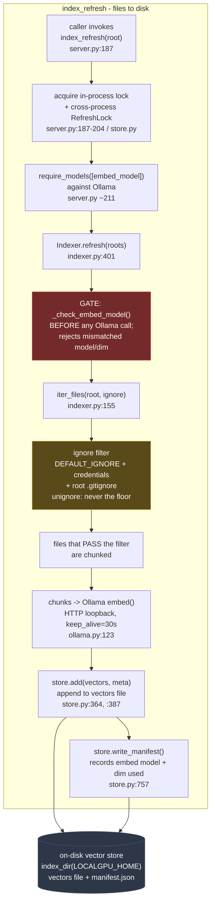
```mermaid
flowchart TB

    subgraph Refresh["index_refresh - files to disk"]
        direction TB
        R0["caller invokes<br/>index_refresh(root)<br/>server.py:187"]
        R1["acquire in-process lock<br/>+ cross-process RefreshLock<br/>server.py:187-204 / store.py"]
        R2["require_models([embed_model])<br/>against Ollama<br/>server.py ~211"]
        R3["Indexer.refresh(roots)<br/>indexer.py:401"]
        GATE2["GATE: _check_embed_model()<br/>BEFORE any Ollama call;<br/>rejects mismatched model/dim"]
        R4["iter_files(root, ignore)<br/>indexer.py:155"]
        IGNORE["ignore filter<br/>DEFAULT_IGNORE + credentials<br/>+ root .gitignore<br/>unignore: never the floor"]
        R5["files that PASS the filter<br/>are chunked"]
        R6["chunks -> Ollama embed()<br/>HTTP loopback, keep_alive=30s<br/>ollama.py:123"]
        R7["store.add(vectors, meta)<br/>append to vectors file<br/>store.py:364, :387"]
        R8["store.write_manifest()<br/>records embed model + dim used<br/>store.py:757"]

        R0 --> R1 --> R2 --> R3 --> GATE2 --> R4 --> IGNORE --> R5 --> R6 --> R7 --> R8
    end

    Disk[("on-disk vector store<br/>index_dir(LOCALGPU_HOME)<br/>vectors file + manifest.json")]

    R7 --> Disk
    R8 --> Disk

    style GATE2 fill:#742a2a,stroke:#c53030,color:#fff
    style IGNORE fill:#5a4a1a,stroke:#b7861a,color:#fff
    style Disk fill:#2d3748,stroke:#4a5568,color:#fff
```

| Box | Details |
|---|---|
| `R0` | plugin/localgpu/mcp/server.py:187 |
| `R1` | plugin/localgpu/mcp/server.py:187-204 / store.py |
| `R3` | plugin/localgpu/mcp/indexer.py:401 |
| `GATE2` | plugin/localgpu/mcp/indexer.py:403; *fires BEFORE any Ollama call* |
| `R4` | plugin/localgpu/mcp/indexer.py:155 |
| `IGNORE` | DEFAULT_IGNORE (plugin/localgpu/mcp/config.py:30-86) incl. credential patterns: .env, .env.*, *.pem, *.key, *.p12, *.pfx, id_rsa*, credentials.json (plugin/localgpu/mcp/config.py:73-86) + root .gitignore merged in (plugin/localgpu/mcp/indexer.py:169-171) + 'unignore' config key may lift any pattern EXCEPT the floor {.git, .localgpu, node_modules} (plugin/localgpu/mcp/config.py:94, 241-249) |
| `R6` | plugin/localgpu/mcp/ollama.py:123 (plugin/localgpu/mcp/ollama.py:26 DEFAULT_KEEP_ALIVE) |
| `R7` | plugin/localgpu/mcp/store.py:364; open(vectors_path, 'ab') plugin/localgpu/mcp/store.py:387 |
| `R8` | plugin/localgpu/mcp/store.py:757 - records embed model + dim used |

- **Source:** `data-flow.mmd`
- **Drawn from:** `plugin/localgpu/mcp/config.py`, `plugin/localgpu/mcp/indexer.py`, `plugin/localgpu/mcp/ollama.py`, `plugin/localgpu/mcp/server.py`, `plugin/localgpu/mcp/store.py`
- **Readability:** PASS: 12 nodes, no crossings, nothing drawn through a node

## Process bitbucket svg check

What --check (CI strategy A) verifies: stale sources, damaged or unverifiable SVGs and unrendered fences, and which of them exit 1.

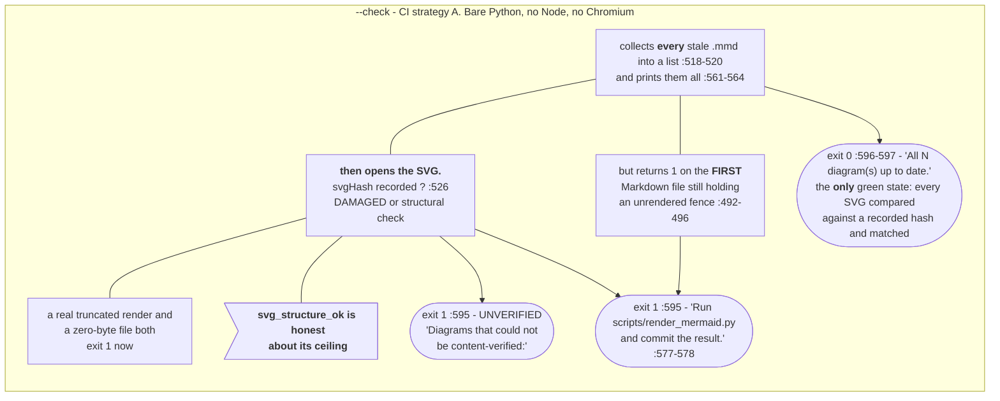
```mermaid
flowchart TB

    subgraph Verify["--check - CI strategy A. Bare Python, no Node, no Chromium"]
        direction TB
        C1["collects <b>every</b> stale .mmd into a list :518-520<br/>and prints them all :561-564"]
        C5["<b>then opens the SVG.</b><br/>svgHash recorded ? :526<br/>DAMAGED or structural check"]
        C6["a real truncated render and<br/>a zero-byte file both<br/>exit 1 now"]
        C8>"<b>svg_structure_ok is honest<br/>about its ceiling</b>"]
        C2["but returns 1 on the <b>FIRST</b><br/>Markdown file still holding<br/>an unrendered fence :492-496"]
        C3(["exit 1 :595 - 'Run scripts/render_mermaid.py<br/>and commit the result.' :577-578"])
        C4(["exit 0 :596-597 - 'All N diagram(s) up to date.'<br/>the <b>only</b> green state: every SVG compared<br/>against a recorded hash and matched"])
        C7(["exit 1 :595 - UNVERIFIED<br/>'Diagrams that could not<br/>be content-verified:'"])
        C1 --- C2
        C1 --- C5
        C5 --- C6
        C5 --- C8
    end

    C1 --> C4
    C5 --> C7
    C5 --> C3
    C2 --> C3
```

| Box | Details |
|---|---|
| `C5` | compare it :528 - a mismatch is DAMAGED :529-530. no svgHash (pre-v2 manifest) ? structural check svg_structure_ok() :100-117 at :532-534: non-empty, has &lt;svg, ends &lt;/svg&gt; |
| `C6` | under either manifest version - tests/test_check_reads_the_svg.py:92 and :198 prove it by damaging a genuine mmdc render |
| `C8` | in its own docstring :103-106: a well-formed SVG with WRONG CONTENTS passes it. Passing is therefore the absence of evidence, not evidence - which is the entire argument for UNVERIFIED exiting 1 rather than 0. |
| `C2` | before any other file is examined. Asymmetric on purpose or not, the effect is that one fence hides the rest - and this is the one early return the 1.2.2 fix did NOT remove. |
| `C7` | exit 1 :595 - 'Diagrams that could not be content-verified:' :569-573 plus a summary line :574-576 ('N diagram(s) verified; N stale, N damaged, N unverified'). Was exit 0 until 1.2.2. The caveat was in the output while the exit code - the only part CI reads - still said pass. Names render --force as the one-time fix :591-594, and stays distinct from DAMAGED :565-568: no claim the SVG is wrong, only that nothing can say it is right |

- **Source:** `process-bitbucket-svg-check.mmd`
- **Drawn from:** `skills/mermaid-svg-bitbucket/scripts/render_mermaid.py`, `skills/mermaid-svg-bitbucket/tests/test_check_reads_the_svg.py`
- **Readability:** PASS: 8 nodes, no crossings, nothing drawn through a node

## Process bitbucket svg collect

How the two kinds of source, a Mermaid fence in Markdown and a standalone .mmd file, are collected into one sorted list, including how a fence is extracted to a sidecar .mmd without changing any other line ending.

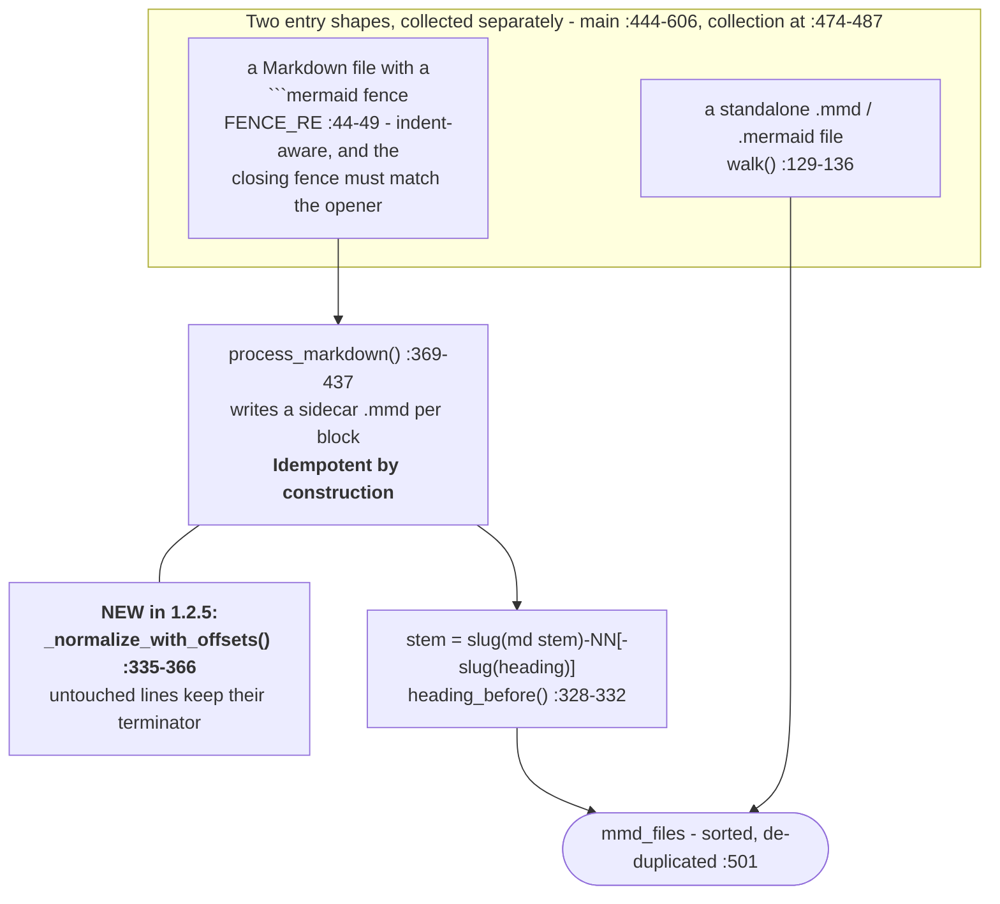
```mermaid
flowchart TB

    subgraph Inputs["Two entry shapes, collected separately - main :444-606, collection at :474-487"]
        direction TB
        MD["a Markdown file with a<br/>```mermaid fence<br/>FENCE_RE :44-49 - indent-aware, and the<br/>closing fence must match the opener"]
        MMD["a standalone .mmd / .mermaid file<br/>walk() :129-136"]
    end

    EXTRACT["process_markdown() :369-437<br/>writes a sidecar .mmd per block<br/><b>Idempotent by construction</b>"]
    EXTRACT2["<b>NEW in 1.2.5:<br/>_normalize_with_offsets() :335-366</b><br/>untouched lines keep their terminator"]
    NAME["stem = slug(md stem)-NN[-slug(heading)]<br/>heading_before() :328-332"]

    MD --> EXTRACT
    EXTRACT --- EXTRACT2
    EXTRACT --> NAME
    NAME --> POOL
    MMD --> POOL
    POOL(["mmd_files - sorted, de-duplicated :501"])
```

| Box | Details |
|---|---|
| `MMD` | skips DEFAULT_EXCLUDES :42 (.git, node_modules, .venv, venv, vendor, dist, build, .tox) |
| `EXTRACT` | (newline="\n" pinned :410) and rewrites the fence into an image link. Idempotent by construction: once the fence is gone there is nothing left for FENCE_RE to match, so re-runs are no-ops - the file is not marked, the evidence is the absence itself |
| `EXTRACT2` | Every line the rewrite does NOT touch keeps its own original terminator - CRLF, LF, bare CR, or no trailing newline at all. Before: the whole file was read with read_text() (which collapses every terminator to "\n") and written back the same way - so one CRLF line in a mostly-LF file flipped every OTHER line to CRLF too. Now: raw_text is decoded but NOT collapsed; a parallel normalized copy is built for FENCE_RE/HEADING_RE matching, and an offset map lets pass-through spans be sliced out of raw_text :412, :427 instead. The one line the function DOES write - the inserted image link - takes the terminator that already ended the fence's own closing line :413-422, then the whole result is written with newline="" :435 so nothing gets re-translated at write time. Regressions: tests/test_check_reads_the_svg.py :460 (preserves CRLF convention), :602 (preserves CRLF after the last fence), :582 (adds no trailing newline), :638 (sidecar content correct for a CRLF source) |
| `NAME` | walks every heading before the block and keeps the LAST, so the filename says which section it came from |

- **Source:** `process-bitbucket-svg-collect.mmd`
- **Drawn from:** `skills/mermaid-svg-bitbucket/scripts/render_mermaid.py`, `skills/mermaid-svg-bitbucket/tests/test_check_reads_the_svg.py`
- **Readability:** PASS: 6 nodes, no crossings, nothing drawn through a node

## Process bitbucket svg publish

What is committed together, how Bitbucket shows it, why the SVG is committed at all, and what the shipped pipeline snippet says about checking or rendering it in CI.

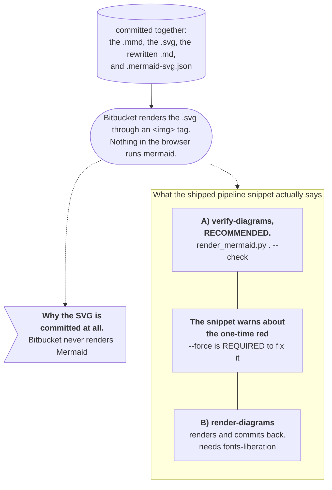
```mermaid
flowchart TB

    COMMIT[("committed together:<br/>the .mmd, the .svg, the rewritten .md,<br/>and .mermaid-svg.json")]
    COMMIT --> BB(["Bitbucket renders the .svg through an &lt;img&gt; tag.<br/>Nothing in the browser runs mermaid."])

    subgraph CI["What the shipped pipeline snippet actually says"]
        direction TB
        P1["<b>A) verify-diagrams,<br/>RECOMMENDED.</b><br/>render_mermaid.py . --check"]
        P2["<b>The snippet warns about<br/>the one-time red</b><br/>--force is REQUIRED to fix it"]
        P3["<b>B) render-diagrams</b><br/>renders and commits back.<br/>needs fonts-liberation"]
        P1 --- P2 --- P3
    end

    BB -.-> CI

    ORDER>"<b>Why the SVG is<br/>committed at all.</b><br/>Bitbucket never renders Mermaid"]
    BB -.-> ORDER
```

| Box | Details |
|---|---|
| `P1` | A) verify-diagrams, RECOMMENDED. python:3.11-slim, one line: python scripts/render_mermaid.py . --check No push credentials, no commit loop, and the diff lands in review where a human can see it. Never reaches resolve_mmdc at all - which is why the WinError 2 above was a developer-machine and strategy-B failure, invisible to strategy A |
| `P2` | in its own header: a repo whose manifest predates version 2 fails the first run, and --force is REQUIRED to fix it because the source hash already matches and a plain run would skip them. The script's own message says the same thing. Two places, one sentence - deliberately, because whichever one a reader hits first has to be enough. |
| `P3` | Needs write access and [skip ci], or the commit retriggers the pipeline. fonts-liberation is not optional: Chromium in a slim image has no fonts, mermaid MEASURES text to lay out nodes, and no fonts means every label is mis-sized and the boxes overlap. |
| `ORDER` | Bitbucket Cloud has never rendered Mermaid in Markdown (BCLOUD-21675, open for years); a fenced block shows as raw source. The .mmd stays the reviewable artifact and the .svg is a build product that happens to be committed - which is why the manifest exists to say whether the two still agree. |

- **Source:** `process-bitbucket-svg-publish.mmd`
- **Drawn from:** `skills/mermaid-svg-bitbucket/scripts/render_mermaid.py`, `skills/mermaid-svg-bitbucket/assets/bitbucket-pipelines.snippet.yml`
- **Readability:** PASS: 6 nodes, no crossings, nothing drawn through a node

## Process bitbucket svg render

How render() runs mmdc, refuses an SVG with foreignObject labels, and records the result in the manifest; and where each failure lands.

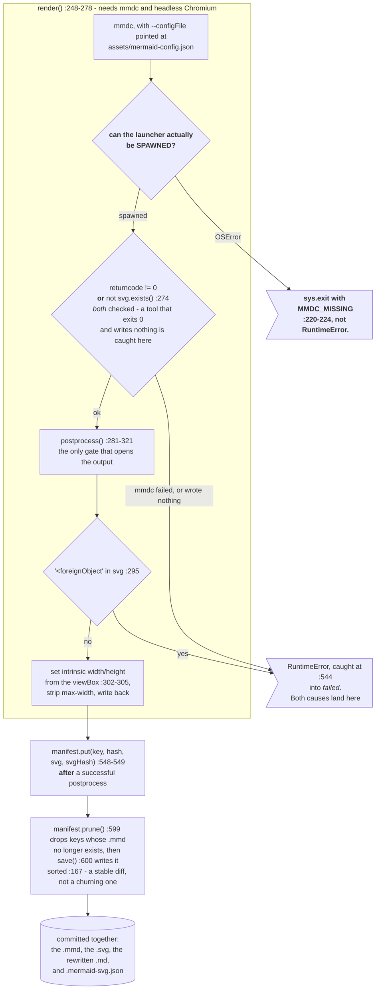
```mermaid
flowchart TB

    subgraph Render["render() :248-278 - needs mmdc and headless Chromium"]
        direction TB
        R0{"<b>can the launcher actually<br/>be SPAWNED?</b>"}
        R1["mmdc, with --configFile pointed at<br/>assets/mermaid-config.json"]
        R2{"returncode != 0<br/><b>or</b> not svg.exists() :274<br/><i>both</i> checked - a tool that exits 0<br/>and writes nothing is caught here"}
        R3["postprocess() :281-321<br/>the only gate that opens the output"]
        R4{"'&lt;foreignObject' in svg :295"}
        R5["set intrinsic width/height<br/>from the viewBox :302-305,<br/>strip max-width, write back"]
        R1 --> R0
        R0 -->|spawned| R2
        R2 -->|ok| R3
        R3 --> R4
        R4 -->|no| R5
    end

    TOOLGONE>"<b>sys.exit with MMDC_MISSING<br/>:220-224, not RuntimeError.</b>"]
    R0 -->|"OSError"| TOOLGONE

    FAIL>"RuntimeError, caught at :544<br/>into <i>failed</i>.<br/>Both causes land here"]
    R2 -->|"mmdc failed, or wrote nothing"| FAIL
    R4 -->|yes| FAIL

    WRITE["manifest.put(key, hash,<br/>svg, svgHash) :548-549<br/><b>after</b> a successful postprocess"]
    R5 --> WRITE
    WRITE --> SAVE["manifest.prune() :599 drops keys whose .mmd<br/>no longer exists, then save() :600 writes it<br/>sorted :167 - a stable diff, not a churning one"]
    SAVE --> COMMIT[("committed together:<br/>the .mmd, the .svg, the rewritten .md,<br/>and .mermaid-svg.json")]
```

| Box | Details |
|---|---|
| `R0` | subprocess.run wrapped in try/except OSError :262-273. resolve_mmdc already returned a path that EXISTS; this is the separate question of whether it RUNS - a shim pointing at a deleted install, a wrong-architecture binary, a lost execute bit |
| `R1` | built at :251-258 --backgroundColor :256 (default #ffffff, opaque so diagrams stay legible against dark mode) --quiet :257, --puppeteerConfigFile :259-260 when one exists |
| `R5` | strip mermaid's max-width style :307, then write the file back with newline="\n" :321 pinned (NEW in 1.2.5) - the write no longer turns LF into CRLF on Windows. It does NOT make raw SVG bytes reproducible across platforms (render_mermaid.py:93-94, and the TODO.md bullet "Real mmdc output has nothing for a line-ending translation to act on"). Regression: tests/test_check_reads_the_svg.py:345 |
| `TOOLGONE` | An unusable launcher is unusable for EVERY diagram, so falling through to the per-file failed list would retry each one and bury the message under N copies of the same error. The resolved path is printed alongside it :273, because 'mmdc not found' is confusing on a machine where it demonstrably was. |
| `FAIL` | and both exit 1 :602 - mmdc exiting non-zero :274-276, and an SVG that would be blank-labelled in Bitbucket :295-300. The config sets htmlLabels:false, but a source can re-enable it with an inline %%{init}%% directive, so the output is checked rather than the config trusted. |
| `WRITE` | never before - which is also why svg_digest reads the file at that moment and not the one render() produced |

- **Source:** `process-bitbucket-svg-render.mmd`
- **Drawn from:** `skills/mermaid-svg-bitbucket/scripts/render_mermaid.py`, `skills/mermaid-svg-bitbucket/assets/mermaid-config.json`, `skills/mermaid-svg-bitbucket/tests/test_check_reads_the_svg.py`
- **Readability:** PASS: 11 nodes, no crossings, nothing drawn through a node

## Process bitbucket svg resolve

The three things located before anything runs: the Mermaid config, an optional Puppeteer config, and the mmdc launcher, including the Windows WinError 2 fix in resolve_mmdc().

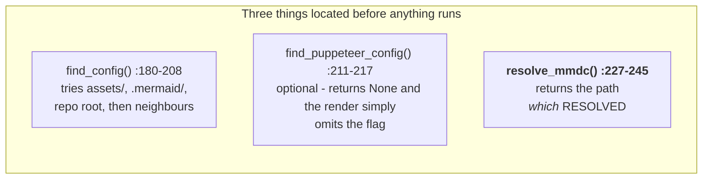
```mermaid
flowchart TB

    subgraph Resolve["Three things located before anything runs"]
        direction TB
        FC["find_config() :180-208<br/>tries assets/, .mermaid/,<br/>repo root, then neighbours"]
        FP["find_puppeteer_config() :211-217<br/>optional - returns None and the render simply<br/>omits the flag"]
        RM["<b>resolve_mmdc() :227-245</b><br/>returns the path<br/><i>which</i> RESOLVED"]
    end
```

| Box | Details |
|---|---|
| `FC` | then the script's own neighbours. Exits with the list it tried, and says WHY defaults are not acceptable :206-207: mmdc's defaults emit foreignObject labels |
| `RM` | - :239-241 for the mmdc branch, :242-244 for npx - not the bare name. It used to test if shutil.which("mmdc") for truthiness and then hand subprocess the literal string "mmdc". which consults PATHEXT; CreateProcess does not - it searches for the literal name and name+.exe only - so Windows' mmdc.cmd was FOUND and then could not be SPAWNED: WinError 2 on a machine where mermaid-cli was installed. Both branches had the bug; the npx fallback is fixed too. Falling through exits with MMDC_MISSING :220-224 at :245 - MMDC_MISSING is now a shared module-level constant, reused by render()'s OSError handler too |

- **Source:** `process-bitbucket-svg-resolve.mmd`
- **Drawn from:** `skills/mermaid-svg-bitbucket/scripts/render_mermaid.py`, `skills/mermaid-svg-bitbucket/assets/mermaid-config.json`, `skills/mermaid-svg-bitbucket/SKILL.md`
- **Readability:** PASS: 3 nodes, no crossings, nothing drawn through a node

## Process bitbucket svg up to date

What "up to date" means: the source hash and the manifest decide whether a diagram is current, then --check goes to verification and a normal run skips or renders.

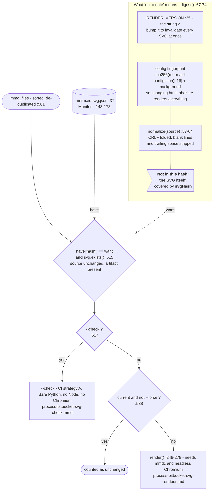
```mermaid
flowchart TB

    POOL(["mmd_files - sorted, de-duplicated :501"])

    subgraph Hash["What 'up to date' means - digest() :67-74"]
        direction TB
        H1["RENDER_VERSION :35 - the string <b>2</b><br/>bump it to invalidate every SVG at once"]
        H2["config fingerprint<br/>sha256(mermaid-config.json)[:16] + background<br/>so changing htmlLabels re-renders everything"]
        H3["normalize(source) :57-64<br/>CRLF folded, blank lines<br/>and trailing space stripped"]
        H4>"<b>Not in this hash:<br/>the SVG itself.</b><br/>covered by <b>svgHash</b>"]
        H1 --- H2 --- H3 --- H4
    end

    CURRENT{"have['hash'] == want<br/><b>and</b> svg.exists() :515<br/>source unchanged, artifact present"}
    POOL --> CURRENT
    Hash -.->|"want"| CURRENT
    MANIFEST[(".mermaid-svg.json :37<br/>Manifest :143-173")]
    MANIFEST -.->|"have"| CURRENT

    MODE{"--check ?<br/>:517"}
    CURRENT --> MODE

    Verify["--check - CI strategy A. Bare Python, no Node, no Chromium<br/>process-bitbucket-svg-check.mmd"]
    Render["render() :248-278 - needs mmdc and headless Chromium<br/>process-bitbucket-svg-render.mmd"]
    MODE -->|yes| Verify

    MODE -->|no| SKIP{"current and not --force ?<br/>:538"}
    SKIP -->|yes| SKIPPED(["counted as unchanged"])
    SKIP -->|no| Render
```

| Box | Details |
|---|---|
| `H3` | trailing space and leading and trailing blank lines stripped - a whitespace edit must not cost a re-render |
| `H4` | digest() covers the source only. The artifact is covered separately by svgHash - svg_digest() :77-97, recorded at render time :548-549 and compared on --check :528. NEW in 1.2.5: svg_digest() also folds CRLF/CR to LF before hashing :96-97, not just at write time - closes a false DAMAGED on a Windows clone with core.autocrlf=true (no .gitattributes entry marks *.svg as binary here), which checks out the committed LF bytes as CRLF and would otherwise hash differently from what was recorded. Regression: tests/test_check_reads_the_svg.py:276 (test_check_tolerates_a_crlf_checkout_of_a_committed_svg). Its own subtlety, unchanged: the hash is taken AFTER postprocess(), which REWRITES the SVG. Hashing before would record a digest the file never has. |
| `MANIFEST` | An unreadable manifest is a warning, not an error - it degrades to 'nothing is current', which re-renders rather than silently skipping. save() :166-173 now pins newline="\n" :172-173 - a Windows-rendered manifest is byte-identical to a Linux one for the same JSON. Regression: tests/test_check_reads_the_svg.py:381 |

- **Source:** `process-bitbucket-svg-up-to-date.mmd`
- **Drawn from:** `skills/mermaid-svg-bitbucket/scripts/render_mermaid.py`, `skills/mermaid-svg-bitbucket/assets/mermaid-config.json`, `skills/mermaid-svg-bitbucket/tests/test_check_reads_the_svg.py`
- **Readability:** PASS: 12 nodes, no crossings, nothing drawn through a node

## Process bitbucket svg

mermaid-svg-bitbucket end to end: sources are collected, checked against the manifest, then either verified (--check) or rendered, and the SVG is committed for Bitbucket. Each box is a part drawn in its own file.

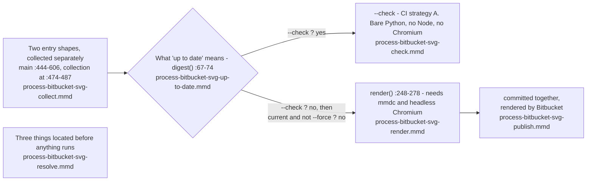
```mermaid
flowchart LR
    Inputs["Two entry shapes, collected separately<br/>main :444-606, collection at :474-487<br/>process-bitbucket-svg-collect.mmd"]
    Resolve["Three things located before anything runs<br/>process-bitbucket-svg-resolve.mmd"]
    Hash{"What 'up to date' means - digest() :67-74<br/>process-bitbucket-svg-up-to-date.mmd"}
    Verify["--check - CI strategy A. Bare Python, no Node, no Chromium<br/>process-bitbucket-svg-check.mmd"]
    Render["render() :248-278 - needs mmdc and headless Chromium<br/>process-bitbucket-svg-render.mmd"]
    CI["committed together,<br/>rendered by Bitbucket<br/>process-bitbucket-svg-publish.mmd"]

    Inputs --> Hash
    Hash -->|"--check ? yes"| Verify
    Hash -->|"--check ? no, then<br/>current and not --force ? no"| Render
    Render --> CI
```

| Box | Details |
|---|---|
| `CI` | and what the shipped pipeline snippet actually says |

- **Source:** `process-bitbucket-svg.mmd`
- **Drawn from:** `skills/mermaid-svg-bitbucket/scripts/render_mermaid.py`, `skills/mermaid-svg-bitbucket/assets/mermaid-config.json`, `skills/mermaid-svg-bitbucket/assets/bitbucket-pipelines.snippet.yml`, `skills/mermaid-svg-bitbucket/SKILL.md`, `skills/mermaid-svg-bitbucket/tests/test_check_reads_the_svg.py`
- **Readability:** PASS: 6 nodes, no crossings, nothing drawn through a node

## Process crew brief crew context

The crew-context SessionStart hook: how it reads the config, applies the stale-handoff rule and the auto-resume decision, and what it emits as additionalContext for each session source.

```mermaid
flowchart TB
    CC[crew-context]
    subgraph crewContext["crew-context (crew_context.py)"]
        CC --> cc1{".crew/ directory?<br/>:993"}
        cc1 -- no --> ccx([emit nothing])
        cc1 -- yes --> cc2["read crew.json else config.json<br/>:121-132"]
        cc2 --> cc3{"memory.inject?<br/>:1000-1003"}
        cc3 -- off --> cc4[incident banner only]
        cc3 -- on --> cc5["branch@HEAD, incident banner,<br/>codemap-behind line<br/>:881-892"]
        cc5 --> stale{"handoff stale?<br/>72h / 3 commits / branch"}
        stale -- yes --> arch["archive to .crew/handoffs/<br/>never delete<br/>crew_state.py:774, :980"]
        stale -- no --> cc6
        arch --> cc6
        stale -. "stale but the move failed:<br/>note stays, stale passed on (:893)" .-> cc6
        cc6{"auto-resume armed?<br/>:900"}
        cc6 -- "no (off)" --> src{"source?"}
        cc6 -- "run / wait" --> rs1["one line: ready to run,<br/>or did not start: reason<br/>resume_line :687"]
        rs1 --> src
        src -- startup --> ptr["pointer + next action<br/>:908-910"]
        src -- "resume/clear/compact/fork" --> full["full note, next action first,<br/>then the auto-resume line<br/>:911-923"]
    end

    ptr --> out(["additionalContext JSON<br/>:1090"])
    full --> out
    cc4 --> out
```

| Box | Details |
|---|---|
| `stale` | crew_state.py:646, :859-914 |
| `cc6` | machine resume.auto true, no repo veto; source clear / manual compact; note written by this session (T-0042); :900, crew_resume.decide |
| `rs1` | ready to run the re-rendered command; resume_line :687, never initialUserMessage |

- **Source:** `process-crew-brief-crew-context.mmd`
- **Drawn from:** `plugin/crew/hooks/scripts/crew-context.sh`, `plugin/crew/hooks/scripts/crew_context.py`, `plugin/crew/hooks/scripts/crew_resume.py`, `plugin/crew/hooks/scripts/crew_state.py`
- **Readability:** PASS: 15 nodes, no crossings, nothing drawn through a node

## Process crew brief handoff read

The handoff-read SessionStart hook: the three checks that make it exit, and when it prints the handoff note. In crew 1.0 it usually exits, because crew-context delivers the note instead.

```mermaid
flowchart TB
    HR[handoff-read]
    subgraph handoffRead["handoff-read.sh"]
        HR --> hr1{"source is<br/>clear/compact/resume/fork?<br/>:34"}
        hr1 -- no --> hrx([exit 0])
        hr1 -- yes --> hr2{"memory.inject on?<br/>:41 (1.0 default: on)"}
        hr2 -- yes --> hrx
        hr2 -- no --> hr3{".crew/config.json?<br/>:44"}
        hr3 -- no --> hrx
        hr3 -- yes --> hr4[stale check / print note<br/>:63-89]
    end

    hr3 -. "? 1.0-only repo (crew.json, no config.json)<br/>with inject:false gets no handoff" .-> hrx
```

- **Source:** `process-crew-brief-handoff-read.mmd`
- **Drawn from:** `plugin/crew/hooks/scripts/handoff-read.sh`
- **Readability:** PASS: 6 nodes, no crossings, nothing drawn through a node

## Process crew brief platform sync

The platform-sync SessionStart hook: silent without a crew config, otherwise it heals a broken config and records the machine it is running on.

```mermaid
flowchart TB
    PS[platform-sync]
    subgraph platformSync["platform-sync (crew_platform.py)"]
        PS --> ps1{"config or .crew/?<br/>:507-530"}
        ps1 -- no --> psx([exit 0, silent])
        ps1 -- yes --> ps2["heal_config if broken<br/>:547-563"]
        ps2 --> ps3["detect machine,<br/>write changed platform fields<br/>:566-584"]
    end
```

- **Source:** `process-crew-brief-platform-sync.mmd`
- **Drawn from:** `plugin/crew/hooks/scripts/platform-sync.sh`, `plugin/crew/hooks/scripts/crew_platform.py`
- **Readability:** PASS: 5 nodes, no crossings, nothing drawn through a node

## Process crew brief status

What /crew:status reads when run on demand, and the one place it differs from the SessionStart hooks: it checks a fixed handoff path and applies no stale rule.

```mermaid
flowchart TB
    subgraph status["/crew:status (on demand)"]
        st1["status.md:14<br/>crew_status.py --root ."] --> st2["report lines:<br/>git header, config, roster,<br/>tracker, tickets ... handoff<br/>:211-240"]
        st2 -. "? checks fixed .work/HANDOFF.md (:231),<br/>not handoffPath, no stale rule" .-> st3([report, capped at 40 lines])
    end
```

| Box | Details |
|---|---|
| `st2` | git header, config file, roster, tracker (crew_tracker.resolve, :67), tickets, review ledgers, verify, shell (Windows only, T-0040), codemap freshness, metrics, handoff, interrupted migrate :211-240 |

- **Source:** `process-crew-brief-status.mmd`
- **Drawn from:** `plugin/crew/commands/status.md`, `plugin/crew/hooks/scripts/crew_status.py`, `plugin/crew/hooks/scripts/crew_tracker.py`
- **Readability:** PASS: 3 nodes, no crossings, nothing drawn through a node

## Process crew brief

What crew 1.0 does when a session starts: hooks.json fans out to three SessionStart hooks, each drawn in its own file, plus the on-demand /crew:status report.

```mermaid
flowchart TB
    start([Session starts<br/>source: startup / resume / clear / compact / fork])
    start --> reg["3 SessionStart pairs<br/>hooks.json:3-10"]

    reg --> HR["handoff-read<br/>process-crew-brief-handoff-read.mmd"]
    reg --> PS["platform-sync<br/>process-crew-brief-platform-sync.mmd"]
    reg --> CC["crew-context<br/>process-crew-brief-crew-context.mmd"]

    status(["/crew:status (on demand)<br/>process-crew-brief-status.mmd"])
```

| Box | Details |
|---|---|
| `reg` | 3 SessionStart pairs, sh + ps1, no matcher; each claims per session+source |

- **Source:** `process-crew-brief.mmd`
- **Drawn from:** `plugin/crew/hooks/hooks.json`, `plugin/crew/hooks/scripts/handoff-read.sh`, `plugin/crew/hooks/scripts/platform-sync.sh`, `plugin/crew/hooks/scripts/crew-context.sh`
- **Readability:** PASS: 6 nodes, no crossings, nothing drawn through a node

## Process crew lifecycle approve

How /crew:approve, typed by the user only, records or refuses a plan approval through the approval hook, including the group-approval path, and how the ticket then moves to planned.

```mermaid
flowchart TB
    subgraph approve["/crew:approve - typed by the user only"]
        ap0["user types /crew:approve id<br/>approve.md:5"]
        ap0 --> ap1{"approval-hook verdict?<br/>hooks.json:14"}
        ap1 -- refused --> apx([prompt blocked, reason shown<br/>:15])
        ap1 -- recorded --> ap2["approval.json =<br/>digest(spec.md, plan.md)<br/>:12-13"]
        ap1 -- "several ids, a range,<br/>or plain text" --> apg["PENDING list, nothing recorded<br/>until the user's --confirm<br/>approve.md:27-32"]
        apg -- "confirmed, every hash unchanged" --> ap2
    end

    ap2 --> planned["spec.md 'status: planned',<br/>move --to planned<br/>plan.md:60-63"]
    planned --> to_im0>"next: implement part<br/>crew_ticket.py validate"]
```

| Box | Details |
|---|---|
| `ap0` | approve.md:5 disable-model-invocation |
| `ap1` | approval-hook (UserPromptSubmit) hooks.json:14; approve.md:9 |
| `ap2` | header status value normalised; approved_via user-prompt |
| `apg` | user's own /crew:approve --confirm records one receipt per ticket, or none |
| `planned` | spec.md header 'status: planned' keeps the approval, crew_tracker.py move --to planned |

- **Source:** `process-crew-lifecycle-approve.mmd`
- **Drawn from:** `plugin/crew/commands/approve.md`, `plugin/crew/commands/plan.md`, `plugin/crew/hooks/hooks.json`, `plugin/crew/hooks/scripts/crew_ticket.py`, `plugin/crew/hooks/scripts/crew_tracker.py`
- **Readability:** PASS: 7 nodes, no crossings, nothing drawn through a node

## Process crew lifecycle brainstorm

How a request enters the crew lifecycle: a small change takes /crew:fix, anything else goes through /crew:brainstorm until the user approves a direction and the ticket moves to ready.

```mermaid
flowchart TB
    ask([A request])
    ask --> small{"small change?<br/>brainstorm.md:90-91"}
    small -- yes --> fix["/crew:fix - same phases,<br/>one step each, one review round<br/>fix.md:2, :75, :95"]
    small -- no --> BR

    subgraph brainstorm["/crew:brainstorm"]
        BR["mint T-####: crew_tracker.py create<br/>INDEX row 'direction'<br/>brainstorm.md:15-40"] --> br2["one question per message,<br/>then 2-3 options, recommendation first<br/>:45, :54"]
        br2 --> br3["write direction.md, show, STOP<br/>:63-73"]
    end

    br3 --> ok1{user approves<br/>the direction?}
    ok1 -- no --> br2
    ok1 -- yes --> rdy["crew_tracker.py move --to ready<br/>brainstorm.md:81"]

    fix -.-> BR
    fix -. "same /crew:approve,<br/>/crew:review, /crew:done" .-> to_ap0>"next: approve part<br/>user types /crew:approve id"]
    rdy --> to_sp1>"next: spec-plan part<br/>direction.md?"]
```

| Box | Details |
|---|---|
| `small` | small? one subsystem, known cause, no new behaviour, no auth/SQL/IaC |
| `BR` | (+ Obsidian card); 'id taken' -&gt; next free id; any other failure -&gt; stop |
| `rdy` | (INDEX 'ready', card stays in Backlog) |

- **Source:** `process-crew-lifecycle-brainstorm.mmd`
- **Drawn from:** `plugin/crew/commands/brainstorm.md`, `plugin/crew/commands/fix.md`, `plugin/crew/hooks/scripts/crew_tracker.py`
- **Readability:** PASS: 10 nodes, no crossings, nothing drawn through a node

## Process crew lifecycle done

/crew:done's four checks, all of which must pass before the ticket is marked done, and the optional landing through the merge train.

```mermaid
flowchart TB
    subgraph done["/crew:done - all four or nothing<br/>done.md:7"]
        dn1{"1 review receipt<br/>--check-receipt<br/>done.md:10-13"}
        dn1 -- pass --> dn2{"2 verify gate all pass<br/>crew_status.py<br/>:21-27"}
        dn2 -- pass --> dn3{"3 completion audit<br/>passes?<br/>:40-53"}
        dn3 -- pass --> dn5{"4 artifacts current<br/>crew_refresh_check.py, read-only<br/>:55-66"}
        dn5 -- fresh --> dn4["trailer report, then<br/>'status: done', move --to done<br/>:68-97"]
        dn1 -- fail --> dnx([refuse done])
        dn2 -- fail --> dnx
        dn3 -- fail --> dnx
        dn5 -- "stale / unknown" --> dnx
        dn4 --> ln0{"train armed?<br/>crew_train.py status<br/>done.md:99-102"}
        ln0 -- yes --> ln1{"check-land passes?<br/>done.md:104-110"}
        ln1 -- LAND_OK --> ln2["you run the printed gh pr merge,<br/>then release --merged sha<br/>crew never merges :110-111"]
        ln1 -- "refused: catch-up,<br/>gate the merged head again<br/>:112-113" --> to_im5>"back: implement part<br/>then /crew:review last"]
    end
```

| Box | Details |
|---|---|
| `dn3` | (refresh artifacts: re-anchor or regeneration the change reaches) |
| `dn4` | first a report, never a check (T-0066, done.md:68-79): crew_trailers.py --check lists git.forbiddenTrailers over the ticket's own commits (git log --first-parent) as clean / FINDING / unknown, copied to the close note and PR body; never refuses, never rewrites. Then spec.md 'status: done' (keeps the approval), crew_tracker.py move --to done, crew_metrics record |
| `ln1` | crew_train.py check-land: holds the train, merge-tree clean, base unmoved in Touch, receipt + gate |
| `ln2` | --merge --match-head-commit sha |

- **Source:** `process-crew-lifecycle-done.mmd`
- **Drawn from:** `plugin/crew/commands/done.md`, `plugin/crew/hooks/scripts/crew_ticket.py`, `plugin/crew/hooks/scripts/completion_audit.py`, `plugin/crew/hooks/scripts/crew_refresh_check.py`, `plugin/crew/hooks/scripts/crew_tracker.py`, `plugin/crew/hooks/scripts/crew_train.py`
- **Readability:** PASS: 10 nodes, no crossings, nothing drawn through a node

## Process crew lifecycle implement

/crew:implement from the approval check to handing over to /crew:review: the plan steps under the scope guard, the refresh-artifacts loop and the required standards self-check.

```mermaid
flowchart TB
    subgraph implement["/crew:implement"]
        im0{"plan approved?<br/>implement.md:17-23"}
        im0 -- "no / stale" --> imx([refuse: /crew:plan id --approve])
        im0 -- yes --> im1["scope_base --record (kept if activate<br/>recorded; exit 1 could not tell), then<br/>crew_tracker.py move --to in-progress<br/>:28, :33"]
        im1 --> im2["steps in order, test first,<br/>scope-guard on every write<br/>:38-42"]
        im2 --> im3a["changed-file list, verify<br/>:59, :69"]
        im3a --> im3["step 6: tests, then /crew:docs<br/>:88-91"]
        im3 --> rf1{"crew_refresh_check.py<br/>:94"}
        rf1 -- "refresh with ..." --> rf2["run the named refresh,<br/>commit, re-run"]
        rf2 --> rf1
        rf1 -- "stop" --> rfx([report the reason, stop])
        rf1 -- fresh --> sc1["required standards self-check<br/>:106-110"]
        sc1 --> im4["spec.md 'status: review',<br/>move --to review<br/>:111-114"]
        im4 --> im5["then /crew:review last<br/>:115"]
    end

    im5 --> to_pf0>"next: review part<br/>preflight first"]

    stop["Stop hooks every turn:<br/>verify-gate, completion-audit<br/>hooks.json:58, :62"] -.- im2
```

| Box | Details |
|---|---|
| `im0` | crew_ticket.py validate |
| `im2` | recurring-findings checklist for the Touch paths, then steps in order; hooks.json:31 (PreToolUse, Touch) |
| `sc1` | crew_standards.py init, answer every row, crew_standards.py stamp until exit 0 |
| `im4` | spec.md header 'status: review' (keeps the approval), crew_tracker.py move --to review (Review lane: review outstanding) |

- **Source:** `process-crew-lifecycle-implement.mmd`
- **Drawn from:** `plugin/crew/commands/implement.md`, `plugin/crew/hooks/hooks.json`, `plugin/crew/hooks/scripts/crew_ticket.py`, `plugin/crew/hooks/scripts/crew_tracker.py`, `plugin/crew/hooks/scripts/crew_refresh_check.py`, `plugin/crew/hooks/scripts/crew_standards.py`
- **Readability:** PASS: 14 nodes, no crossings, nothing drawn through a node

## Process crew lifecycle review

/crew:review: the preflight, pre-review and self-check gates that run before a round is spent, then the review rounds and their verdicts, ending in a receipt or NEEDS_REPLAN.

```mermaid
flowchart TB
    subgraph review["/crew:review - two rounds per ticket"]
        pf0{"preflight (#264):<br/>receipt, gate, budget?"}
        pf0 -- "CLEAN receipt: CLEAN,<br/>no round, no self-check" --> rcpt
        pf0 -- "gate not passed or unknown:<br/>exit 5, no round spent,<br/>self-check not asked<br/>review.md:449" --> vg0["run the verify gate,<br/>then review again"]
        vg0 --> to_im5
        pf0 -- "go on" --> pr0{"pre-review checks<br/>pass? (L-0574)"}
        pr0 -- "NEW finding or COULD NOT CHECK:<br/>exit 5, no round spent<br/>review.md:449" --> fx0["fix the finding or the tool,<br/>then review again"]
        fx0 --> to_im5
        pr0 -- "pass / n/a / none configured,<br/>override recorded, or an active<br/>incident (skip logged)" --> rv0{"self-check<br/>stamped?"}
        pf0 -- "no rounds left or NEEDS_REPLAN:<br/>budget refusal answers first<br/>review_run.py:850-861" --> replan
        rv0 -- "no: exit 2,<br/>no round spent<br/>review.md:446-449" --> to_sc1
        rv0 -- "yes (or no approval receipt,<br/>or an incident: skip logged)" --> rv1["reserve a round, run<br/>Codex / Copilot /<br/>crew:reviewer fallback<br/>review.md:25-28, :451"]
        rv1 --> rv2{"verdict (the script's)<br/>:440, :482-486"}
        rv2 -- "CLEAN (exact: no other line)" --> rcpt["receipt written<br/>:510"]
        rv2 -- "FINDINGS (stray prose<br/>ignored and named)" --> rv3{"final round,<br/>0 BLOCK?"}
        rv3 -- "auto-accept or owner :508" --> rcpt
        rv3 -- "fix, round 2" --> again_rv1
        rv2 -- "INCOMPLETE (tool failure: refunded, :485-486)" --> again_rv1
        rv2 -- "INCOMPLETE (reviewer / tree, a contract-like<br/>or shortfall stray line): counts" --> again_rv1
        rv2 -- "third round refused" --> replan([NEEDS_REPLAN:<br/>back to /crew:plan])
    end

    again_rv1>"again: reserve a round,<br/>run the reviewers (above)"]
    to_im5>"back: implement part<br/>then /crew:review last"]
    to_sc1>"back: implement part<br/>required standards self-check"]
    rcpt --> to_dn1>"next: done part<br/>1 review receipt"]
```

| Box | Details |
|---|---|
| `pf0` | preflight first (#264): a CLEAN receipt covers this bundle? verify gate passed this tree? review_run.py:672, :846 |
| `pr0` | no linter finding the bundle adds against its base? could every configured linter check? review_run.py prereview_gate :731 |
| `rv0` | self-check stamped for this bundle and standards set? review_run.py standards_gate |
| `rv1` | on one bundle; prompt carries the standards checklist, then the recurring-findings checklist, then any web tests |
| `rv3` | report findings and every ignored line verbatim (:498-500); final round, 0 BLOCK? else fix, or the owner accepts :503, :505-508 |
| `pr0->fx0` | NEW finding: exit 5, no round spent, not overridable; or COULD NOT CHECK: exit 5 unless --allow-unverified |
| `pf0->replan` | the budget refusal answers first, no pre-review checks, no self-check |
| `rv2->rv3` | FINDINGS (stray prose beside findings ignored and named: review_verdict.py:210-213) |
| `rv3->rcpt` | auto-accept (L-0510): eligible, no specialist/control BLOCK; one follow-up ticket :505-506 - or the owner accepts :508 |

- **Source:** `process-crew-lifecycle-review.mmd`
- **Drawn from:** `plugin/crew/commands/review.md`, `plugin/crew/hooks/scripts/review_run.py`, `plugin/crew/hooks/scripts/review_verdict.py`, `plugin/crew/hooks/scripts/crew_standards.py`
- **Readability:** PASS: 14 nodes, no crossings, nothing drawn through a node

## Process crew lifecycle spec plan

/crew:spec writes spec.md from the approved direction, then /crew:plan writes plan.md, amending the spec's Touch list first when a step reaches outside it, and stops for approval.

```mermaid
flowchart TB
    subgraph spec["/crew:spec"]
        sp1{"direction.md?<br/>spec.md:10"}
        sp1 -- missing --> spx([refuse: run /crew:brainstorm])
        sp1 -- yes --> sp2["write spec.md<br/>Touch one path per bullet<br/>:15, :38-43"]
        sp2 --> sp3["crew_tracker.py move --to spec<br/>:45-48"]
    end

    subgraph plan["/crew:plan"]
        sp3 --> pl1["write plan.md: steps with<br/>Files / Test / Risk / Standards<br/>plan.md:27, :36"]
        pl1 --> pl2{"every Files: entry<br/>inside Touch?<br/>:44"}
        pl2 -- no --> amend["amend spec Touch first<br/>spec.md:57"]
        amend --> pl1
        pl2 -- yes --> pl3["show the plan, STOP<br/>:49"]
    end

    pl3 --> to_ap0>"next: approve part<br/>user types /crew:approve id"]
```

| Box | Details |
|---|---|
| `sp2` | write spec.md: Intent, Exclusions, Evidence, Unknowns, Touch, Acceptance checks :15; Touch one path per bullet :38-43 |
| `sp3` | (INDEX, board -&gt; Ready) |
| `pl1` | optional second opinion :22 |

- **Source:** `process-crew-lifecycle-spec-plan.mmd`
- **Drawn from:** `plugin/crew/commands/spec.md`, `plugin/crew/commands/plan.md`, `plugin/crew/hooks/scripts/crew_tracker.py`
- **Readability:** PASS: 9 nodes, no crossings, nothing drawn through a node

## Process crew lifecycle

The whole crew ticket lifecycle at a glance, one node per stage; each stage is drawn in full in its own process-crew-lifecycle-<part>.mmd file.

```mermaid
flowchart LR
    ask([A request])
    fix["/crew:fix<br/>(brainstorm part)"]
    brainstorm["/crew:brainstorm<br/>(brainstorm part)"]
    spec["/crew:spec<br/>(spec-plan part)"]
    plan["/crew:plan<br/>(spec-plan part)"]
    approve["/crew:approve<br/>(approve part)"]
    implement["/crew:implement<br/>(implement part)"]
    review["/crew:review<br/>(review part)"]
    done["/crew:done<br/>(done part)"]
    ask -- "small: yes" --> fix
    ask -- "small: no" --> brainstorm
    fix -.-> brainstorm
    brainstorm --> spec --> plan --> approve --> implement --> review --> done
    fix -. "same /crew:approve,<br/>/crew:review, /crew:done" .-> approve
```

- **Source:** `process-crew-lifecycle.mmd`
- **Drawn from:** `plugin/crew/commands/brainstorm.md`, `plugin/crew/commands/spec.md`, `plugin/crew/commands/plan.md`, `plugin/crew/commands/approve.md`, `plugin/crew/commands/implement.md`, `plugin/crew/commands/review.md`, `plugin/crew/commands/done.md`, `plugin/crew/commands/fix.md`
- **Readability:** PASS: 9 nodes, no crossings, nothing drawn through a node

## Process qa audit

generated by crew qa_doc.py on 2026-10-03. Verify before trusting.

```mermaid
flowchart LR
  trig["qaAuditStale<br/>at session start"] --> run["qa_audit.py"]
  run --> result["3 GAP, 0 UNKNOWN"]
  result --> act["fix one GAP<br/>through the gate<br/>open GAP: phase partial"]
  act --> stamp["qa_audit.py --stamp"]
```

- **Source:** `process-qa-audit.mmd`
- **Drawn from:** `.crew/verify.json`, `.github/workflows/instruction-budgets.yml`, `.github/workflows/marketplace.yml`, `.github/workflows/mcp-servers.yml`, `.github/workflows/plugin-evals.yml`, `.github/workflows/publish-mcp-servers.yml`, `.github/workflows/pylint.yml`, `.github/workflows/pytest-crew.yml`
- **Readability:** PASS: 5 nodes, no crossings, nothing drawn through a node

## Process qa gates

generated by crew qa_doc.py on 2026-10-03. Verify before trusting.

```mermaid
flowchart TD
  edit(["change"]) --> stop["Stop gate<br/>49 rule(s) in .crew/verify.json"]
  stop -->|red| fix1["fix, then the Stop gate runs again"]
  stop -->|green| review["review<br/>(/crew:review)"]
  review --> ci["CI<br/>10 workflow file(s)"]
  ci -->|red| fix2["fix, push, CI runs again"]
  ci -->|green| merge(["merge"])
  merge --> ladder["promotion ladder<br/>(see the ladder diagram)"]
  classDef gap stroke:#c0392b,stroke-width:2px,stroke-dasharray:4 3
```

- **Source:** `process-qa-gates.mmd`
- **Drawn from:** `.crew/verify.json`, `.github/workflows/instruction-budgets.yml`, `.github/workflows/marketplace.yml`, `.github/workflows/mcp-servers.yml`, `.github/workflows/plugin-evals.yml`, `.github/workflows/publish-mcp-servers.yml`, `.github/workflows/pylint.yml`, `.github/workflows/pytest-crew.yml`
- **Readability:** PASS: 8 nodes, no crossings, nothing drawn through a node

## Process qa ladder

generated by crew qa_doc.py on 2026-10-03. Verify before trusting.

```mermaid
flowchart LR
  merge(["merge to the default branch"])
  none["no environments declared in .crew/verify.json<br/>merge is the last gate"]:::gap
  merge --> none
  classDef gap stroke:#c0392b,stroke-width:2px,stroke-dasharray:4 3
```

- **Source:** `process-qa-ladder.mmd`
- **Drawn from:** `.crew/verify.json`
- **Readability:** PASS: 2 nodes, no crossings, nothing drawn through a node

## Process

localgpu: /localgpu:setup (7 steps, agent-driven) calls bootstrap.{sh,ps1} (6 steps, script-driven). NOTE: ground truth handed to this lane said "six-step" setup flow; commands/setup.md actually says "Seven steps, in order" (plugin/localgpu/commands/setup.md:7) - corrected here, see report.

```mermaid
flowchart TB

    Start(["user runs<br/>/localgpu:setup"])

    subgraph SetupFlow["/localgpu:setup - commands/setup.md - 7 steps"]
        direction TB
        S1["Step 1: resolve LOCALGPU_HOME<br/>[AGENT]<br/>setup.md Step 1"]
        S2["Step 2: check Ollama<br/>installed + serving<br/>[AGENT] setup.md Step 2"]
        S3["Step 3: pull the two models<br/>[AGENT] setup.md Step 3"]
        S4["Step 4: build the environment<br/>[SCRIPT] setup.md Step 4"]
        S5["Step 5: write repo config<br/>[AGENT] writes<br/>&lt;repo&gt;/.localgpu/config.json;<br/>asks whether it is gitignored<br/>setup.md Step 5"]
        S6["Step 6: register the MCP server<br/>[SCRIPT] 'localgpu mcp-init'<br/>setup.md Step 6"]
        S7["Step 7: hand off, do not index<br/>[AGENT] setup.md Step 7"]

        S1 --> S2 --> S3 --> S4 --> S5 --> S6 --> S7
    end

    Start --> S1

    subgraph Bootstrap["bootstrap.sh / bootstrap.ps1 - matched pair, same 6 steps, same order (verified)"]
        direction TB
        B1["1. NVIDIA driver present,<br/>report compute capability<br/>[SCRIPT]"]
        B2["2. Ollama installed<br/>[SCRIPT]"]
        B3["3. venv + numpy<br/>(+ mcp/requirements.txt,<br/>editable console script)<br/>[SCRIPT]"]
        B4["4. both models pulled<br/>(idempotent - checks<br/>/api/tags first)<br/>[SCRIPT]"]
        B5["5. VRAM discipline:<br/>export OLLAMA_MAX_LOADED_MODELS=1<br/>plugin/localgpu/bootstrap.sh:645-716<br/>[SCRIPT]"]
        B6["6. VERIFY: real embed request,<br/>then 'ollama ps'<br/>[SCRIPT]"]

        B1 --> B2 --> B3 --> B4 --> B5 --> B6
    end

    S4 -- "bash bootstrap.sh (Linux/macOS/WSL)<br/>OR pwsh -File bootstrap.ps1 (Windows)<br/>setup.md Step 4" --> B1
    B6 -- "returns control" --> S5

    Note["Every step in both flows<br/>detects before it acts -<br/>re-running either is a no-op"]

    style S4 fill:#5a4a1a,stroke:#b7861a,color:#fff
    style S6 fill:#5a4a1a,stroke:#b7861a,color:#fff
    style Bootstrap fill:#1a2a3a,stroke:#2b6cb0,color:#fff
```

| Box | Details |
|---|---|
| `S1` | prints resolved path, flags WSL cross-filesystem case |
| `S2` | runs 'ollama --version' and 'curl .../api/tags' as tool calls; stops if either fails |
| `S3` | runs 'ollama pull ...' x2, skipped on --no-pull (bootstrap step 4 covers this too) |
| `S4` | invokes bootstrap.sh or bootstrap.ps1 for the platform |
| `S6` | runs 'localgpu mcp-init &lt;repo&gt;' (plugin/localgpu/cli/localgpu_cli.py:339) -- resolves the 3 paths itself, verifies them, merges into repo-root .mcp.json, gitignores it -- no template, no hand-substitution |
| `S7` | reports what changed, points at /localgpu:index, runs /localgpu:doctor |
| `B6` | proving GPU residency, not CPU offload bootstrap.sh header comment |
| `Note` | where the target already exists (plugin/localgpu/bootstrap.sh:1-4 header, setup.md throughout) |

- **Source:** `process.mmd`
- **Drawn from:** `plugin/localgpu/bootstrap.ps1`, `plugin/localgpu/bootstrap.sh`, `plugin/localgpu/cli/localgpu_cli.py`, `plugin/localgpu/commands/setup.md`, `plugin/localgpu/mcp/requirements.txt`
- **Readability:** PASS: 15 nodes, no crossings, nothing drawn through a node
