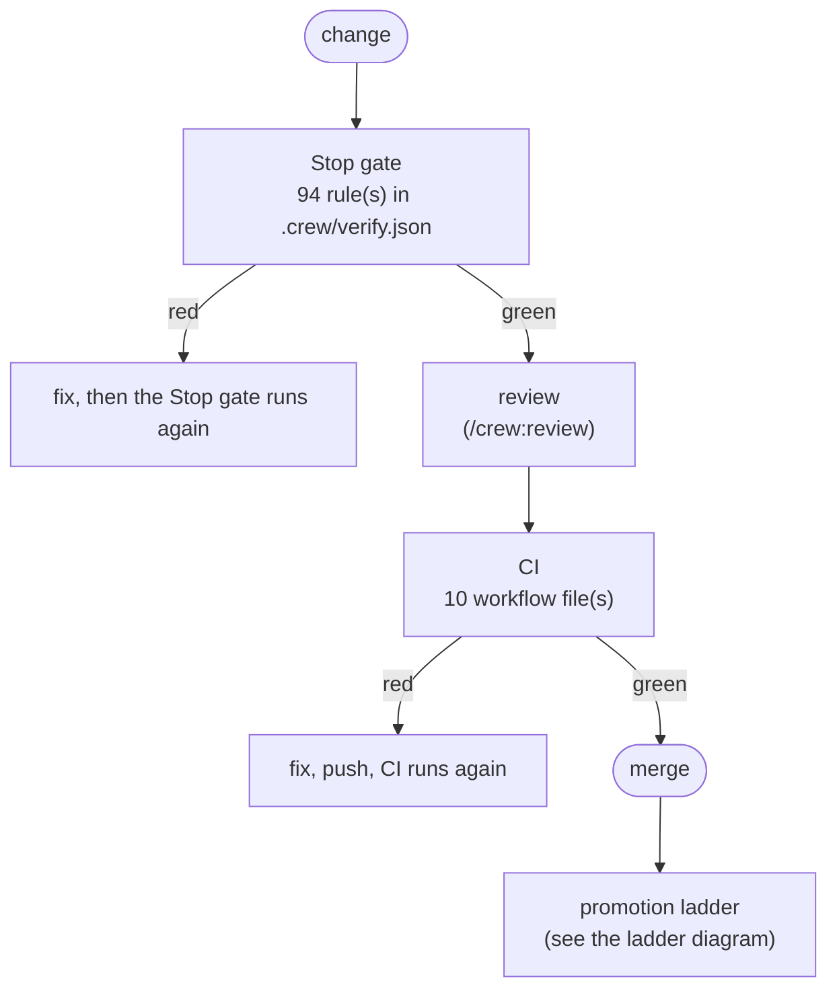
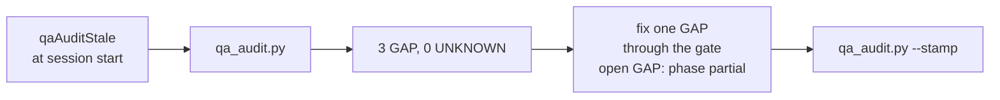

<!-- generated by crew qa_doc.py; edit the inputs, not this file -->
# QA process: useful-claude-add-ons

## Summary

| Item | Value |
|---|---|
| Commit | `f9ed7ddd` |
| Generated | 2026-10-09 |
| Verify map | ok (94 rule(s)) |
| Environments | none declared |
| CI files | `.github/workflows/instruction-budgets.yml`, `.github/workflows/marketplace.yml`, `.github/workflows/mcp-servers.yml`, `.github/workflows/plugin-evals.yml`, `.github/workflows/publish-mcp-servers.yml`, `.github/workflows/pylint.yml`, `.github/workflows/pytest-crew.yml`, `.github/workflows/runner-autostart.yml`, `.github/workflows/shell-suites.yml`, `.github/workflows/verify-gate.yml` |
| Audit | 3 GAP, 0 UNKNOWN, 11 PASS, 6 N/A |

## How a change is checked

Every change passes the Stop gate, review and CI before it merges. Dashed red boxes are gaps.



## How the QA audit runs

The audit reports and never blocks. During setup, a phase with an open GAP is `partial`, never `done`.



## Promotion ladder

No `environments` block in `.crew/verify.json`. Merging is the last gate this repository declares; `/crew:init --phase 8` adds one.


## Gate rules

| # | Paths | Runs | Reach | Seconds |
|---|---|---|---|---|
| 0 | `.claude-plugin/marketplace.json`, `**/.claude-plugin/plugin.json`, `**/pyproject.toml`, `plugin/**` | `python3 scripts/check-marketplace.py --pending-bump` | local | 9 |
| 1 | `plugin/PLUGINS.md`, `plugin/README.md`, `plugin/*/README.md`, `**/SKILL.md` | `bash _verify/smoke.sh` | local | 5 |
| 2 | `README.md`, `CLAUDE.md`, `AGENTS.md`, `TODO.md` | `python3 scripts/check-marketplace.py --pending-bump`<br/>`python3 scripts/_test/self-claims.py`<br/>`python3 scripts/sync-updates.py --check` | local | 12 |
| 3 | `scripts/**` | `python3 scripts/check-marketplace.py --pending-bump`<br/>`python3 scripts/_test/self-claims.py`<br/>`python3 scripts/_test/version-drift.py` | local | 84 |
| 4 | `plugin/crew/hooks/scripts/verify-gate.sh`, `plugin/crew/hooks/scripts/verify-gate.ps1`, `plugin/crew/hooks/scripts/promote-gate.sh`, `plugin/crew/hooks/scripts/promote-gate.ps1` | `python3 plugin/crew/tests/pytest_rule.py plugin/crew/tests/test_verify` | local | 50 |
| 5 | `plugin/crew/hooks/scripts/promote-gate.sh`, `plugin/crew/hooks/scripts/promote-gate.ps1`, `plugin/crew/hooks/scripts/_promote_github.py`, `plugin/crew/hooks/scripts/_promote_dispatch.py` | `python3 plugin/crew/tests/pytest_rule.py plugin/crew/tests/test_promot` | local | 16 |
| 6 | `plugin/crew/hooks/scripts/promote-gate.sh`, `plugin/crew/hooks/scripts/promote-gate.ps1`, `plugin/crew/hooks/scripts/_promote_review.py`, `plugin/crew/hooks/scripts/review_ledger.py` | `python3 plugin/crew/tests/pytest_rule.py plugin/crew/tests/test_promot` | local | 15 |
| 7 | `plugin/crew/hooks/scripts/crew_ghdeploy.py`, `plugin/crew/tests/test_crew_ghdeploy.py`, `plugin/crew/tests/ghdeploy_mutations.py`, `plugin/crew/hooks/scripts/promote-gate.sh` | `python3 plugin/crew/tests/pytest_rule.py plugin/crew/tests/test_crew_g` | local | 30 |
| 8 | `plugin/crew/hooks/scripts/crew_guards.py`, `plugin/crew/tests/test_guard*.py` | `python3 -m pytest plugin/crew/tests/test_guards.py plugin/crew/tests/t` | local | 4 |
| 9 | `plugin/crew/hooks/scripts/crew_memory.py`, `plugin/crew/tests/test_crew_memory.py`, `plugin/crew/tests/test_crew_memory_save.py`, `plugin/crew/tests/test_crew_memory_migrate.py` | `python3 plugin/crew/tests/pytest_rule.py plugin/crew/tests/test_crew_m` | local | 14 |
| 10 | `plugin/crew/hooks/scripts/crew_unattended.py`, `plugin/crew/tests/test_crew_unattended.py`, `plugin/crew/tests/test_crew_unattended_windows.py`, `plugin/crew/tests/sabotage_unattended.py` | `python3 plugin/crew/tests/pytest_rule.py plugin/crew/tests/test_crew_u` | local | 6 |
| 11 | `plugin/crew/hooks/scripts/cloud_guard.py`, `plugin/crew/hooks/scripts/crew_guards.py`, `plugin/crew/hooks/scripts/crew_dispatch.py`, `plugin/crew/hooks/scripts/cloud-guard.sh` | `python3 plugin/crew/tests/pytest_rule.py plugin/crew/tests/test_cloud_` | local | 47 |
| 12 | `plugin/crew/hooks/scripts/crew_config.py`, `plugin/crew/templates/**`, `plugin/crew/CONFIG.md`, `plugin/crew/skills/crew-setup/SKILL.md` | `python3 -m pytest plugin/crew/tests/test_crew_config.py plugin/crew/te` | local | 13 |
| 13 | `plugin/crew/hooks/scripts/crew_guards.py`, `plugin/crew/hooks/scripts/crew_config.py`, `plugin/crew/hooks/scripts/crew_backup.py`, `plugin/crew/hooks/scripts/crew_ticket.py` | `python3 -m pytest plugin/crew/tests/test_crew_config_personal.py plugi` | local | 39 |
| 14 | `plugin/crew/hooks/scripts/crew_state.py`, `plugin/crew/hooks/scripts/crew_common.py`, `plugin/crew/hooks/scripts/crew_endpoints.py`, `plugin/crew/hooks/scripts/crew_incident.py` | `python3 plugin/crew/tests/pytest_rule.py plugin/crew/tests/test_crew_s` | local | 12 |
| 15 | `plugin/crew/tests/conftest.py`, `plugin/crew/tests/crew_fixtures.py`, `plugin/crew/tests/context.py`, `plugin/crew/tests/sabotage.py` | `sh -c 'if python3 -c "import xdist" >/dev/null 2>&1; then python3 -m p` | local | 377 |
| 16 | `plugin/crew/tests/poll_fixtures.py`, `plugin/crew/tests/test_poll_fixtures.py` | `python3 plugin/crew/tests/pytest_rule.py plugin/crew/tests/test_poll_f` | local | 24 |
| 17 | `plugin/crew/skills/crew-graph/scripts/crew_upgrade.py`, `plugin/crew/tests/test_upgrade.py`, `plugin/crew/tests/test_sabotage_harness.py`, `plugin/crew/tests/sabotage_bound.py` | `python3 -m pytest plugin/crew/tests/test_upgrade.py plugin/crew/tests/` | local | 10 |
| 18 | `plugin/crew/hooks/scripts/crew_migrate.py`, `plugin/crew/tests/test_migrate.py`, `plugin/crew/tests/sabotage_migrate.py`, `plugin/crew/commands/migrate.md` | `python3 -m pytest plugin/crew/tests/test_migrate.py -q` | local | 12 |
| 19 | `plugin/crew/hooks/scripts/crew_ticket.py`, `plugin/crew/tests/test_approval_digest.py`, `plugin/crew/tests/test_scope_base_branch.py`, `plugin/crew/tests/test_crew_bookkeeping.py` | `python3 plugin/crew/tests/pytest_rule.py plugin/crew/tests/test_approv` | local | 14 |
| 20 | `plugin/crew/commands/**`, `plugin/crew/agents/**`, `plugin/crew/skills/**`, `plugin/crew/hooks/hooks.json` | `(cd plugin/crew && python3 hooks/scripts/_test/validate-prompts.py)` | local | 1 |
| 21 | `plugin/crew/skills/crew-diagrams/**` | `bash plugin/crew/skills/crew-diagrams/scripts/_test/render.sh` | local | 8 |
| 22 | `plugin/crew/skills/crew-setup/templates/**`, `plugin/crew/tests/test_setup_verify_templates.py` | `python3 -m pytest plugin/crew/tests/test_setup_verify_templates.py -q ` | local | 10 |
| 23 | `scripts/check-crew-docs.py`, `scripts/_test/crew-docs.py` | `python3 scripts/_test/crew-docs.py` | local | 15 |
| 24 | `**/*.ps1`, `**/*.psm1` | `sh scripts/pwsh-isolated.sh -NoProfile -File ./scripts/check-powershel` | local | 5 |
| 25 | `**/*.py`, `.pylintrc`, `ruff.toml` | `sh -c 'python3 -m ruff --version >/dev/null 2>&1 \|\| { echo "TOOL MISSI`<br/>`sh -c 'python3 -m pylint --version >/dev/null 2>&1 \|\| { echo "TOOL MIS` | local | 38 |
| 26 | `plugin/gizmoduck/**` | `python3 -m pytest plugin/gizmoduck/scripts/_test/ -q` | local | 30 |
| 27 | `mcp-servers/**` | `sh -c 'command -v npm >/dev/null 2>&1 \|\| { echo "TOOL MISSING: npm is ` | local | 196 |
| 28 | `skills/bitbucket/**` | `bash skills/bitbucket/scripts/_test/merge_gate.sh` | local | 5 |
| 29 | `skills/doc-builder/**` | `bash skills/doc-builder/scripts/_test/checklist.sh` | local | 1 |
| 30 | `skills/mermaid-svg-bitbucket/**`, `skills/notify/**`, `skills/cisco-meraki/**`, `skills/windows-ssm/**` | `python3 -m pytest skills/mermaid-svg-bitbucket/tests/ skills/notify/te` | local | 13 |
| 31 | `_verify/**` | `bash _verify/smoke.sh` | local | 5 |
| 32 | `.github/workflows/**` | `python3 scripts/_test/gate-runner.py` | local | 60 |
| 33 | `graphify-out/**`, `.crew/codemap/**`, `.crew/**`, `.serena/**` |  | local | 0 |
| 34 | `.claude/rules/**`, `.crew/codemap/**` | `python3 plugin/crew/hooks/scripts/crew_instructions.py rules --root . ` | local | 1 |
| 35 | `plugin/crew/hooks/scripts/crew_refresh_check.py`, `plugin/crew/hooks/scripts/crew_reference.py`, `plugin/crew/hooks/scripts/scope_guard.py`, `plugin/crew/hooks/scripts/completion_audit.py` | `python3 plugin/crew/tests/pytest_rule.py plugin/crew/tests/test_refres` | local | 15 |
| 36 | `plugin/crew/hooks/scripts/crew_resume.py`, `plugin/crew/hooks/scripts/crew_goal_state.py`, `plugin/crew/hooks/scripts/crew_context.py`, `plugin/crew/hooks/scripts/handoff-write.sh` | `python3 plugin/crew/tests/pytest_rule.py plugin/crew/tests/test_crew_r` | local | 25 |
| 37 | `plugin/crew/hooks/scripts/crew_autopilot.py`, `plugin/crew/hooks/scripts/crew_ticket.py`, `plugin/crew/commands/autopilot.md`, `plugin/crew/tests/test_crew_autopilot.py` | `python3 plugin/crew/tests/pytest_rule.py plugin/crew/tests/test_crew_a` | local | 30 |
| 38 | `plugin/crew/hooks/scripts/crew_docs_check.py`, `plugin/crew/tests/test_docs_check.py`, `plugin/crew/tests/test_crew_autopilot_docs.py`, `plugin/crew/tests/test_crew_autopilot_tracker.py` | `python3 plugin/crew/tests/pytest_rule.py plugin/crew/tests/test_docs_c` | local | 8 |
| 39 | `plugin/crew/hooks/scripts/crew_autopilot.py`, `plugin/crew/commands/autopilot.md`, `plugin/crew/tests/test_crew_autopilot_policy.py`, `plugin/crew/hooks/scripts/crew_sleep.py` | `python3 plugin/crew/tests/pytest_rule.py plugin/crew/tests/test_crew_a` | local | 43 |

54 more rule(s) in `.crew/verify.json`.

## QA audit findings

UNKNOWN means the audit could not tell. It is not a pass.

| Rule | Status | Check | Evidence |
|---|---|---|---|
| H2 | GAP | Parallel test runner | pytest without -n on a large suite: .github/workflows/pytest-crew.yml:349 (10296 tests), .github/workflows/pytest-crew.yml:352 (10296 tests), .github/workflows/pytest-crew.yml:400 (8975 tests), .github/workflows/pytest-crew.yml:452 (8975 tests); serial and small enough that workers would cost more: .github/workflows/pytest-crew.yml:185 (137 tests), .github/workflows/pytest-crew.yml:199 (31 tests) |
| H6 | GAP | Fast linter: rule set named, version pinned | ruff installed unpinned at .github/workflows/verify-gate.yml:77 |
| R9 | GAP | Always-loaded instructions stay small | CLAUDE.md is 12255 chars (~3063 tokens, loaded every session; threshold 12000) |
| H3 | PASS | Wall-clock tests run serially | parallel runs exclude a marker that a serial run selects; not judged (select a marker subset): .github/workflows/pytest-crew.yml:263, .github/workflows/pytest-crew.yml:458 |
| H4 | PASS | Fixtures isolated from global git config | conftest/fixture modules pin commit.gpgsign, maintenance.auto |
| H5 | PASS | Deep linter parallel, explicit job count | 1 pylint invocation(s) with an explicit -j |
| H7 | PASS | CI runs the configured fast linter | ruff runs at .github/workflows/pylint.yml:86, .github/workflows/pylint.yml:116 |
| R11 | PASS | Repo carries a steward skill | .claude/skills/steward/SKILL.md present |
| G1 | PASS | Every gate rule declares reach and seconds | all 94 rule(s) declare reach and seconds |
| G2 | PASS | No fire-and-forget commands in the verify map | 121 command(s); none fire-and-forget |
| G3 | PASS | _verify scripts: explicit env, strict flags, zero checks fails | 3 script(s); none carry the template's known defects |
| G4 | PASS | Generated directories are ignored (or tracked on purpose) | 1 generated dir(s) handled; tracked (a decision to confirm, not a gap): graphify-out |
| G5 | PASS | .gitignore carries crew's .crew/* block | `.crew/*`, `.crew/.approved-*` and `.work/` all present |
| E7 | PASS | CI runs the _verify entry points the gate runs | 1 _verify entry point(s) also run in CI |
| E1 | N/A | Non-production environments declare data provenance | no environments block |
| E2 | N/A | Every environment has a rehearsed rollback | no environments block |
| E3 | N/A | Deploys name the promoted SHA, not the checkout's HEAD | no environments block and no deploy workflow |
| E4 | N/A | Deploy workflows fail loudly | no deploy workflow |
| E5 | N/A | Credential inventory: reach and live columns | no environments block and no .crew/secrets.md |
| E6 | N/A | No verifier scripts inside a served directory | no served directory (public, public_html, wwwroot, htdocs, www, web) |

## Keeping this page current

This page is generated. Edit `.crew/verify.json`, `_verify/` or CI, then re-run:

```bash
python3 ${CLAUDE_PLUGIN_ROOT}/skills/crew-qa-standards/scripts/qa_doc.py --root . --write
```

The diagram sources are `docs/diagrams/process-qa-gates.mmd`, `process-qa-ladder.mmd` and `process-qa-audit.mmd`.
