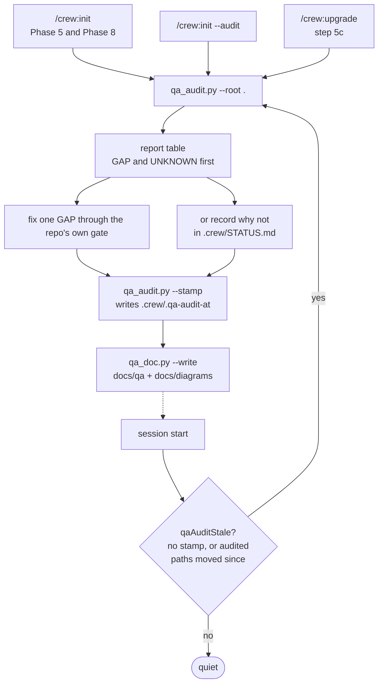
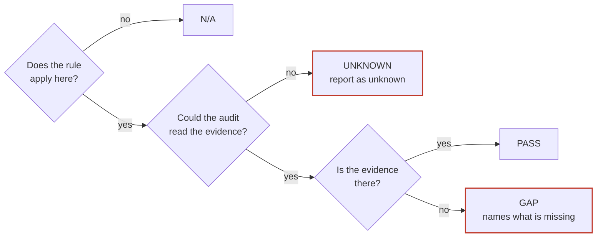
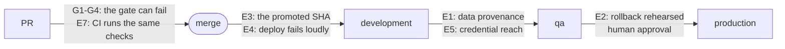

# Crew QA standards: how the audit works

Ticket **L-0618**. Crew sets up verify gates, test environments and promotion ladders in other
repositories. This page explains how crew now checks that those are set up well, when it checks,
and what it does with the answer. The evidence behind every item is in
[`docs/review/09-qa-standards-crew.md`](../review/09-qa-standards-crew.md).

An HTML copy of this page is [`crew-qa-standards.html`](crew-qa-standards.html). A generated
example for this repository is [`README.md`](README.md).

## In one table

| Question | Answer |
|---|---|
| What runs? | `qa_audit.py`, in the `crew-qa-standards` skill |
| Does it change anything? | No. It reports. `--stamp` writes one marker file, only when asked |
| Does it block? | No. It is not a hook. The gate stays what `.crew/verify.json` says |
| What does it check? | Harness (H), review (R), gate (G) and environment (E) items |
| What are the answers? | PASS, GAP, N/A, UNKNOWN. UNKNOWN is never a pass |
| When does it run? | Setup, upgrade, `/crew:init --audit`, and when `qaAuditStale` fires |
| How is the result documented? | `qa_doc.py` writes `docs/qa/` (Markdown + HTML) and the diagram sources |

## When it runs

The audited paths are `.crew/verify.json`, `_verify/`, the CI files and `.gitignore`. A repo that
was set up before this version has no stamp, so it hears `qaAuditStale` once on its next session.

## What each answer means

An unreadable `.crew/verify.json` is UNKNOWN on every item that reads it, not N/A. A git command
that fails is UNKNOWN. A wrapper the audit cannot follow (`make test`) is UNKNOWN.

## The items

| Item | Checks | Defect it answers |
|---|---|---|
| G1 | every rule declares `reach` and `seconds` | D10: a Stop gate that runs nothing |
| G2 | no fire-and-forget command (`curl` without `-f`, dispatch without watch, `\|\| true`) | D2: checks that cannot fail |
| G3 | `_verify` scripts need `--env`, refuse unknown flags, fail on zero checks | D1: the template's bugs |
| G4 | generated directories are ignored | D6: slow gates, argv overflow |
| G5 | `.gitignore` has the `.crew/*` block | D9: approval marker the gate trips on |
| E1 | non-production data provenance (`seeded`, restored + scrub, shared + owner) | D4: QA holding production data |
| E2 | rollback rehearsed on every rung, within 90 days | D3: untested rollback |
| E3 | no deploy of `$(git rev-parse HEAD)` | D2: deploying the checkout, not the proof |
| E4 | deploy workflows do not swallow exits; GitHub sets `concurrency:` | D2: green deploys that shipped nothing |
| E5 | `.crew/secrets.md` says where each credential reaches and if it is live | D4: live payment keys in QA |
| E6 | no verifier script under a web root | D9: verifier as a public endpoint |
| E7 | CI runs the `_verify` entry points the gate runs | D5: local gate and CI disagree |

The full text, with the fix for each, is
[`references/environments.md`](../../plugin/crew/skills/crew-qa-standards/references/environments.md).
Items that need the deployed target to answer (deployed build id, alarm subscriptions, test
identities) are reader items: the audit never calls a remote host.

## Where the checks sit on a promotion

## Commands

| To | Run |
|---|---|
| Audit this repo | `python3 ${CLAUDE_PLUGIN_ROOT}/skills/crew-qa-standards/scripts/qa_audit.py --root .` |
| Record the audit | add `--stamp` |
| See every crew checkout | `qa_audit.py --all-repos ~/src` |
| Document the QA process | `qa_doc.py --root .` (dry run), then `--write` |
| The same, guided | `/crew:init --audit` |

## What this change does not do yet

From the ticket's proposed slicing, these are later work:

| Slice | Content |
|---|---|
| b | corrected `_verify` templates, `--audit --fix`, a CI template per stack, `holds` in the promote gate |
| c | sabotage entries for the new checks (harness: its own tooling PR) |
| d | review-validity checks (D8), coordinated with the QA-rounds work |
