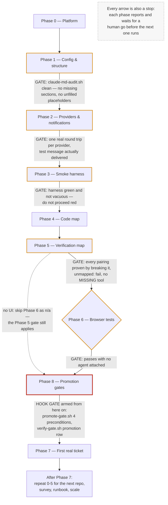

# Plugin reference

What each plugin in [`plugin/`](.) actually contains, and — for the parts that execute on their own — what starts running the moment it is enabled. The one-line catalog is in [`README.md`](README.md); this is the detail behind it.

Read the **Hooks** section of any plugin before installing it. Commands and agents wait to be asked. Hooks do not.

---

## `crew` — virtual dev team for multi-repo legacy work

| | |
|---|---|
| **Source** | [`crew/`](crew) |
| **Version** | 0.16.3 |
| **Install** | `claude plugin install crew@useful-claude-add-ons` |
| **Menu item** | 21, `repo-plugins` — **off by default**. Menu item 22, `graphify`, is a separate, also-off-by-default install of the `graphify` CLI this plugin's graph feature depends on — see **The code graph** below. |
| **Registers** | 14 agents, 24 commands, 17 skills, 20 hook entries (10 scripts × `.sh`/`.ps1`) across 5 events |
| **Upstream guide** | [`crew/README.md`](crew/README.md) — 25 sections, the authoritative version |

Built for the awkward case: several repositories, mixed stacks, legacy code, and almost no test coverage. The workflow is file-backed tickets, one implementation session, an independent reviewer, and deterministic gates that block on failure rather than offering an opinion.

Its central design claim is worth repeating, because it is the opposite of how most agent bundles are built: **a persona in a prompt adds no capability.** A role earns its place only if it buys an isolated context window, a restricted tool set, or genuinely independent eyes. Project management, business analysis, architecture, documentation, and training are files, commands, or you — there is nothing for an agent to isolate. Every custom subagent also loads your entire `CLAUDE.md` hierarchy at startup, so a 4,000-token `CLAUDE.md` across eight delegations is 32,000 tokens of overhead before any work happens.

### Hooks — the part that runs without being asked

Ten scripts across five events, each shipped as a `.sh`/`.ps1` pair
registered on its own matcher or event — 20 hook entries. **These are why
menu item 21 is unticked by default.**

| Script | Event | What it does |
|---|---|---|
| `guard.sh` / `.ps1` | `PreToolUse` on the Bash / PowerShell tool | Blocks `terraform apply`/`destroy`, destructive DDL, force push, hard reset, prod-targeted commands, and any command that would print a secret value into the transcript |
| `promote-gate.sh` / `.ps1` | `PreToolUse` on the Bash / PowerShell tool | Refuses a declared `deploy` command unless the `requires` environment has an all-pass row for this sha, the rollback runbook is verified inside 90 days, `requireHuman` is approved, and the tree is clean |
| `handoff-read.sh` / `.ps1` | `SessionStart` | Injects the prior handoff back after a clear, compact, or resume |
| `platform-sync.sh` / `.ps1` | `SessionStart` | Detects this machine and repairs the `platform` block in `.crew/config.json` - the one block that is committed and therefore wrong for everybody who did not run `/crew:init`. **Writes config**, and is the only hook that does: the seven derived facts (`os`, `wsl`, `wslVersion`, `distro`, `shell`, `repoFilesystem`, `windowsHostIp`) and nothing a human chose. Also recreates `config.json` itself when `.crew/` exists but the file is missing or unreadable - backing up a malformed one to `config.json.broken` first - and never when `.crew/` does not exist. Reports, without changing, a preference this OS cannot honour |
| `pm-brief.sh` / `.ps1` | `SessionStart` | Runs `crew_state.py` and prints a prioritized brief — schema currency, a stale or missing code graph, a pending handoff, stale or missing diagrams, review health, ticket sizing. Prints only; the acting is the PM's |
| `pm-pulse.sh` / `.ps1` | `Stop` | Re-engages the PM when the project state actually changed — a ticket closed, a gate broke, diagrams fell behind HEAD. **Fails the turn** to hand its findings back. What it then says depends on `pm.authority`: under the default `report-only` it presents recommendations and explicitly forbids dispatching; under `act` it is a work order. Gated on a state fingerprint, not on the event: turns that change nothing stay silent, and the same state can only interrupt once. Honours `stop_hook_active`, and stands down after 12 pulses in a session |
| `verify-gate.sh` / `.ps1` | `Stop` | Runs the checks the changed paths map to; **fails the turn** on red, on a changed path with no rule, or on a deploy that wrote no promotion row. Honours `stop_hook_active`, so a red check cannot pin the session. Stands down while an emergency lane is open, recording what did not run |
| `context-watch.sh` / `.ps1` | `Stop` | Reads actual window occupancy from the transcript's last `message.usage` record and asks for a handoff once per session, at the later of `context.warnAt` and `context.reserveTokens` of remaining headroom; instructs a full wrap-up instead if `context.autoWrapUp` is `true`. On the following turn it invokes `auto-clear`, which is inert unless `context.autoClear.enabled` is `true` |
| `auto-clear.sh` / `.ps1` | called by `context-watch`, not registered | **Experimental, off by default.** Types `/clear` into the *terminal* once the handoff is written — it cannot clear the conversation, it drives the terminal the way a human would. `tmux` targets a pane by id; every other method needs an explicit `windowTitle` and refuses without one. Refusals go to `.crew/.autoclear.log`, because a `Stop` hook's stderr is invisible on exit 0 |
| `handoff-write.sh` / `.ps1` | `PreCompact` | Snapshots the transcript and writes a skeleton handoff before compaction discards it |
| `notify.sh` / `.ps1` | `Notification`, and called directly by commands | One outbound line to Teams or Telegram. Never reads, never accepts instructions |

**This is what "the moment the plugin is enabled" means in practice: a `SessionStart` hook now fires on every session's `startup`, unconditionally, in a repository with `.crew/config.json` present.** `handoff-read` and `pm-brief` both run before you type anything, so enabling the plugin changes what the very first turn of every session looks like, not just what later tool calls are allowed to do.

**Since 0.8.0 it also changes how turns end.** `pm-pulse` is a `Stop` hook that *fails the turn* when the project's state has changed, handing its findings back to the session. That is the part to understand before enabling: a hook that can block is a hook you cannot talk out of it. It is gated on a state fingerprint rather than on the event, so turns that change nothing are silent; it honours `stop_hook_active`, so it cannot loop; and it stands down after 12 pulses in a session. Set `pm.enabled: false` in `.crew/config.json` to switch it off along with the brief.

**It does not dispatch anything by default.** `pm.authority` ships as `report-only`, so out of the box the pulse surfaces findings and stops — a plugin update must not turn someone's PM autonomous underneath them, because consent to install is not consent to delegate. Setting `pm.authority: "act"` (or answering the question `/crew:init` now asks) lets the PM dispatch roles and refresh diagrams on its own. An unrecognised value resolves to `report-only`: a typo in a permissions field has to fail closed.

Every event is registered twice, once per flavour, each with the matching `shell` field on the PowerShell side — a `shell: powershell` entry is documented and Claude Code does read it, running that entry via PowerShell without needing `CLAUDE_CODE_USE_POWERSHELL_TOOL`. `guard.sh` / `guard.ps1` and `promote-gate.sh` / `promote-gate.ps1` additionally branch on `tool_name` at the `PreToolUse` matcher — a `PowerShell` tool call goes to the `.ps1`, a `Bash` tool call is judged by the `.sh` — because that is which language the command is actually written in, not which OS is running. Branching on the OS instead would judge bash commands with PowerShell rules on Windows, which blocks the correct secret-capture form and misses the wrong one. The other hooks judge no command, so both flavours are simply wired to their event with no branch. `hooks/scripts/_common.sh` also ships a `crew_tool_dispatch` helper for judging a command from inside a single bash-registered script; it is unused here in favour of the explicit dual-matcher registration above, but stays available for a hook that wants that shape instead.

A hook cannot be argued out of blocking `terraform apply`; an agent can. That is the entire value, and also the reason a bootstrap run should not install one without the box being ticked.

Committed suites, all sabotage-tested: `hooks/scripts/_test/run-tests.sh` (101 cases across the three gates, the emergency lane, and the PM pulse), `setup-walkthrough.sh` (32 cases running every setup-phase script against a real mixed-stack scratch repo), `validate-prompts.py` (133 structural checks over the commands, agents and skills), and `tests/` under pytest (324 cases, including both flavours of `context-watch` and of the two gates that stand down). All but the pytest suite's Windows-only cases run in CI. What none of them proves is whether the prompts produce good work — that needs a live session on a real ticket, which is what setup Phase 7 is for.

**Every hook is inert until the repository has `.crew/config.json`.** Installing the plugin arms nothing - `/crew:init` in a repo is what turns the gates on there. A gate firing in every repository you opened would be hostile, so this is deliberate; it does mean "installed it, nothing happened" is expected rather than broken.

**The `Stop` gate is additionally inert until you build its map.** `verify-gate.sh` reads `.crew/verify.json`; with no such file there is nothing to run. `/crew:verify` builds it. Set `verifyGate: false` in `.crew/config.json` to disable the gate without uninstalling.

**Windows — fixed in 0.2.0, corrected in 0.3.0.** In 0.2.0 `guard.sh` and `verify-gate.sh` exited 0 on MSYS/MINGW to "defer" to `.ps1` twins that nothing ever invoked, so on Windows the command guard blocked nothing and the `Stop` gate ran nothing — which reads as "the gate passed" rather than "the gate never ran". 0.3.0 registers **both flavours on every matcher-less event on purpose**, not because each one fires — `hooks.json` has no way to know in advance which shell a given machine actually has, so both are wired and one is expected to fail; `PreToolUse` is the exception, where `guard.sh`/`guard.ps1` and `promote-gate.sh`/`promote-gate.ps1` are registered on separate `Bash` and `PowerShell` matchers instead, so the branch is by *which tool Claude used*, not by OS. The PowerShell side carries `shell: powershell`, a field Claude Code documents and reads — it runs that entry via PowerShell without needing `CLAUDE_CODE_USE_POWERSHELL_TOOL`. What is not configurable is the *default* interpreter for a bare `command` string with no `shell` field: that goes to `sh -c` on macOS/Linux and to **Git Bash** on Windows (PowerShell only when Git Bash isn't installed) — so a `bash` resolved from some non-MSYS parent process is not necessarily what runs it. On Windows this is measured, not hypothetical: Git for Windows ships two `bash.exe` binaries, and `usr/bin/bash.exe` exits 127 running these scripts where `bin/bash.exe` runs them fine, so which one resolves first on `PATH` decides whether the `.sh` side works at all; on a machine where a non-MSYS parent process resolved `bash` to the WSL launcher, the `.sh` side exited 127 on every script while the `.ps1` twin exited 0. **One flavour failing is expected behavior, not a bug** — it is not evidence the hook itself didn't run. What is genuinely unverified is the opposite combination, real hook-runner behavior with **no `pwsh` on Linux**; that was never exercised, so treat it as unconfirmed rather than assumed fine. The remaining requirement on Windows is that Git Bash (or WSL) is on `PATH` for the `.sh` half to have any chance; without any bash at all, that half never fires, and the plugin does not pretend otherwise.

**`python3` is no longer required.** The scripts resolve `python3`, then `python`, then `py`, and `guard.sh` prefers `jq` when it is present. With none of them available the affected hook says so on stderr and exits 0 rather than failing open in silence.

**`context.autoWrapUp` and `context.autoResume`** (both default `false`) change what happens around the handoff, not whether it happens:
- `autoWrapUp` changes what `context-watch` tells the session to do at `warnAt` — reach a stopping point and write the handoff, instead of just asking for one. **The `/clear` itself stays manual regardless of this setting, because no hook can trigger one** — a hook runs as a child process and cannot reset its parent's conversation. Without stating that plainly, the feature reads as broken (why doesn't it actually clear?) rather than as what it is: bounded by a real constraint.
- `autoResume` makes the next `SessionStart` open already holding the last handoff, emitted as `additionalContext` rather than `initialUserMessage` — the latter is confirmed only for non-interactive `-p` invocations, and could not be confirmed to behave the same way in an interactive session, so the safer field was used. That means the session opens **with the handoff in view**; it does not start working unattended. A human still gives the first turn.

### The code graph

`crew-graph` (below) wraps the third-party `graphify` CLI to build a code
graph at `graph.out` (default `graphify-out/graph.json`, configurable in
`.crew/config.json`), and `/crew:upgrade` (next) uses it to bring an older
setup forward. Neither is a hook — nothing here runs on its own — but both assume
`graphify` is on `PATH`, which is a **separate, off-by-default install**:
menu item 22 (`uv tool install graphifyy` — the PyPI package is `graphifyy`,
double-y; the CLI it installs is `graphify`). A keyless build needs both
`--no-viz` and `--code-only`: without `--code-only`, `graphify` errors on any
repository containing docs, rather than skipping them. Exporting the graph
into Obsidian is gated on `graph.obsidian.confirmed` being set explicitly by
the user in `.crew/config.json`; `/crew:upgrade` never sets that flag itself.

### The emergency lane

`/crew:emergency` is a time-boxed, recorded decision to stop gating while
something is actually broken. `.crew/incident.json` is the whole mechanism:
while it exists and its `expiresAtEpoch` is in the future, `verify-gate` exits 0
without running the checks and `promote-gate` computes its preconditions,
records the ones that failed, and allows the deploy anyway. Everything skipped
goes to `.crew/incident-skips.log`, one row per gate and reason, and
`/crew:emergency end` turns that into `.work/INCIDENT-<id>.md` plus an archived
record under `.crew/incidents/`.

Three properties are worth stating, because they are what make this safe enough
to ship:

- **It expires on its own.** The gates compare an integer epoch; no command runs
  and no file is touched to re-gate. Forgetting to close an incident - the
  realistic failure, since nobody forgets to declare one during an outage -
  cannot leave a repository permanently ungated. `emergency.ttlMinutes`
  defaults to 120 and `extend` is capped at `emergency.maxTtlMinutes` (480),
  measured from *now* each time, so repeated extensions cannot drift.
- **The command guard never stands down.** `guard.sh` / `guard.ps1` has no
  incident branch and must not get one: standing down the checks that say a
  change is wrong is a trade, and standing down the ones that stop it being
  unrecoverable - a force push, a destructive Terraform verb, a history
  rewrite, a secret read - is not. An incident is precisely when someone is
  tired enough to need that hook.
- **A repo can forbid it.** `emergency.standDown: false` in `.crew/config.json`
  keeps every gate gating; the incident is still declared, recorded, and named
  in the session brief. For a repository where skipping verification is not a
  decision anyone local gets to make.

Every session start says so while an incident is open, and keeps saying so
after it expires unclosed - `incidentActive` and `incidentUnclosed` are the two
highest-priority PM triggers, above `upgradeNeeded`, and the incident line sits
in the brief's quiet lines so no line cap can truncate it away.

Enforcement is session-local, like every other gate here: an incident stands
the hooks down for sessions in this repository on this machine. It does nothing
to CI or to branch protection.

### Commands — 24, all explicit

| Command | Purpose |
|---|---|
| `/crew:init` | Guided phased setup, resumable |
| `/crew:onboard [--refresh <area>]` | Build or refresh the code map |
| `/crew:reference [--api\|--features\|--audit]` | Enumerate endpoints, jobs, consumers, CLI commands and feature flags into `docs/reference/`, each anchored to `file:line` |
| `/crew:verify` | Build or refresh the change-to-check map the `Stop` gate reads, creating `_verify/` if the repo has no check directory |
| `/crew:promote <env> [--dry-run\|--status]` | Promote development -> qa -> production, running deploy, smoke, regression, and post-soak verification as separate gates |
| `/crew:emergency <what is broken>\|status\|extend [min]\|end` | Declare a time-boxed incident: the `verify` and `promote` gates stand down and record what they skipped, parallel read-only lanes investigate the cause at once, and `end` writes the debt list. The command guard does **not** stand down |
| `/crew:ticket <description>` | Scope a request into a ticket |
| `/crew:work <id>` | Work one ticket end to end |
| `/crew:review` | Independent QA — walks `qa.order` (Codex, Copilot, `qa-reviewer`), striking the author's own model family first |
| `/crew:model [key value]` | Show which model backs each role and probe it; set `qa.*` / `dev.*` keys with validation |
| `/crew:roster` | List every role: active here, available but off, and which are backed by an external provider |
| `/crew:plan <decision>` | Independent design opinion before building |
| `/crew:survey [area]` | Research gaps, produce ranked findings with options |
| `/crew:scale` | Evidence-based crew sizing |
| `/crew:docs [--audit]` | Update the documents this change should touch |
| `/crew:runbook <name\|--audit\|--verify>` | Write, verify, or audit operational runbooks |
| `/crew:handoff` | Write the handoff note before clearing |
| `/crew:diagram <type>` | Architecture, data-flow, process, and sequence diagrams |
| `/crew:jira-sync <KEY> [--push]` | Sync one issue with the local cache |
| `/crew:sdp-sync <REQUEST-ID> [--push]` | Sync one ServiceDesk Plus request with the local cache: pull the forty tokens that matter out of a several-thousand-token payload, push one note and a transition |
| `/crew:obsidian-sync <T-####> [--push]` | Sync one Obsidian Kanban card with the local cache: pull reads the card's lane as the status, push moves the card and appends one note. Edits the board in place — the `kanban-plugin` frontmatter, the trailing `%% kanban:settings` block and the `**Complete**` marker are load-bearing, and a regenerated board silently stops rendering as one |
| `/crew:pm [assign\|authority [value]\|onboard\|offboard <role>]` | Talk to the crew's manager: status with no argument, `assign` to let it decide and dispatch the next work itself, `authority report-only\|act` to read or set how much it may do unprompted, or add/remove a role. Offboarding still needs an explicit yes before it touches `.crew/config.json` |
| `/crew:upgrade [--force]` | Bring an out-of-date setup forward: backs up the codemap and the config first, migrates `pm`, `graph`, `qa`, `dev` and `roles`, recomputes the tier, builds the graph if missing, reconciles derived facts per subsystem, and reports contradictions, stale-on-purpose anchors and machine-global config findings rather than resolving them. A block that arrived as the wrong type is left untouched and `schema` is deliberately not stamped |
| `/crew:config [--show]` | Show every globally-settable key with its effective value and the layer that decided it, and walk the machine-global config at `~/.claude/crew/config.json`. Dry run by default; `--apply` writes, merging rather than replacing. Refuses any key that describes a repository rather than a machine, and marks a widening of `pm.authority` on both the plan and the write. The only thing in crew that writes outside the repository |

First run in a new repository: `/crew:init`, then `/crew:onboard`, then `/crew:verify`.

### Agents — 14, tiered plus the manager

Tier 0 installs with everyone; tiers 1 and 2 are added as the work demands. `/crew:scale` decides from evidence rather than taste.

| Agent | Tools | Model | Tier | Role |
|---|---|---|---|---|
| `explorer` | read-only | `sonnet` | 0 | Maps code, returns summaries not contents |
| `qa-reviewer` | read-only | `opus` | 0 | Hostile review; the Codex fallback |
| `security` | read-only | `sonnet` | 1 | Exploitable defects in the diff |
| `smoke-author` | read/write | `sonnet` | 1 | Builds and repairs the safety net |
| `developer` | read/write | `sonnet` | 1 | Implements one scoped change and returns a summary; never reviews its own diff, never merges or pushes |
| `browser-tester` | read/write | `sonnet` | 2 | Playwright specs, visual baselines, user flows |
| `analyst` | read-only | `sonnet` | 2 | Anchored findings and options, never tickets |
| `planner` | read-only | `sonnet` | 2 | Design second opinion from an abstracted brief |
| `dba` | read-only | `sonnet` | 2 | Migrations, locks, online safety |
| `docs-writer` | read/write | `sonnet` | 2 | Architecture and data flow from real code; exports a delivered artifact per `crew-house-style` |
| `infrastructure-architect` | read-only | `sonnet` | 2 | AWS network and account design — VPCs, routing, connectivity, DNS, ingress, landing zones — with tradeoffs. Never applies to a live account |
| `scribe` | read/write | `sonnet` | 2 | The durable record: ADRs, CHANGELOG entries, handoff notes, and what was tried and rejected |
| `researcher` | read-only + web | `sonnet` | 2 | External research only — docs, APIs, versions, vendor limits, standards, prior art. Every claim carries its source |
| `pm` | read/write + `Agent` | `opus` | — (outside the ladder) | The standing manager. Reads state, decides what the crew does next, and — **when `pm.authority` is `act`** — dispatches the roles that do it. Under the default `report-only` it recommends and stops. Also does the heavy analysis that would cost more context in the main session than the answer is worth: correlating defect classes across `.crew/metrics.md`, auditing codemap anchors, assembling tier-change evidence |

`explorer`, `qa-reviewer`, `security`, `analyst`, `planner`, `dba`, `infrastructure-architect` and `researcher` are read-only — a restricted tool set is one of the three things that earns a role its place. `researcher`'s read-only set is the seam that keeps it out of the codebase: it holds web and Context7 tools and no `Grep`, because anything inside this repository belongs to `explorer` or `analyst`.

**The three agents added in 0.15.x joined the ladder in 0.16.0**, at tier 2, alongside `dba` and `docs-writer` — each closes a defect class that only appears once a repo is doing enough of that kind of work to have the evidence. `/crew:scale` proposes them, `/crew:pm` can onboard them, and `/crew:upgrade` adds them to any config already at tier 2. The ladder itself lives in `crew_state.ROLE_TIERS`; the two markdown tables that describe it (`crew-scaling/SKILL.md` and `crew-pm/onboarding.md`) are checked against that dict by a committed test rather than parsed at runtime.

**Model tiers.** `opus` for the PM, because every dispatch decision derives from the project picture it holds and a bad assignment is inherited by every role below it. `opus` for `qa-reviewer`, because it is the same model family as the author and the tier is the only compensation left when Codex is absent. `sonnet` for the working roles: narrow brief, clean context, one deliverable. QA itself defaults to Codex — `qa.provider` ships as `auto`, so a machine with `codex` on `PATH` gets a different model family reviewing, and `/crew:review` says out loud which reviewer ran. These are tiers, not pinned versions; a plugin cannot pin a point release.

**The PM is standing, and that is the point of it.** It is spawned once per session under the name `crew-pm` and stays addressable; `/crew:pm` messages the existing one rather than spawning a fresh one each time. The roles it dispatches each see one slice of the work and are gone — the PM is the only thing holding what was decided, what was deferred, who was onboarded, and why. A PM respawned per invocation knows the state JSON and nothing else. It also does not end when the queue empties: it reports what is outstanding and waits.

**One hat per role, the PM's included.** The PM assesses scope, onboards and offboards roles, communicates, and keeps tickets current. It does not write application code, tests, docs, migrations, or reviews — implementation goes to `developer`, review goes through `/crew:review`, and its own writes are limited to `.crew/`, ticket text, `TODO.md`, and generated diagrams. `agents/pm.md` carries a routing table from kind-of-work to role, and an explicit rule that a dispatch is an Agent call rather than a sentence describing one — narrating a plan and calling it progress is this agent's characteristic failure, and `/crew:pm` refuses to relay a report written in the future tense.

`pm` is the exception, and it is a deliberate one — but it is opt-in. A manager whose only output is a recommendation is a manager the user has to manage, so `pm.authority: "act"` lets this one assign work itself and report afterwards. It ships `report-only`.

Four bounds keep `act` honest. A priority the user has stated **outranks** the PM's own trigger ordering, and the PM says so when it re-orders. **Removal and deletion still need an explicit yes** — offboarding a role, deleting a codemap or a diagram, rewriting `metrics.md` — because adding capability is reversible and removing it destroys the evidence that would say whether removing it was right. A multi-agent run is **announced before** it happens, which is not a permission gate but the difference between a manager and a surprise. And `pm.maxDispatches` (default 3) caps roles per pass, so a queue is never worked until the context runs out.

The fifth bound is about scope rather than permission, and it is the one that makes autonomy survivable: **a problem the PM stumbles on gets fixed only if it blocks a finding it was already working.** Everything else becomes a ticket (if a `tracker` is configured) or a `TODO.md` line with its reason, and the report has to say what was deferred and where it went. Autonomy's failure mode is not doing the wrong thing, it is doing too many things — refreshing a diagram, noticing a bug, fixing it, noticing thin tests, writing tests, and never finishing the diagram. It writes only inside `.crew/`, `docs/diagrams/`, and `TODO.md` — application source is always someone else's job.

### Bundled skills — 17

These are ordinary skills, scoped to `crew`'s own workflow. They work on every Claude surface, including chat, unlike the hooks and agents.

| Skill | What it covers |
|---|---|
| `crew-setup` | Platform detection **and toolchain resolution**, nine phased setup steps, provider wiring, and reconciling an existing repo `CLAUDE.md` against the template section by section |
| `crew-verification` | The change-to-check map, the `_verify/` layout, secrets handling, browser-test policy, and the five promotion gates for development -> qa -> production |
| `crew-context` | Context exhaustion — warn near the limit, write handoffs, resume after a clear or compact |
| `crew-docs` | Keeping `CHANGELOG.md`, `README.md`, `SECURITY.md`, `TODO.md` and ADRs current as work lands, plus the anchored API and feature reference under `docs/reference/` |
| `crew-lint` | Linters and formatters for PowerShell, PHP, Python, Terraform, and JavaScript, wired into the gate |
| `crew-terraform` | `terraform-docs` and `tflint` for a module — header block, `footer.md`, README injection |
| `crew-runbooks` | Writing, indexing, and maintaining operational runbooks |
| `crew-diagrams` | Architecture and data-flow diagrams, with a Visio path |
| `crew-house-style` | House style for a document handed to a human — palette, headings, capitalization, and PDF vs DOCX vs HTML vs plain markdown. Routes generation to `anthropic-office-skills`, `ppt-master` and `visio-diagrams`; falls back to markdown and says so when none is installed |
| `crew-providers` | Codex as reviewer, Gemini as design partner, and verifying either |
| `crew-memory` | Obsidian-backed memory |
| `crew-notify` | Teams and Telegram payload discipline |
| `crew-cloud` | AWS and Azure MCP |
| `crew-scaling` | Evidence for growing or shrinking the crew |
| `crew-pm` | Field meanings and the authority rule behind `/crew:pm` and the `pm-brief` / `pm-pulse` hooks — what `pm.authority` switches, the guardrails that bound `act` (blockers only, ticket-or-TODO the rest, dispatch cap), and the removal/deletion yes that holds either way |
| `crew-graph` | Building and querying the `graphify` code graph, the reconcile shape `/crew:upgrade` reads, and the Obsidian export consent gate |
| `find-skills` | Discovering and installing other skills |

### What it creates in a repository

Setup is nine resumable phases (`/crew:init`), and every artifact it writes is a file you can read and delete.

| Path | Written by | Holds |
|---|---|---|
| `.crew/config.json` | phase 1 | Provider, tracker, memory, context and notification settings |
| `.crew/verify.json` | phase 5 | Which checks a changed path requires, which specialist reviews it, and the promotion sequence per environment |
| `.crew/codemap/` | phase 4 | One note per subsystem, every claim anchored to `file:line` and a sha |
| `_verify/` | phase 3 | `smoke.sh`, `run-all.sh`, `cases/`, and a `README.md` recording what each check covers and when it last proved it could fail |
| `docs/reference/` | `/crew:reference` | Every endpoint and every headless capability, anchored |
| `.work/` | as work happens | Tickets, findings, the handoff note, and `PROMOTIONS.md` |
| `CLAUDE.md` | phase 1 | Created if absent; if present, missing sections are **appended, never overwritten** |

`.crew/` and `.work/` must be gitignored - the deploy gate writes a marker there, and an ungitignored marker dirties the tree and blocks the next deploy.

### Setup phase order

Source of truth: `crew-setup/phases.md`. Its numbers run 0-8, but its body does
not: the sections appear as 0, 1, 2, 3, 4, 5, 6, then **8** (Promotion gates),
then **7** (First real ticket), and the closing section is titled "After Phase
7". Two things in the file agree that First real ticket runs last — where the
section sits, and that closing heading, whose content ("repeat Phases 0-5 for
the next repo", "run `/crew:survey` now that there is a safety net worth acting
on") only makes sense from the end. Only the numbers disagree, and the phase
table is sorted by number rather than making a claim about order. So the
sequence below is **0-6, 8, 7** — the order the prose runs in, not the order
the numbers suggest.



**Skippable:** Phase 6 is the only phase that can be marked `n/a` outright, and
only when the repo has no UI. Two phases have optional *parts* without being
skippable themselves — Phase 2's notifications and Cloud MCP halves, and Phase
5's Terraform sub-step, which only applies when there are `.tf` files. Phase 3
can end `blocked`, which is not a skip: it stops the sequence rather than
letting it past.

**Gated.** One gate is mechanical and the rest are written, and the difference
is the point:

- **Phase 8 is enforced by hooks.** `promote-gate.sh` refuses any command
  matching a declared `deploy` entry unless all four preconditions hold for the
  sha at HEAD, and `verify-gate.sh` will not let a turn end after a deploy that
  wrote no `.work/PROMOTIONS.md` row.
- **Phases 1, 2, 3, 5 and 6 are stop-and-prove gates** — written into
  `phases.md`, not enforced by code, but each closed by a named artifact or a
  script's verdict rather than by judgement. Phase 1 is done when
  `claude-md-audit.sh` reports no missing sections and no remaining
  placeholders. Phase 2 is done on a real round trip per provider and a test
  message that arrived, explicitly not on something being found on `PATH`.
  Phase 3 says do not proceed to Phase 4 with a red or vacuous harness. Phase 5
  is done when every pairing has been proven by breaking the code and watching
  the mapped check go red, `"unmapped"` is `"fail"`, and `resolve-tools.sh`
  reports no MISSING tool. Phase 6 is done when `npx playwright test` passes
  **with no agent attached**.
- **Phase 0 needs a human acceptance** — any CRLF or filesystem problem is
  either fixed or explicitly accepted, and nothing is re-cloned without asking.
- **Every phase boundary is a gate**, which is the one that does not belong to
  any phase: setup runs one phase, then stops and reports, and does not chain
  into the next without being told to go.

Phase 4 is the one phase with no gate. Its done-when is satisfied by producing
the code map and **reporting** which areas are still unmapped, so it closes
with known gaps rather than refusing to close on them.

Phases 3 and 5 also arm the machinery the later phases are judged by, which is
the concrete reason they come first. With no `.crew/verify.json` yet,
`verify-gate.sh` falls back to running `_verify/smoke.sh` — Phase 3's artifact
(`plugin/crew/hooks/scripts/verify-gate.sh:122-130`). Once Phase 5 has written
the map, the same gate checks the rules a changed path requires and refuses to
end the turn on unmapped changes (`verify-gate.sh:189-190`).

**Why 8 precedes 7:** Phase 7 is the acceptance test of the assembled system,
so everything it is meant to shake down has to be armed before it runs. Its
output is the awkward-parts feedback, and that feedback is only worth having if
promotion is part of what was exercised. Phase 8 is also where `.gitignore`
grows to cover `.crew/` and `.work/` — the directories Phase 7's `/crew:work`
immediately starts writing into, and an ungitignored marker there dirties the
tree and blocks the next deploy.

**None of it is durable outside a crew session.** `guard.sh`, `verify-gate.sh`
and `promote-gate.sh` are hooks that live in whichever Claude Code session has
the crew plugin active. A phase marked `done` records that the setup work
happened once; it says nothing about whether the session open right now has the
plugin enabled. A teammate who never installed crew gets none of these gates,
even with `CLAUDE.md`, `.crew/verify.json` and `.crew/STATUS.md` all sitting
there looking fully set up.

Per phase, what it produces and what going wrong looks like:

- **Phase 0 — Platform.** Produces a recorded `platform` block in
  `.crew/config.json` and every tool the repo needs resolved to a form that
  actually runs on this machine (native, or `wsl.exe -e <tool>`). Wrong looks
  like a rule calling `terraform validate` on a shell where terraform only
  exists in WSL — the gate reports "command not found" as a failed check
  instead of a missing tool, and someone loses an afternoon to a config bug
  that was never there. **Gated on a human:** any CRLF or filesystem problem is
  fixed or explicitly accepted, and nothing is re-cloned without asking first.
- **Phase 1 — Config and structure.** Produces `.crew/config.json` (reviewer,
  tracker, memory, `pm.authority`), the repo's `CLAUDE.md` (created, or
  appended to — never regenerated), and the context/handoff settings. **Gated
  by a script:** `claude-md-audit.sh` compares the repo's `CLAUDE.md` against
  the template section by section, and the phase does not close while it still
  reports a missing section or an unfilled placeholder. Wrong
  looks like a repo ending up crew-managed with no promotion discipline and
  no stop-and-ask list because missing `CLAUDE.md` sections were silently
  skipped, or `pm.authority` resolving to something other than what was just
  chosen because a machine-global file was already deciding it.
- **Phase 2 — Providers and notifications.** Produces a reviewer chain proven
  by one real round trip each (not just found on `PATH`), a design second
  opinion, and a notification channel that has actually delivered a test
  message. **Gated:** presence on `PATH` and a pasted webhook URL do not close
  this phase; a completed call and a message someone actually saw do. Wrong
  looks like an `events` list set to everything — a channel that pings
  constantly gets muted within a week, and a muted channel is worse than none
  because the team believes it is covered.
- **Phase 3 — Smoke harness.** Produces `_verify/` with a green `smoke.sh` in
  under 90 seconds, 5-9 real checks, and a `README.md` recording what each
  covers. **Gated:** does not proceed to Phase 4 with a red or vacuous
  harness — a gate that passes because it checks nothing is worse than no
  gate at all.
- **Phase 4 — Code map.** Produces `.crew/codemap/INDEX.md`, one note per
  subsystem, every claim anchored to a file path and a sha. Wrong looks like
  an anchor asserted without the file having actually been read, or an
  unmapped area folded quietly into "done" instead of reported as a gap.
- **Phase 5 — Verification map.** Produces `.crew/verify.json` mapping
  changed paths to checks with `"unmapped": "fail"`, plus linter and
  Terraform rules, with every pairing verified by breaking the code and
  confirming the mapped check goes red. **Gated:** not done until
  `resolve-tools.sh` reports no MISSING tool either — a rule naming a tool this
  shell cannot run is a check that fails on the turn someone needed it. Wrong
  looks like a pairing that stays green when broken — a coverage hole, and
  finding it is half the point of this phase — or a script in `_verify/` that
  no rule names, so it never runs.
- **Phase 6 — Browser tests (skippable).** Produces Playwright specs and
  visual baselines for the two or three flows where breakage is expensive,
  Chromium only unless there is evidence of a browser-specific bug, and with
  Playwright installed and confirmed by `npx playwright test --list` before any
  spec is written. Explicitly `n/a` when there is no UI; otherwise **gated** on
  `npx playwright test` passing **with no agent attached**. Wrong looks like
  chasing exhaustive coverage instead of the handful of flows that matter, or
  skipping it for a repo that does have a UI because it is the path of least
  resistance.
- **Phase 8 — Promotion gates.** Produces the `environments` block in
  `verify.json` (deploy, smoke, regression, rollback, soak per environment),
  `requireHuman: true` on production, and a rollback runbook with a fresh
  `last verified` date. **The one gate here that is enforced by code rather
  than written down:** from here on, `promote-gate.sh` refuses any command
  matching a declared
  `deploy` entry unless every precondition already holds, and `verify-gate.sh`
  will not let a turn end after a deploy that wrote no promotion row. Wrong
  looks like an `environments` block with five aspirational commands nobody
  has run — it reads as coverage while being worse than an empty file.
- **Phase 7 — First real ticket.** Produces one small, real change carried
  through `/crew:ticket` -> `/crew:plan` -> `/crew:work` -> `/crew:review` end
  to end, plus the awkward-parts feedback that gets fed back into the command
  prompts themselves. Wrong looks like picking something too large — which
  tests the code instead of the loop — or treating one clean run as proof the
  prompts are good rather than proof this one ticket went well.

The code map and the verification map come before the first real ticket
because work reviewed against nothing is unreviewed. Phase 4 gives the review
something to read the change against, Phase 5 gives it the rules a changed
path must satisfy, and only then is Phase 7's `/crew:review` doing anything a
turn later could not have done by eye. Run the ticket first and the loop still
completes — it just completes against an empty map, which looks exactly like
success.

### Testing

Four committed suites, all sabotage-tested - three under `plugin/crew/hooks/scripts/_test/` and the pytest suite under `plugin/crew/tests/`:

| Suite | Cases | Covers |
|---|---|---|
| `run-tests.sh` | 101 | Every gate: what the command guard blocks and allows, root-level glob matching, the stop-loop exit, all four promotion preconditions, and the PM pulse — that `stop_hook_active` never blocks, that an unchanged state cannot interrupt twice, and that diagram freshness is read from the anchor rather than an mtime |
| `setup-walkthrough.sh` | 32 | Builds a mixed-stack scratch repo and runs every script phases 0-8 invoke |
| `validate-prompts.py` | 110 | Frontmatter, tool names, referenced agents and paths, read-only agents holding no write tools |
| `tests/` (pytest, one level up) | 324 | The Python behind the hooks: `crew_state`, `pm_brief`, `pm_pulse`, both flavours of `context-watch`, and the two gates that stand down. Run it — it is the suite that catches renderer regressions the shell suite cannot see, such as a new brief line squeezing the top finding out of a capped brief |

What none of them proves is whether the prompts produce good work. The 24 commands and 14 agents are instructions to a model; only a live session on a real ticket exercises those, which is what setup phase 7 is for.

### Optional integrations

All off unless configured: Codex as an independent reviewer, Gemini as a design partner, Jira or ServiceDesk Plus over MCP, an Obsidian Kanban board for tickets, Obsidian for memory, and Teams or Telegram for notifications. `crew` works with none of them. The Kanban tracker is the one integration with nothing to connect to — its precondition is a vault directory that exists, not a connector that authenticates.

### Uninstall

```bash
claude plugin uninstall crew@useful-claude-add-ons
```

The hooks go with it. To keep the plugin but stop the `Stop` gate, set `verifyGate: false` in the repository's `.crew/config.json`.

---

## `gizmoduck` — Nuclei scans, diffed and triaged into tickets

| | |
|---|---|
| **Source** | [`gizmoduck/`](gizmoduck) |
| **Version** | 0.2.0 |
| **Install** | `claude plugin install gizmoduck@useful-claude-add-ons` |
| **Registers** | 6 commands, 1 skill. **No agents, no hooks** — nothing runs unless you type a command |
| **Upstream guide** | [`gizmoduck/README.md`](gizmoduck/README.md) |

Runs [Nuclei](https://github.com/projectdiscovery/nuclei) against hosts and websites, then does the part that usually gets skipped: diffs the run against a baseline so you see what is genuinely new, renders a triaged report, and turns Critical and High findings into ServiceDesk Plus tickets. Nuclei is MIT-licensed and self-hosted, so the whole loop runs locally — no export step, no API quota, no findings leaving the machine.

**Only scan assets you own or have written permission to test.** The bundled skill says so in its first paragraph and tells the session to confirm authorisation when a target does not look like the user's. That is a prompt, not an enforcement mechanism: nothing here can tell whose host an IP is, so the check is yours to actually make.

### Commands — 6

| Command | Does |
|---|---|
| `/gizmoduck:scan <target> [sev]` | Scan a URL, host, or a file of one target per line; summarise, report, and open tickets for Critical and High |
| `/gizmoduck:report <findings.jsonl> [sev]` | Re-render a report from findings already captured — Markdown, HTML, or PDF — without paying for another scan |
| `/gizmoduck:tickets <findings.jsonl> [sev]` | Open or sync ServiceDesk Plus tickets from a findings file |
| `/gizmoduck:diff <old.jsonl> <new.jsonl> [sev]` | What is present in the new run and absent from the old, keyed on template plus location |
| `/gizmoduck:update` | Update the Nuclei engine and the community template set |
| `/gizmoduck:doctor` | Which half of the toolchain is missing — `nuclei`, templates, `python`, or the PDF renderer |

`scan` defaults to `--severity critical,high,medium` and reports at High and above; both are overridable per invocation. The severity floor for *tickets* is separate from the floor for the *report*, which is the point — Mediums belong in the document, not in somebody's queue.

### The CLI underneath

Everything is one Python file, `scripts/gizmoduck.py`, with `scan`, `summary`, `report`, `tickets`, `diff`, `doctor`, and `update` subcommands. It is usable directly, which matters for scheduling: a cron job or a scheduled task can run the scan and the diff without a Claude session in the loop.

`tickets` does not call ServiceDesk Plus itself. It emits one ticket payload per finding — subject prefixed `[Nuclei <template-id>]`, severity, CVSS, CVE, affected hosts, remediation — and the session opens or updates them through the ServiceDesk Plus tools it already has. The template-id prefix is what makes the second run idempotent: a finding whose ticket is still open gets a note instead of a duplicate.

Findings are deduplicated by template and location before anything is reported or ticketed, so one misconfiguration across forty hosts is one finding with forty affected targets rather than forty findings.

### What it needs installed

`bootstrap.sh` (WSL/Linux) and `bootstrap.ps1` (Windows) fetch the prebuilt Nuclei binary and the community templates. PDF output needs `wkhtmltopdf` — `bootstrap.sh` installs it; on Windows it is `winget install wkhtmltopdf`. Markdown and HTML reports work without it, and `report --format pdf` degrades to saying so rather than producing a truncated file.

Run `/gizmoduck:doctor` before assuming a scan failure is a scan failure. Most first-run problems are a missing template set or a `python` that is not on `PATH` under whichever shell the command landed in.

### Uninstall

```bash
claude plugin uninstall gizmoduck@useful-claude-add-ons
```

Nothing keeps running afterwards — there were no hooks. The Nuclei binary and templates that `bootstrap` installed are outside the plugin and stay where they are.

---

## `obsidian-vault` — one or more Obsidian vaults as Claude Code memory

| | |
|---|---|
| **Source** | [`obsidian-vault/`](obsidian-vault) |
| **Version** | 0.1.2 |
| **Install** | `claude plugin install obsidian-vault@useful-claude-add-ons` |
| **Registers** | 2 agents, 11 commands, 3 skills, 8 hook entries (3 scripts × `.sh`/`.ps1`) across 4 events |
| **Upstream guide** | [`obsidian-vault/README.md`](obsidian-vault/README.md) |

Makes one or more Obsidian vaults Claude Code's durable, token-efficient
memory: code choices, decisions, architecture, links between code, and
patterns - captured automatically at session end, gardened into concepts,
recalled cheaply, and mapped visually. No vault path is hardcoded; it resolves
from an env var, a config file, or Obsidian's own vault registry, in that
order. Named `obsidian-vault` rather than `obsidian` so it cannot collide with
a third-party plugin already named plainly `obsidian`.

**Multi-vault by design.** `~/.claude/obsidian/config.json` models named
vaults (`vaults: { memory: {...}, codegraphs: {...} }`), because a code-graph
export vault commonly runs into hundreds of thousands of notes on the same
machine as a hand-curated one - a different scale with a different set of
rules. Local REST API is per-vault, so this plugin registers one MCP server
per vault, never one server juggling two.

### Hooks — the part that runs without being asked

Three scripts across four events (`vault-capture` is registered twice, for
`SessionEnd` and `PreCompact`), each a `.sh`/`.ps1` pair delegating to one
shared Python module per script, so the two flavours cannot drift - 8 hook
entries.

| Script | Event | What it does |
|---|---|---|
| `bridge-status.sh`/`.ps1` | `SessionStart` | Probes **every configured vault's** Local REST API bridge (each on its own port) and states plainly whether each `mcp__obsidian-<name>__*` will work this session, with the specific fix for each failure mode (not running, wrong port enabled, rejected key). Never blocks - a `SessionStart` hook cannot, and "the bridge is down" is information, not a reason to refuse a turn. Claims the session once via a lock file so both interpreters firing (normal on Windows) does not print the context twice. |
| `vault-guard.sh`/`.ps1` | `PostToolUse` on `Edit`/`Write`/`MultiEdit` | Enforces the *default* vault's frontmatter contract, ASCII-only rule, and canvas well-formedness. **All three checks ship OFF** in `~/.claude/obsidian/config.json` - a fresh install must not reject edits against a different vault's house rules. `/obsidian-vault:init` turns a toggle on only when it finds the matching rule stated in the target vault's own `CLAUDE.md`. Can block (exit 2) with the specific violation and fix on stderr. A non-default vault (a generated code-graph vault, say) is never held to this contract. |
| `vault-capture.sh`/`.ps1` | `SessionEnd`, `PreCompact` | Appends one line (session id, cwd, transcript path) to the default vault's `inbox/pending-reflect.md` for the gardener to process later. Costs nothing, never raises - a capture miss must not break a session. |

**This is what "the moment the plugin is enabled" means in practice:**
`bridge-status` fires on every session start once at least one vault resolves,
and `vault-guard` fires on every edit to a file inside the default vault - but
with every guard check off by default, a fresh install changes nothing about
what you can write until `/obsidian-vault:init` or you turn a toggle on
deliberately.

**`vault-guard` is the one hook that can block**, and ships a committed,
sabotage-tested regression suite: `obsidian-vault/hooks/scripts/_test/run-tests.sh`
(12 cases - 6 must-block, 5 must-allow, 1 proving the off-by-default toggles
actually gate the checks). Sabotage-tested means exactly that: the ASCII check
was disabled once during development to confirm the suite goes red rather than
staying green, per this repo's rule that a hook allowed to block needs proof
its suite can catch a real regression, not just that the suite exists.

### Commands — 11

| Command | Does |
|---|---|
| `/obsidian-vault:init [name] [path]` | Install/configure Obsidian, the REST bridge, and this plugin's config for one vault - see the `obsidian-setup` skill for the full steps |
| `/obsidian-vault:doctor` | Diagnose every configured vault's bridge by running `vault_ops.py diagnose`, plus a git-configured-but-not-a-git-repo default vault (Obsidian Git firing into the void on a timer), `CLAUDE.md` drift against what the filesystem actually shows, gardener staleness, and empty structural folders. Read-only, and its tool list enforces that rather than asserting it - the acting is `/obsidian-vault:repair` |
| `/obsidian-vault:repair` | The acting counterpart to `doctor`: reassign colliding ports, reload a vault so a `data.json` edit takes effect, and re-register its MCP server, for one vault or all. Shows the plan before applying and takes a yes per operation |
| `/obsidian-vault:install` | Enable the plugin set the vault's **profile** calls for - the Local REST API floor for any vault Claude must reach, plus `code-graph` for a generated vault or the fuller authored set for a human one - check the new vault's ports against every other vault's, then register its MCP server. Each plugin is confirmed on its own; a set is never enabled behind one yes |
| `/obsidian-vault:note <type> <title>` | Create a note that satisfies the memory contract on the first write, from the templates this plugin now ships - `memory`, `concept`, `decision`, `session`, `source`, `design` |
| `/obsidian-vault:optimize` | Reports per-plugin cost on a large vault (index size, what depends on it); every install or removal proposed and confirmed one at a time, never batched behind a single yes |
| `/obsidian-vault:canvas <topic>` | Builds/refreshes a `.canvas` from a topic's wikilink neighborhood - delegates to the `obsidian-canvas` skill for the JSON Canvas mechanics where that skill is installed |
| `/obsidian-vault:map <area>` | Builds/refreshes a Map-of-Content note, grouped by the vault's own taxonomy |
| `/obsidian-vault:graph [repo] [vault]` | Builds the code graph (`graphify . --no-viz --code-only`, both flags) and exports it (`graphify export obsidian`, a separate subcommand - `--obsidian` on the build command is silently ignored) into a dedicated, separately-configured codegraphs vault laid out `<org>/<repo>/`; a short stub note also lands in the default vault |
| `/obsidian-vault:garden` / `/obsidian-vault:reflect <topic>` | On-demand dispatch of the two agents below |

### Agents — 2

| Agent | Role |
|---|---|
| `obsidian-vault:gardener` | Distills queued sessions (`inbox/pending-reflect.md`) into concept/decision/daily notes with populated provenance. Never invents a locator, quote, date, hash, or confidence score - `authority: unknown` is a correct value, a guessed one is not. Writes corrections as visible passages, never silent overwrites. Touches git only if the vault already has it - never runs `git init` itself. |
| `obsidian-vault:reflector` | Read-only. Answers "what does the vault know about X" and explicitly surfaces contradictions between notes rather than smoothing them over. Never writes. |

Neither is scheduled by this plugin - see the `obsidian-scheduling` skill for
wiring one to Task Scheduler, cron, or a systemd user timer, including the
unattended-permissions tradeoff (`--dangerously-skip-permissions` is what
makes an unattended run possible at all) stated plainly rather than left in a
script comment.

### Bundled skills — 3

| Skill | For |
|---|---|
| `obsidian-setup` | The full per-OS install, per-vault Local REST API configuration, and per-vault MCP registration steps `/obsidian-vault:init` follows, plus the `enableInsecureServer`/HTTPS-port and "Obsidian looks up but isn't" troubleshooting that a wrong guess here silently breaks |
| `obsidian-memory-contract` | The six-key frontmatter contract, evidence rules, tag discipline, canvas-holds-no-facts rule, and the filesystem-over-MCP performance rule at scale (~50k+ notes) - and explicitly does not apply one vault's contract to another. Yields to a vault-specific skill (this repo ships `claude-memories-vault`/`claude-memories-canvas` for one particular vault) or the vault's own `CLAUDE.md` wherever either exists |
| `obsidian-scheduling` | Cross-platform reference for scheduling the gardener/reflector unattended - Task Scheduler, cron, systemd user timers |

### What it creates

`~/.claude/obsidian/config.json` - user-level, not per-repo: a vault is one
resource shared across every project's sessions, unlike crew's
`.crew/config.json`. Never commit this file to a project repo.

### Testing

`obsidian-vault/hooks/scripts/_test/run-tests.sh` covers `vault-guard.py` as
described above. What it does not prove: whether the commands and agents
produce good gardening or good canvases, or whether multi-vault resolution
behaves correctly against a second real vault (verified here only against the
single real vault on the machine that built it) - those need a live session
against a real second vault.

### Optional integrations

Obsidian itself and `graphify` are both installed by `/obsidian-vault:init`/
`/obsidian-vault:graph` only if missing, and only with confirmation for
anything that writes outside `~/.claude/`. The plugin works against an
already-set-up vault with none of its own install steps run.

### Related tooling this plugin does not absorb

`vault-automation/` (Windows-only capture/gardener scripts) is marked
superseded in its own README rather than deleted, since the root `README.md`
still documents it as a runnable quickstart. `claude-obsidian-setup/` targets
a different thing entirely - vault creation for the third-party
`claude-obsidian` plugin's own conventions - and was left untouched. See
`obsidian-vault/README.md`'s "Related" section for the full accounting.

### Uninstall

```bash
claude plugin uninstall obsidian-vault@useful-claude-add-ons
```

The hooks go with it. `~/.claude/obsidian/config.json` is left in place;
delete it by hand for no trace.
