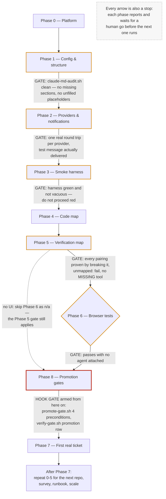

# Plugin reference

What each plugin in [`plugin/`](.) actually contains, and — for the parts that execute on their own — what starts running the moment it is enabled. The one-line catalog is in [`README.md`](README.md); this is the detail behind it.

Read the **Hooks** section of any plugin before installing it. Commands and agents wait to be asked. Hooks do not.

---

## `crew` — virtual dev team for multi-repo legacy work

| | |
|---|---|
| **Source** | [`crew/`](crew) |
| **Version** | 1.0.41<!-- claim: plugin-version:crew --> |
| **Install** | `claude plugin install crew@useful-claude-add-ons` |
| **Menu item** | 21, `repo-plugins` — **off by default**. Menu item 22, `graphify`, is a separate, also-off-by-default install of the `graphify` CLI this plugin's graph feature depends on — see **The code graph** below. |
| **Registers** | 4 agents, 35 commands, 29 skills<!-- claim: plugin-skills:crew -->, 34 hook entries (13 scripts × `.sh`/`.ps1`) across 8 events |
| **Upstream guide** | [`crew/README.md`](crew/README.md) — 25 sections, the authoritative version |

Built for the awkward case: several repositories, mixed stacks, legacy code, and almost no test coverage. The workflow is file-backed tickets, one implementation session, an independent reviewer, and deterministic gates that block on failure rather than offering an opinion.

Its central design claim is worth repeating, because it is the opposite of how most agent bundles are built: **a persona in a prompt adds no capability.** A role earns its place only if it buys an isolated context window, a restricted tool set, or genuinely independent eyes. Project management, business analysis, architecture, documentation, and training are files, commands, or you — there is nothing for an agent to isolate. Every custom subagent also loads your entire `CLAUDE.md` hierarchy at startup, so a 4,000-token `CLAUDE.md` across eight delegations is 32,000 tokens of overhead before any work happens.

### Hooks — the part that runs without being asked

Thirteen scripts across eight events, each shipped as a `.sh`/`.ps1` pair
registered on its own matcher or event — 34 hook entries. **These are why
menu item 21 is unticked by default.**

| Script | Event | What it does |
|---|---|---|
| `cloud-guard.sh` / `.ps1` | `PreToolUse` on the Bash / PowerShell tool | **Off by default** (`guards.cloudGuard`: `off`/`report`/`block`). Judges `terraform`/`tofu` apply/destroy, `aws` delete/terminate/`rm --recursive`, `az` delete/purge, SQL `DROP`/`TRUNCATE` and force push, and checks the effective AWS profile/region and Azure subscription against the pinned `cloud.*` values; an unknown identity is never allowed unattended, and it never emits an allow |
| `promote-gate.sh` / `.ps1` | `PreToolUse` on the Bash / PowerShell tool | Refuses a declared `deploy` command unless the `requires` environment has an all-pass row for this sha, the rollback runbook is verified inside 90 days, `requireHuman` is approved, and the tree is clean |
| `approval-hook.sh` / `.ps1` | `UserPromptSubmit` | Records a ticket's plan approval only when the prompt *you* typed is `/crew:approve <id>`: validates `spec.md` and `plan.md` and writes the receipt bound to both hashes, or blocks the prompt and says why. Any other prompt: no output, exit 0 |
| `scope-guard.sh` / `.ps1` | `PreToolUse` on Write/Edit/MultiEdit/NotebookEdit/Bash/PowerShell | **Off by default** (`scope.mode`: `off`/`report`/`block`/`auto`; `/crew:init` writes `auto` for a new repo). Refuses an edit with no current approval or outside the spec's Touch, and a shell command that runs `crew_ticket.py approve` or writes crew state — see "Scope and approval" |
| `completion-audit.sh` / `.ps1` | `Stop` | **Off by default**, same `scope.mode`. Diffs the whole tree against the ticket's start commit and blocks the stop once if any changed path is outside Touch, shell-made writes included |
| `handoff-read.sh` / `.ps1` | `SessionStart` | Resets its once-per-session markers; prints the prior handoff after a clear, compact, or resume only when `memory.inject` is false |
| `platform-sync.sh` / `.ps1` | `SessionStart` | Detects this machine and repairs the `platform` block in `.crew/config.json` - machine-local (`.crew/*` is ignored; the un-ignore list is `codemap/`, `endpoints.json`, `verify.json`), so the block goes wrong in place rather than in transit: one checkout opened from Windows and from WSL, or WSL2's `windowsHostIp` after a reboot. **Writes config**, and is the only hook that does: the seven derived facts (`os`, `wsl`, `wslVersion`, `distro`, `shell`, `repoFilesystem`, `windowsHostIp`) and nothing a human chose. Also recreates `config.json` itself when `.crew/` exists but the file is missing or unreadable - backing up a malformed one to `config.json.broken` first - and never when `.crew/` does not exist. Reports, without changing, a preference this OS cannot honour |
| `crew-context.sh` / `.ps1` | `SessionStart`, `UserPromptSubmit`, `PostToolUse` on Read/Edit/Write/MultiEdit and vault MCP tools, `SubagentStart` | **On by default since 1.0.0; `memory.inject: false` in `.crew/config.json` turns it off, and then it emits and logs nothing.** Injects branch/HEAD, code-map anchor state and the handoff at SessionStart, budgeted code-map slices and vault-labelled recall per turn, and is the only channel that reaches a dispatched subagent (`SubagentStart`). Never blocks. `handoff-read` stops printing the handoff while this is on, so the two never inject it twice |
| `verify-gate.sh` / `.ps1` | `Stop` | Runs the checks the changed paths map to; **fails the turn** on red, on a changed path with no rule, or on a deploy that wrote no promotion row. Honours `stop_hook_active`, so a red check cannot pin the session. Stands down while an emergency lane is open, recording what did not run |
| `context-watch.sh` / `.ps1` | `Stop` | Reads actual window occupancy from the transcript's last `message.usage` record and asks for a handoff once per session, at the later of `context.warnAt` and `context.reserveTokens` of remaining headroom; instructs a full wrap-up instead if `context.autoWrapUp` is `true`. On the following turn it invokes `auto-clear`, which is inert unless `context.autoClear.enabled` is `true` |
| `auto-clear.sh` / `.ps1` | called by `context-watch`, not registered | **Experimental, off by default.** Types `/clear` into the *terminal* once the handoff is written — it cannot clear the conversation, it drives the terminal the way a human would. `tmux` targets a pane by id; every other method needs an explicit `windowTitle` and refuses without one. Refusals go to `.crew/.autoclear.log`, because a `Stop` hook's stderr is invisible on exit 0 |
| `handoff-write.sh` / `.ps1` | `PreCompact` | Snapshots the transcript and writes a skeleton handoff before compaction discards it |
| `notify.sh` / `.ps1` | `Notification`, and called directly by commands | One outbound line to Teams or Telegram. Never reads, never accepts instructions |

**This is what "the moment the plugin is enabled" means in practice: a `SessionStart` hook now fires on every session's `startup`, unconditionally, in a repository with `.crew/config.json` present.** `crew-context`, `platform-sync` and `handoff-read` all run before you type anything, so enabling the plugin changes what the very first turn of every session looks like, not just what later tool calls are allowed to do.

**crew 1.0 removed the PM agent, its `pm-brief` SessionStart brief and its `pm-pulse` Stop hook.** Nothing in crew dispatches work on its own any more: one interactive session owns a ticket, and the Stop hooks that remain (`verify-gate`, `completion-audit`, `context-watch`) block on a failed check, not on a changed project state.

Every event is registered twice, once per flavour, each with the matching `shell` field on the PowerShell side — a `shell: powershell` entry is documented and Claude Code does read it, running that entry via PowerShell without needing `CLAUDE_CODE_USE_POWERSHELL_TOOL`. `promote-gate.sh` / `promote-gate.ps1` additionally branch on `tool_name` at the `PreToolUse` matcher (and `cloud-guard` inside `cloud_guard.py`) — a `PowerShell` tool call goes to the `.ps1`, a `Bash` tool call is judged by the `.sh` — because that is which language the command is actually written in, not which OS is running. Branching on the OS instead would judge bash commands with PowerShell rules on Windows, which blocks the correct secret-capture form and misses the wrong one. The other hooks judge no command, so both flavours are simply wired to their event with no branch. `hooks/scripts/_common.sh` also ships a `crew_tool_dispatch` helper for judging a command from inside a single bash-registered script; it is unused here in favour of the explicit dual-matcher registration above, but stays available for a hook that wants that shape instead.

A hook cannot be argued out of blocking `terraform apply`; an agent can. That is the entire value, and also the reason a bootstrap run should not install one without the box being ticked.

Committed suites, all sabotage-tested: `hooks/scripts/_test/run-tests.sh` (the gates and the emergency lane), `setup-walkthrough.sh` (32 cases running every setup-phase script against a real mixed-stack scratch repo), `validate-prompts.py` (298 structural checks over the commands, agents and skills), and `tests/` under pytest (1404 cases, including both flavours of `context-watch` and of the two gates that stand down). All but the pytest suite's Windows-only cases run in CI. What none of them proves is whether the prompts produce good work — that needs a live session on a real ticket, which is what setup Phase 7 is for.

**Every hook is inert until the repository has `.crew/config.json`.** Installing the plugin arms nothing - `/crew:init` in a repo is what turns the gates on there. A gate firing in every repository you opened would be hostile, so this is deliberate; it does mean "installed it, nothing happened" is expected rather than broken.

**The `Stop` gate is additionally inert until you build its map.** `verify-gate.sh` reads `.crew/verify.json`; with no such file there is nothing to run. `/crew:verify` builds it. Set `verifyGate: false` in `.crew/config.json` to disable the gate without uninstalling.

**Windows — fixed in 0.2.0, corrected in 0.3.0.** In 0.2.0 `guard.sh` and `verify-gate.sh` exited 0 on MSYS/MINGW to "defer" to `.ps1` twins that nothing ever invoked, so on Windows the command guard blocked nothing and the `Stop` gate ran nothing — which reads as "the gate passed" rather than "the gate never ran". 0.3.0 registers **both flavours on every matcher-less event on purpose**, not because each one fires — `hooks.json` has no way to know in advance which shell a given machine actually has, so both are wired and one is expected to fail; `PreToolUse` is the exception, where `guard.sh`/`guard.ps1` and `promote-gate.sh`/`promote-gate.ps1` are registered on separate `Bash` and `PowerShell` matchers instead, so the branch is by *which tool Claude used*, not by OS. The PowerShell side carries `shell: powershell`, a field Claude Code documents and reads — it runs that entry via PowerShell without needing `CLAUDE_CODE_USE_POWERSHELL_TOOL`. What is not configurable is the *default* interpreter for a bare `command` string with no `shell` field: that goes to `sh -c` on macOS/Linux and to **Git Bash** on Windows (PowerShell only when Git Bash isn't installed) — so a `bash` resolved from some non-MSYS parent process is not necessarily what runs it. On Windows this is measured, not hypothetical: Git for Windows ships two `bash.exe` binaries, and `usr/bin/bash.exe` exits 127 running these scripts where `bin/bash.exe` runs them fine, so which one resolves first on `PATH` decides whether the `.sh` side works at all; on a machine where a non-MSYS parent process resolved `bash` to the WSL launcher, the `.sh` side exited 127 on every script while the `.ps1` twin exited 0. **One flavour failing is expected behavior, not a bug** — it is not evidence the hook itself didn't run. What is genuinely unverified is the opposite combination, real hook-runner behavior with **no `pwsh` on Linux**; that was never exercised, so treat it as unconfirmed rather than assumed fine. The remaining requirement on Windows is that Git Bash (or WSL) is on `PATH` for the `.sh` half to have any chance; without any bash at all, that half never fires, and the plugin does not pretend otherwise.

**`python3` is no longer required.** The scripts resolve `python3`, then `python`, then `py`, and `guard.sh` prefers `jq` when it is present. With none of them available the affected hook says so on stderr and exits 0 rather than failing open in silence.

**`context.autoWrapUp`** (default `false`) changes what happens around the handoff, not whether it happens:
- `autoWrapUp` changes what `context-watch` tells the session to do at `warnAt` — reach a stopping point and write the handoff, instead of just asking for one. **The `/clear` itself stays manual regardless of this setting, because no hook can trigger one** — a hook runs as a child process and cannot reset its parent's conversation. Without stating that plainly, the feature reads as broken (why doesn't it actually clear?) rather than as what it is: bounded by a real constraint.
- Resuming needs no setting since 1.0.0: the context hook opens the next `SessionStart` after `/clear`, `/compact` or a resume already holding the last handoff, as `additionalContext`. The session opens **with the handoff in view**; it does not start working unattended. A human still gives the first turn. `context.autoResume` is no longer read.

### The code graph

`crew-graph` (below) wraps the third-party `graphify` CLI to build a code
graph at `graph.out` (default `graphify-out/graph.json`, configurable in
`.crew/config.json`), and `/crew:upgrade` (next) uses it to bring an older
setup forward. Neither is a hook — nothing here runs on its own — but both assume
`graphify` is on `PATH`, which is a **separate, off-by-default install**:
menu item 22 (`uv tool install graphifyy` — the PyPI package is `graphifyy`,
double-y; the CLI it installs is `graphify`). A keyless build needs both
`--no-viz` and `--code-only`: without `--code-only`, `graphify` errors on any
repository containing docs, rather than skipping them. Exporting the graph
into Obsidian is gated on `graph.obsidian.confirmed` being set explicitly by
the user in `.crew/config.json`; `/crew:upgrade` never sets that flag itself.

### The emergency lane

`/crew:emergency` is a time-boxed, recorded decision to stop gating while
something is actually broken. `.crew/incident.json` is the whole mechanism:
while it exists and its `expiresAtEpoch` is in the future, `verify-gate` exits 0
without running the checks and `promote-gate` computes its preconditions,
records the ones that failed, and allows the deploy anyway. Everything skipped
goes to `.crew/incident-skips.log`, one row per gate and reason, and
`/crew:emergency end` turns that into `.work/INCIDENT-<id>.md` plus an archived
record under `.crew/incidents/`.

Three properties are worth stating, because they are what make this safe enough
to ship:

- **It expires on its own.** The gates compare an integer epoch; no command runs
  and no file is touched to re-gate. Forgetting to close an incident - the
  realistic failure, since nobody forgets to declare one during an outage -
  cannot leave a repository permanently ungated. `emergency.ttlMinutes`
  defaults to 120 and `extend` is capped at `emergency.maxTtlMinutes` (480),
  measured from *now* each time, so repeated extensions cannot drift.
- **There is no command guard to stand down.** `guard.sh` / `guard.ps1` was
  REMOVED in 0.19.52, so nothing inspects a Bash or PowerShell command at any
  time, incident or not. Force pushes, destructive Terraform verbs, history
  rewrites and secret reads are no longer refused by crew. What still stands
  down under an incident is the `verify` and `promote` gates, which is
  precisely when someone is
  tired enough to need that hook.
- **A repo can forbid it.** `emergency.standDown: false` in `.crew/config.json`
  keeps every gate gating; the incident is still declared, recorded, and named
  in the session brief. For a repository where skipping verification is not a
  decision anyone local gets to make.

Every session start says so while an incident is open, and keeps saying so
after it expires unclosed - `incidentActive` and `incidentUnclosed` are the two
highest-priority PM triggers, above `upgradeNeeded`, and the incident line sits
in the brief's quiet lines so no line cap can truncate it away.

Enforcement is session-local, like every other gate here: an incident stands
the hooks down for sessions in this repository on this machine. It does nothing
to CI or to branch protection.

### Commands — 35, all explicit

| Command | Purpose |
|---|---|
| `/crew:approve <ticket-id>` | Approve a ticket's plan - only you can, by typing this; the prompt hook records the receipt |
| `/crew:autopilot [ticket id]` | Resume one ticket from the handoff and drive it through the lifecycle until a human is needed - off until `autopilot.mode: plan`; approval and review acceptance always stop |
| `/crew:brainstorm <what needs doing>` | Brainstorm a request into an approved direction, before it becomes a spec |
| `/crew:change <new \| status <id> \| close <id> \| list>` | File, check and close a change request — SDP, Jira or local |
| `/crew:config [--show]` | Show where every crew setting comes from, and guide the machine-global config |
| `/crew:debug <the symptom, or a ticket id, e.g. "login 500s after deploy" or T-0042>` | Find the cause of a defect before anyone proposes a fix |
| `/crew:diagram <architecture \| data-flow <area> \| process <name> \| sequence <flow> \| refresh>` | Create or refresh diagrams from the actual code |
| `/crew:docs [--audit]` | Update the documents this change should touch — and only those |
| `/crew:done <ticket id>` | Close a ticket - needs an accepted review receipt, a clean verify gate, a passing completion audit, current artifacts |
| `/crew:emergency <what is broken> \| status \| extend [minutes] \| end` | Declare an incident - stand the gates down, spin up parallel investigation lanes, and record what was skipped |
| `/crew:fix <one sentence - what is wrong and where>` | The light path - every lifecycle phase present, each compressed to one step |
| `/crew:gate <disable \| enable \| status> <github \| bitbucket>` | Take a repository's merge gate down and put it back, from the export |
| `/crew:handoff [--clear]` | Write the handoff note for the next session |
| `/crew:implement <ticket id>` | Implement an approved plan for a ticket, then tests, docs and review |
| `/crew:init [--status \| --phase N]` | Guided phased setup for this repo — resumable, one phase at a time |
| `/crew:jira-sync <ISSUE-KEY> [--push]` | Sync a ticket between Jira (via MCP) and the local cache |
| `/crew:migrate [--preview \| --apply \| --rollback <backup-dir>]` | One-time move of a 0.20 crew setup to the 1.0 layout - preview, backup, atomic apply, rollback |
| `/crew:model` | Show or change which model backs each crew role, and probe that it actually answers |
| `/crew:obsidian-sync <T-####> [--push]` | Sync a ticket between an Obsidian Kanban board and the local cache |
| `/crew:onboard [--refresh <subsystem>]` | Learn this codebase once and write a durable, verifiable code map |
| `/crew:plan <ticket id> [--approve]` | Turn an approved spec into a step-by-step plan, then get it approved |
| `/crew:promote <development \| qa \| production> [--dry-run \| --status]` | Promote a build to the next environment, with the full post-deploy proof |
| `/crew:reference [--api \| --features \| --audit \| <area>]` | Generate the API and feature reference from the code, with anchors |
| `/crew:review [ticket id]` | Independent QA review of the current diff (Codex, Copilot, or Claude - first that probes clean) |
| `/crew:runbook <name \| --from-ticket T-#### \| --audit \| --verify <name>>` | Write, update, or audit operational runbooks |
| `/crew:sdp-sync <REQUEST-ID> [--push]` | Sync a ticket between ServiceDesk Plus (via MCP) and the local cache |
| `/crew:spec <ticket id>` | Fill the ticket contract from an approved direction - Intent, Exclusions, Evidence, Unknowns, Touch, Acceptance checks |
| `/crew:split <ISSUE-KEY> [--dry-run]` | Split an oversized Jira ticket into sub-tickets, with evidence and a confirmation |
| `/crew:status [--memory]` | Read-only crew status for this repo - config, roster, tickets, review budget, gate, codemap, handoff |
| `/crew:survey [area, e.g. "performance" or "the billing module"]` | Research the app for real gaps and propose options with tradeoffs |
| `/crew:ticket <what needs doing>` | Removed in crew 1.0 - use /crew:spec |
| `/crew:upgrade` | Bring a pre-0.20 crew config up to the 0.20 schema so /crew:migrate can move it to 1.0 |
| `/crew:verify [--refresh] [--price]` | Build or refresh the verification map from evidence |
| `/crew:webtest <ticket id> [--stage spec\|implement\|heal\|evidence]` | Drive Playwright's Test Agents inside the ticket lifecycle - a healer skip is a finding, never accepted |
| `/crew:work <ticket id>` | Removed in crew 1.0 - use /crew:implement |

First run in a new repository: `/crew:init`, then `/crew:onboard`, then `/crew:verify`. A 0.20 repository runs `/crew:migrate --preview` first.

### Agents — one per `agents/*.md`

crew 1.0 ships four. The interactive session implements; these isolate context,
restrict tools, or supply independent eyes. Stack knowledge that used to be
specialist agents loads on demand as the `stack-*` skills, and nothing sizes
the crew up or down.

| Agent | Tools | Model | Tier | Role |
|---|---|---|---|---|
| `explorer` | read-only | `opus` | 0 | Maps code, returns summaries not contents |
| `reviewer` | read-only + Bash | `opus` | 0 | Hostile review; the last rung of `qa.order`. Renamed from `qa-reviewer` in 1.0 |
| `security` | read-only + Bash | `sonnet` | 1 | Exploitable defects in the diff |
| `researcher` | read-only + web | `sonnet` | 2 | External research only — docs, APIs, versions, vendor limits, standards, prior art. Every claim carries its source |

All four are read-only — a restricted tool set is one of the three things that
earns a role its place. `reviewer` runs on `opus` because it shares a model
family with the author when Codex and Copilot are both unavailable, and the
tier is the only compensation left. `explorer` also runs on `opus` (owner
decision, 2026-09-24): it maps unfamiliar code for every other role, and with
the `localgpu` semantic index disabled or unavailable it has only
Read/Grep/Glob, so a wrong map is inherited by everything built on it.

### Bundled skills — 29

These are ordinary skills, scoped to `crew`'s own workflow. They work on every Claude surface, including chat, unlike the hooks and agents.

| Skill | What it covers |
|---|---|
| `crew-setup` | Platform detection **and toolchain resolution**, nine phased setup steps, provider wiring, and reconciling an existing repo `CLAUDE.md` against the template section by section |
| `crew-change` | The change-request template, the ten questions a change board requires, and how each field maps onto ServiceDesk Plus, Jira and a local file |
| `crew-verification` | The change-to-check map, the `_verify/` layout, secrets handling, browser-test policy, and the five promotion gates for development -> qa -> production |
| `crew-context` | Context exhaustion — warn near the limit, write handoffs, resume after a clear or compact |
| `crew-best-practices` | Community best practices for Claude Code, audited against crew — what crew already does, the three architectural rules it departs from and why (ADR 0003), and the five contradictions the source records about itself |
| `crew-docs` | Keeping `CHANGELOG.md`, `README.md`, `SECURITY.md`, `TODO.md` and ADRs current as work lands, plus the anchored API and feature reference under `docs/reference/` |
| `crew-lint` | Linters and formatters for PowerShell, PHP, Python, Terraform, and JavaScript, wired into the gate |
| `crew-terraform` | `terraform-docs` and `tflint` for a module — header block, `footer.md`, README injection |
| `crew-runbooks` | Writing, indexing, and maintaining operational runbooks |
| `crew-diagrams` | Architecture and data-flow diagrams, with a Visio path |
| `crew-house-style` | House style for a document handed to a human — palette, headings, capitalization, and PDF vs DOCX vs HTML vs plain markdown. Routes generation to `anthropic-office-skills`, `ppt-master` and `visio-diagrams`; falls back to markdown and says so when none is installed |
| `crew-providers` | Codex as reviewer, Gemini as design partner, and verifying either |
| `crew-memory` | Obsidian-backed memory |
| `crew-notify` | Teams and Telegram payload discipline |
| `crew-cloud` | AWS and Azure MCP |
| `crew-graph` | Building and querying the `graphify` code graph, the reconcile shape `/crew:upgrade` reads, and the Obsidian export consent gate |
| `find-skills` | Discovering and installing other skills |
| `crew-debugging` | Root cause before any fix — reproduce, check recent changes, gather evidence from the code map and verification map, one hypothesis tested minimally. Backs `/crew:debug` |
| `crew-brainstorm` | Turn a request into an approved direction before it becomes a spec — one question per message, options with the recommendation first. Backs `/crew:brainstorm`; adapted from `superpowers` (MIT, `NOTICE.md`) |
| `crew-plan` | Turn an approved spec into a step-by-step plan — files, tests and risk per step, no placeholders, self-reviewed against Touch. Backs `/crew:plan`; adapted from `superpowers` (MIT, `NOTICE.md`) |
| `crew-execute` | Execute an approved plan task by task — TDD per step, a ruling instead of a silent deviation. Backs `/crew:implement`; adapted from `superpowers` (MIT, `NOTICE.md`) |
| `stack-angular` | Angular and AngularJS pitfalls, checks and `verify.json` wiring — change detection, RxJS, subscription leaks, injector hierarchy |
| `stack-bash` | Bash pitfalls, checks and `verify.json` wiring — quoting, pipeline exit codes, Git Bash surprises |
| `stack-dotnet` | .NET pitfalls, checks and `verify.json` wiring — DI lifetimes, async, EF Core change tracking, a short .NET Framework 4.8 section |
| `stack-powershell` | Windows PowerShell 5.1 and PowerShell 7 pitfalls, checks and `verify.json` wiring — encoding defaults, TLS, module compatibility, hardening |
| `stack-python` | Python pitfalls, checks and `verify.json` wiring — mutable defaults, exception widening, async, text/bytes encoding |
| `stack-sql` | SQL Server, MySQL and PostgreSQL pitfalls, checks and `verify.json` wiring — sargability, NULL semantics, per-engine locking |
| `stack-terraform` | Terraform pitfalls, checks and `verify.json` wiring — state, plan replacements, `count`/`for_each` re-indexing, module interfaces |
| `stack-web` | Playwright web UI testing pitfalls, checks and `verify.json` wiring — role/testid locators, web-first assertions, trace and visual-baseline discipline, accessibility via axe. Backs `/crew:webtest` |

### What it creates in a repository

Setup is nine resumable phases (`/crew:init`), and every artifact it writes is a file you can read and delete.

| Path | Written by | Holds |
|---|---|---|
| `.crew/config.json` | phase 1 | Provider, tracker, memory, context and notification settings |
| `.crew/verify.json` | phase 5 | Which checks a changed path requires, which specialist reviews it, and the promotion sequence per environment |
| `.crew/codemap/` | phase 4 | One note per subsystem, every claim anchored to `file:line` and a sha |
| `_verify/` | phase 3 | `smoke.sh`, `run-all.sh`, `cases/`, and a `README.md` recording what each check covers and when it last proved it could fail |
| `docs/reference/` | `/crew:reference` | Every endpoint and every headless capability, anchored |
| `.work/` | as work happens | Tickets, findings, the handoff note, and `PROMOTIONS.md` |
| `CLAUDE.md` | phase 1 | Created if absent; if present, missing sections are **appended, never overwritten** |

`.crew/*` and `.work/` must be gitignored (`.crew/*` with the glob, plus the named un-ignore list `!.crew/codemap/`, `!.crew/endpoints.json`, `!.crew/verify.json`) - the operator creates an approval marker under `.crew/` and the gate writes `.crew/.deploy-in-flight` there, and either one tracked dirties the tree and blocks the next deploy.

### Setup phase order

Source of truth: `crew-setup/phases.md`. Its numbers run 0-8, but its body does
not: the sections appear as 0, 1, 2, 3, 4, 5, 6, then **8** (Promotion gates),
then **7** (First real ticket), and the closing section is titled "After Phase
7". Two things in the file agree that First real ticket runs last — where the
section sits, and that closing heading, whose content ("repeat Phases 0-5 for
the next repo", "run `/crew:survey` now that there is a safety net worth acting
on") only makes sense from the end. Only the numbers disagree, and the phase
table is sorted by number rather than making a claim about order. So the
sequence below is **0-6, 8, 7** — the order the prose runs in, not the order
the numbers suggest.



**Skippable:** Phase 6 is the only phase that can be marked `n/a` outright, and
only when the repo has no UI. Two phases have optional *parts* without being
skippable themselves — Phase 2's notifications and Cloud MCP halves, and Phase
5's Terraform sub-step, which only applies when there are `.tf` files. Phase 3
can end `blocked`, which is not a skip: it stops the sequence rather than
letting it past.

**Gated.** One gate is mechanical and the rest are written, and the difference
is the point:

- **Phase 8 is enforced by hooks.** `promote-gate.sh` refuses any command
  matching a declared `deploy` entry unless all four preconditions hold for the
  sha at HEAD, and `verify-gate.sh` will not let a turn end after a deploy that
  wrote no `.work/PROMOTIONS.md` row.
- **Phases 1, 2, 3, 5 and 6 are stop-and-prove gates** — written into
  `phases.md`, not enforced by code, but each closed by a named artifact or a
  script's verdict rather than by judgement. Phase 1 is done when
  `claude-md-audit.sh` reports no missing sections and no remaining
  placeholders. Phase 2 is done on a real round trip per provider and a test
  message that arrived, explicitly not on something being found on `PATH`.
  Phase 3 says do not proceed to Phase 4 with a red or vacuous harness. Phase 5
  is done when every pairing has been proven by breaking the code and watching
  the mapped check go red, `"unmapped"` is `"fail"`, and `resolve-tools.sh`
  reports no MISSING tool. Phase 6 is done when `npx playwright test` passes
  **with no agent attached**.
- **Phase 0 needs a human acceptance** — any CRLF or filesystem problem is
  either fixed or explicitly accepted, and nothing is re-cloned without asking.
- **Every phase boundary is a gate**, which is the one that does not belong to
  any phase: setup runs one phase, then stops and reports, and does not chain
  into the next without being told to go.

Phase 4 is the one phase with no gate. Its done-when is satisfied by producing
the code map and **reporting** which areas are still unmapped, so it closes
with known gaps rather than refusing to close on them.

Phases 3 and 5 also arm the machinery the later phases are judged by, which is
the concrete reason they come first. With no `.crew/verify.json` yet,
`verify-gate.sh` falls back to running `_verify/smoke.sh` — Phase 3's artifact
(`plugin/crew/hooks/scripts/verify-gate.sh:122-130`). Once Phase 5 has written
the map, the same gate checks the rules a changed path requires and refuses to
end the turn on unmapped changes (`verify-gate.sh:189-190`).

**Why 8 precedes 7:** Phase 7 is the acceptance test of the assembled system,
so everything it is meant to shake down has to be armed before it runs. Its
output is the awkward-parts feedback, and that feedback is only worth having if
promotion is part of what was exercised. Phase 8 is also where `.gitignore`
grows to cover `.crew/` and `.work/` — the directories Phase 7's `/crew:implement`
immediately starts writing into, and an ungitignored marker there dirties the
tree and blocks the next deploy.

**None of it is durable outside a crew session.** `guard.sh`, `verify-gate.sh`
and `promote-gate.sh` are hooks that live in whichever Claude Code session has
the crew plugin active. A phase marked `done` records that the setup work
happened once; it says nothing about whether the session open right now has the
plugin enabled. A teammate who never installed crew gets none of these gates,
even with `CLAUDE.md`, `.crew/verify.json` and `.crew/STATUS.md` all sitting
there looking fully set up.

Per phase, what it produces and what going wrong looks like:

- **Phase 0 — Platform.** Produces a recorded `platform` block in
  `.crew/config.json` and every tool the repo needs resolved to a form that
  actually runs on this machine (native, or `wsl.exe -e <tool>`). Wrong looks
  like a rule calling `terraform validate` on a shell where terraform only
  exists in WSL — the gate reports "command not found" as a failed check
  instead of a missing tool, and someone loses an afternoon to a config bug
  that was never there. **Gated on a human:** any CRLF or filesystem problem is
  fixed or explicitly accepted, and nothing is re-cloned without asking first.
- **Phase 1 — Config and structure.** Produces `.crew/config.json` (reviewer,
  tracker, memory, `pm.authority`), the repo's `CLAUDE.md` (created, or
  appended to — never regenerated), and the context/handoff settings. **Gated
  by a script:** `claude-md-audit.sh` compares the repo's `CLAUDE.md` against
  the template section by section, and the phase does not close while it still
  reports a missing section or an unfilled placeholder. Wrong
  looks like a repo ending up crew-managed with no promotion discipline and
  no stop-and-ask list because missing `CLAUDE.md` sections were silently
  skipped, or `pm.authority` resolving to something other than what was just
  chosen because a machine-global file was already deciding it.
- **Phase 2 — Providers and notifications.** Produces a reviewer chain proven
  by one real round trip each (not just found on `PATH`), a design second
  opinion, and a notification channel that has actually delivered a test
  message. **Gated:** presence on `PATH` and a pasted webhook URL do not close
  this phase; a completed call and a message someone actually saw do. Wrong
  looks like an `events` list set to everything — a channel that pings
  constantly gets muted within a week, and a muted channel is worse than none
  because the team believes it is covered.
- **Phase 3 — Smoke harness.** Produces `_verify/` with a green `smoke.sh` in
  under 90 seconds, 5-9 real checks, and a `README.md` recording what each
  covers. **Gated:** does not proceed to Phase 4 with a red or vacuous
  harness — a gate that passes because it checks nothing is worse than no
  gate at all.
- **Phase 4 — Code map.** Produces `.crew/codemap/INDEX.md`, one note per
  subsystem, every claim anchored to a file path and a sha. Wrong looks like
  an anchor asserted without the file having actually been read, or an
  unmapped area folded quietly into "done" instead of reported as a gap.
- **Phase 5 — Verification map.** Produces `.crew/verify.json` mapping
  changed paths to checks with `"unmapped": "fail"`, plus linter and
  Terraform rules, with every pairing verified by breaking the code and
  confirming the mapped check goes red. **Gated:** not done until
  `resolve-tools.sh` reports no MISSING tool either — a rule naming a tool this
  shell cannot run is a check that fails on the turn someone needed it. Wrong
  looks like a pairing that stays green when broken — a coverage hole, and
  finding it is half the point of this phase — or a script in `_verify/` that
  no rule names, so it never runs.
- **Phase 6 — Browser tests (skippable).** Produces Playwright specs and
  visual baselines for the two or three flows where breakage is expensive,
  Chromium only unless there is evidence of a browser-specific bug, and with
  Playwright installed and confirmed by `npx playwright test --list` before any
  spec is written. Explicitly `n/a` when there is no UI; otherwise **gated** on
  `npx playwright test` passing **with no agent attached**. Wrong looks like
  chasing exhaustive coverage instead of the handful of flows that matter, or
  skipping it for a repo that does have a UI because it is the path of least
  resistance.
- **Phase 8 — Promotion gates.** Produces the `environments` block in
  `verify.json` (deploy, smoke, regression, rollback, soak per environment),
  `requireHuman: true` on production, and a rollback runbook with a fresh
  `last verified` date. **The one gate here that is enforced by code rather
  than written down:** from here on, `promote-gate.sh` refuses any command
  matching a declared
  `deploy` entry unless every precondition already holds, and `verify-gate.sh`
  will not let a turn end after a deploy that wrote no promotion row. Wrong
  looks like an `environments` block with five aspirational commands nobody
  has run — it reads as coverage while being worse than an empty file.
- **Phase 7 — First real ticket.** Produces one small, real change carried
  through `/crew:brainstorm` -> `/crew:spec` -> `/crew:plan` -> `/crew:implement` ->
  `/crew:review` -> `/crew:done` end to end, plus the awkward-parts feedback that gets fed back into the command
  prompts themselves. Wrong looks like picking something too large — which
  tests the code instead of the loop — or treating one clean run as proof the
  prompts are good rather than proof this one ticket went well.

The code map and the verification map come before the first real ticket
because work reviewed against nothing is unreviewed. Phase 4 gives the review
something to read the change against, Phase 5 gives it the rules a changed
path must satisfy, and only then is Phase 7's `/crew:review` doing anything a
turn later could not have done by eye. Run the ticket first and the loop still
completes — it just completes against an empty map, which looks exactly like
success.

### Testing

Four committed suites, all sabotage-tested - three under `plugin/crew/hooks/scripts/_test/` and the pytest suite under `plugin/crew/tests/`:

| Suite | Cases | Covers |
|---|---|---|
| `run-tests.sh` | 101 | Every gate: what the command guard blocks and allows, root-level glob matching, the stop-loop exit, all four promotion preconditions, and that `stop_hook_active` never blocks |
| `setup-walkthrough.sh` | 32 | Builds a mixed-stack scratch repo and runs every script phases 0-8 invoke |
| `validate-prompts.py` | 110 | Frontmatter, tool names, referenced agents and paths, read-only agents holding no write tools |
| `tests/` (pytest, one level up) | 324 | The Python behind the hooks: `crew_state`, `crew_context`, both flavours of `context-watch`, and the two gates that stand down. Run it — it is the suite that catches regressions the shell suite cannot see |

What none of them proves is whether the prompts produce good work. Every command and every agent is an instruction to a model; only a live session on a real ticket exercises those, which is what setup phase 7 is for.

### Optional integrations

All off unless configured: Codex as an independent reviewer, Gemini as a design partner, Jira or ServiceDesk Plus over MCP, an Obsidian Kanban board for tickets, Obsidian for memory, and Teams or Telegram for notifications. `crew` works with none of them. The Kanban tracker is the one integration with nothing to connect to — its precondition is a vault directory that exists, not a connector that authenticates.

### Uninstall

```bash
claude plugin uninstall crew@useful-claude-add-ons
```

The hooks go with it. To keep the plugin but stop the `Stop` gate, set `verifyGate: false` in the repository's `.crew/config.json`.

---

## `gizmoduck` — Nuclei scans, diffed and triaged into tickets

| | |
|---|---|
| **Source** | [`gizmoduck/`](gizmoduck) |
| **Version** | 0.5.3<!-- claim: plugin-version:gizmoduck --> |
| **Install** | `claude plugin install gizmoduck@useful-claude-add-ons` |
| **Registers** | 6 commands, 1 skill. **No agents, no hooks** — nothing runs unless you type a command |
| **Upstream guide** | [`gizmoduck/README.md`](gizmoduck/README.md) |

Runs [Nuclei](https://github.com/projectdiscovery/nuclei) against hosts and websites, then does the part that usually gets skipped: diffs the run against a baseline so you see what is genuinely new, renders a triaged report, and turns Critical and High findings into ServiceDesk Plus tickets after one batch confirmation. Nuclei is MIT-licensed and self-hosted, so the whole loop runs locally — no export step, no API quota, no findings leaving the machine.

**Only scan assets you own or have written permission to test.** The bundled skill says so in its first paragraph and tells the session to confirm authorisation when a target does not look like the user's. That is a prompt, not an enforcement mechanism: nothing here can tell whose host an IP is, so the check is yours to actually make.

### Commands — 6

| Command | Does |
|---|---|
| `/gizmoduck:scan <target> [sev]` | Scan a URL, host, or a file of one target per line; summarise, report, then confirm the batch and open tickets for Critical and High |
| `/gizmoduck:report <findings.jsonl> [sev]` | Re-render a report from findings already captured — Markdown, HTML, or PDF — without paying for another scan |
| `/gizmoduck:tickets <findings.jsonl> [sev]` | Confirm the batch, then open or sync ServiceDesk Plus tickets from a findings file |
| `/gizmoduck:diff <old.jsonl> <new.jsonl> [sev]` | What is present in the new run and absent from the old, keyed on template plus location |
| `/gizmoduck:update` | Update the Nuclei engine and the community template set |
| `/gizmoduck:doctor` | Which half of the toolchain is missing — `nuclei`, templates, `python`, or the PDF renderer |

`scan` defaults to `--severity critical,high,medium` and reports at High and above; both are overridable per invocation. The severity floor for *tickets* is separate from the floor for the *report*, which is the point — Mediums belong in the document, not in somebody's queue.

### The CLI underneath

Everything is one Python file, `scripts/gizmoduck.py`, with `scan`, `summary`, `report`, `tickets`, `diff`, `doctor`, and `update` subcommands. It is usable directly, which matters for scheduling: a cron job or a scheduled task can run the scan and the diff without a Claude session in the loop.

`tickets` does not call ServiceDesk Plus itself, and it is gated: without `--yes` it prints a preview of the candidate tickets (severity + subject, one per line), a digest over that exact batch, and the rerun command carrying it, then exits 3 with a `GIZMODUCK_CONFIRMATION_REQUIRED` marker, emitting no records at all. Only with `--yes <digest>` — the digest the preview just printed, passed after the batch has been shown to and approved by the user — does it emit one ticket payload per finding: subject prefixed `[Nuclei <template-id>]`, severity, CVSS, CVE, affected hosts, remediation. A `--yes` whose digest does not match what `tickets` recomputes right now — a different findings file, a different `--min-severity`, findings that changed in between — is refused with `GIZMODUCK_APPROVAL_MISMATCH` rather than silently creating whatever the current batch turns out to be. The session then opens or updates the approved records through the ServiceDesk Plus tools it already has. The template-id prefix is what makes the second run idempotent: a finding whose ticket is still open gets a note instead of a duplicate.

Those payloads are behind `--create`, and the flag withholds rather than warns. A plain `tickets` run returns `"mode": "preview"` with each finding's subject, severity and target count and **no description field at all** — there is no body to file, so a caller that skips the prose still cannot open a ticket from it. `--create` is what generates the bodies, and the command files that ship with the plugin only reach for it after the user has been shown the preview and answered. The `[Nuclei <id>]` de-dupe search is not that confirmation: it chooses between creating a request and noting an existing one, and both of those write.

Findings are deduplicated by template and location before anything is reported or ticketed, so one misconfiguration across forty hosts is one finding with forty affected targets rather than forty findings.

### What it needs installed

`bootstrap.sh` (WSL/Linux) and `bootstrap.ps1` (Windows) fetch the prebuilt Nuclei binary and the community templates. PDF output needs `wkhtmltopdf` — `bootstrap.sh` installs it; on Windows it is `winget install wkhtmltopdf`. Markdown and HTML reports work without it, and `report --format pdf` degrades to saying so rather than producing a truncated file.

Run `/gizmoduck:doctor` before assuming a scan failure is a scan failure. Most first-run problems are a missing template set or a `python` that is not on `PATH` under whichever shell the command landed in.

### Uninstall

```bash
claude plugin uninstall gizmoduck@useful-claude-add-ons
```

Nothing keeps running afterwards — there were no hooks. The Nuclei binary and templates that `bootstrap` installed are outside the plugin and stay where they are.

---

## `localgpu` — the GPU in this machine, as a sidecar

| | |
|---|---|
| **Source** | [`localgpu/`](localgpu) |
| **Version** | 0.1.20<!-- claim: plugin-version:localgpu --> |
| **Install** | `claude plugin install localgpu@useful-claude-add-ons` |
| **Registers** | 6 commands, 1 skill. **No agents, no hooks** — nothing runs unless you type a command. `/localgpu:setup` additionally writes one stdio MCP server into the repository's own `.mcp.json`, which you approve through `/mcp`. The bootstrap separately installs a `localgpu` console script into `$LOCALGPU_HOME/venv`, which Claude Code neither registers nor runs |
| **Upstream guide** | [`localgpu/README.md`](localgpu/README.md) |

Puts a local model behind a repository, in two halves that are installed together and used apart. The **MCP server** is the one that earns its keep: [Ollama](https://ollama.com) serves `nomic-embed-text` for embeddings and `qwen2.5-coder:7b-instruct-q4_K_M` for chat on `127.0.0.1:11434`; a Python MCP server chunks the tree, embeds it into a vector store under `$LOCALGPU_HOME/index/`, and exposes semantic search over it to the session you are already in. The **CLI** is the other half: `localgpu shell` launches a *separate* Claude Code session whose every token comes from the local model, through a proxy that translates the Anthropic Messages API into Ollama's `/api/chat`. No prompt, no file, and no embedding reaches a vendor either way, which is the reason to run it — code that is not permitted to leave the network still gets search by meaning and a fast first-pass answer.

**The local model is a triage tier, not a second opinion.** A 7B model at 4-bit quantization is several tiers below the model reading these commands, and every command that reaches for it says so: `/localgpu:ask` labels its output `qwen2.5-coder:7b (local)` rather than folding it into the session's own prose, refuses to answer when the retrieval came back thin, and always prints the `file:line` excerpts it was given. An unattributed 7B claim inheriting a frontier model's credibility is the failure mode the whole plugin is written around.

### Commands — 6

| Command | Does |
|---|---|
| `/localgpu:setup [--no-pull]` | Six detect-then-act steps: resolve `$LOCALGPU_HOME`, verify Ollama is installed *and* serving, pull the two models (~5 GB), run the bootstrap (venv, dependencies, the `localgpu` CLI), write the config, and register the MCP server. Asks before writing anything, then deliberately hands off rather than indexing — a first build is minutes of GPU time and belongs to a command the user chose to run |
| `/localgpu:doctor` | Seven checks — Ollama, model tags, venv, config provenance, index freshness, MCP registration, VRAM discipline — each `OK`/`WARN`/`FAIL`, reported whether or not they pass, ending in exactly one next step |
| `/localgpu:index [--full] [--root <path>]` | Build or refresh the index. Incremental by default and touching only files whose content hash changed; `--full` confirms first |
| `/localgpu:search <query> [--k N] [--glob <pattern>] [--root <path>]` | Semantic search — `file:line` plus a three-line excerpt. Calls the `search_code` MCP tool directly |
| `/localgpu:ask <question> [--k N] [--glob <pattern>]` | Retrieve with `search_code`, then put the question plus the excerpts to the chat model. Reports the answer, its sources, and the model that produced it |
| `/localgpu:crew` | Report-only: which `crew` roles a local 7B could take over and which it must not, ending in the one route that is supported — `localgpu shell`, a separate session. Writes nothing — not `.crew/config.json`, not an environment variable, not a shim on `PATH` |

`setup` will not install Ollama for you. It registers a background service and a GPU runtime, so the command stops and points at the installer rather than doing it silently.

### The MCP server

`mcp/server.py`, run by the venv's Python over stdio, backed by `config.py` (two config layers — repo `.localgpu/config.json` over machine `$LOCALGPU_HOME/config.json` over built-in defaults, nearest wins), `ollama.py` (the HTTP client), `indexer.py` (walk, chunk, embed) and `store.py` (the vector file). Three tools: `search_code(query, k=10, root=None, path_glob=None)` — the one the commands call — plus `index_status()` (what is indexed, how stale, and whether Ollama answers) and `index_refresh(root=None)`, which refuses rather than queues while another refresh is running.

Registration is per repository: `/localgpu:setup` renders `skills/localgpu/templates/mcp.json` into the repo's `.mcp.json`, expanding `{{LOCALGPU_PYTHON}}`, `{{LOCALGPU_PLUGIN_ROOT}}` and `{{LOCALGPU_HOME}}`. An unexpanded placeholder is a server that will not spawn and a Claude Code error that does not name the cause, so `/localgpu:doctor` checks for it explicitly — and separately checks whether the tools are actually callable in this session, since registering a server is not the same as having approved it through `/mcp`.

### The `localgpu` CLI, and the proxy underneath it

`pyproject.toml` installs one console script, `localgpu` (`cli/localgpu_cli.py`), into `$LOCALGPU_HOME/venv`. It is not a slash command and Claude Code never runs it; it is typed in a terminal, and it resolves only where that venv's `bin`/`Scripts` directory is on `PATH` or the full path is used. Two subcommands:

| Command | Does |
|---|---|
| `localgpu shell [--model M] [--port N] [--keep-alive D] [--verbose] [-- <claude args>]` | Starts the proxy on a loopback port (`--port 0`, a free one, by default) and launches a **separate** `claude` process against it. Trailing arguments pass straight through to `claude` |
| `localgpu proxy [--model M] [--host H] [--port 8817] [--keep-alive D]` | Runs the same proxy in the foreground, verbose, for debugging it or for pointing something other than Claude Code at the local model |

Both preflight against Ollama first — the configured `chat_model` has to be pulled — so a missing model fails before a session starts rather than three prompts into one. `shell` prints a banner naming the model, the proxy URL and the Ollama URL on every launch, because the catch is not enforceable: **everything** in that session is the 7B, including any `/crew:*` command run inside it. It is for exploring and drafting, not for gates.

The child process gets `ANTHROPIC_BASE_URL` and a placeholder `ANTHROPIC_API_KEY`, and it gets `ANTHROPIC_AUTH_TOKEN` and `ANTHROPIC_PROFILE` **removed**. Either of those outranks the API key and would send the session back to the real API silently, which is the worst possible way to discover you were never on the local model. Your own session, and crew's config, are untouched — that separation is the whole design, and `/localgpu:crew` is where the alternatives are refused in writing.

`cli/anthropic_proxy.py` is the translation that makes the two ends meet, and it exists because they otherwise do not: `ANTHROPIC_BASE_URL` makes the client POST `/v1/messages` in the Anthropic Messages format, while Ollama's OpenAI-compatible surface is `/v1/chat/completions` with a different body — point one at the other and every request 404s. It serves the slice Claude Code actually calls: `POST /v1/messages` (streaming and not), `GET /v1/models`, and `GET /health` (also `/v1/health`). Anything else is a 404 in Anthropic's own error shape.

| Crosses intact | Does not cross, and says so rather than faking it |
|---|---|
| System prompts, multi-turn text, tool definitions, tool calls, tool results, stop sequences, `temperature`/`top_p`/`top_k`, `max_tokens` (as `num_predict`), and both reply modes — non-streaming JSON and Anthropic's SSE event order | **Images** — a 7B coder model has no vision, so an image block becomes a visible placeholder instead of vanishing. **Thinking blocks** — nothing is synthesised. **Prompt caching** — `cache_control` is accepted and ignored, and the usage numbers report zero cache hits. **Token counts** — Ollama's own prompt and eval counts are passed through; they are not Anthropic's tokenizer and will not match it |

One piece of it is not a nicety. `qwen2.5-coder:7b-instruct-q4_K_M` — the model this plugin ships with — answers a tools request by writing `{"name": ..., "arguments": {...}}` into `content` and leaving `tool_calls` empty. Claude Code reads that as prose: the tool never runs, `stop_reason` stays `end_turn`, and nothing errors. `recover_text_tool_calls` promotes it to a real `tool_use` block, under four conditions that all have a must-not-fire test — tools were actually offered, the whole message body is one JSON value, it is an object or a list of objects, and every name is one of the offered tools. Prose that merely discusses JSON fails the second and is left alone. Streaming holds back only text that might still resolve to a bare JSON call, so ordinary prose still streams token by token.

The CLI is installed **editable** on purpose (`pip install -e`, bootstrap step 3): `localgpu_cli.py` resolves its sibling `mcp/` directory from its own `__file__`, and a copied install puts that `__file__` in `site-packages`, where `mcp/` does not exist. That directory is deliberately not a package — the name would shadow the MCP SDK. A non-editable install is detected at import and exits with the fix rather than a bare `ImportError`.

### Hooks — none, deliberately

`localgpu` registers **no hooks**, so **nothing starts running the moment it is enabled**. Every part of it waits to be typed: no `PreToolUse` guard, no `Stop` gate, no `SessionStart` brief. There is no background indexer and no watcher — the index goes stale until someone runs `/localgpu:index`, which is a tradeoff the plugin makes on purpose rather than an omission. A hook here would mean GPU work firing on somebody else's schedule, and on an 8 GB card that is not free: it evicts whatever model was resident.

The heavy things this plugin depends on — Ollama, the virtualenv, and roughly 5 GB of model weights — are installed by `/localgpu:setup`, not by installing the plugin and not by the bootstrap scripts. Ticking `localgpu` in the install menu copies commands, a skill and Python source onto the machine and downloads nothing.

### VRAM is the constraint everything else bends around

Two models, one card. `bootstrap.sh` / `bootstrap.ps1` and every command that touches Ollama hold `OLLAMA_MAX_LOADED_MODELS=1` with a short `keep_alive`, because the failure mode when they co-reside is not an error — it is an index run getting an order of magnitude slower partway through, which reads as "big repo" rather than "misconfigured". `/localgpu:index` checks `/api/ps` before it starts, and `/localgpu:ask` says outright that interleaving an ask with a build is the one combination to avoid.

Changing `embed_model` invalidates the whole index: vectors from two embedding models are not comparable, and appending to a mixed index degrades every search without ever erroring. `manifest.json` records the model the vectors were built with, and a disagreement with the config is a `FAIL` and a forced `--full` rebuild, not a warning.

### Bundled skills — 1

| Skill | Covers |
|---|---|
| `localgpu` | The paths, the two config layers and their precedence, the model tags, the VRAM rules, and the `mcp.json` template the commands render. Every command reads it before acting |

### Testing

Two suites, both run by the venv's Python, neither needing Ollama, a GPU or a network.

| Suite | Covers |
|---|---|
| `mcp/_test/` | Config layering and precedence, the Ollama client, chunking and indexing, and the vector store |
| `cli/_test/` | 46 tests over the proxy: the wire format as pure functions in `test_proxy_translation.py` (system prompts, content blocks, the tool-call round trip, options, non-streaming replies, the SSE event sequence), and the same proxy on a real bound socket against a fake Ollama in `test_proxy_server.py` (routing, status codes, chunked SSE framing, and the text a user sees when Ollama is down or the model is not pulled) |

The proxy suite carries a sabotage log — four regressions reintroduced as real edits to `anthropic_proxy.py`, each confirmed red — and a warning worth reading before adding a file: `cli/_test` has no `conftest.py` on purpose. Both `_test` directories are outside any package, so pytest imports each `conftest.py` under the same top-level name and one silently wins, breaking every `mcp/_test` module that imports helpers from it — but only when both suites run in the same invocation, which is exactly what a full run is. The path setup is inlined in each test module instead.

There are no hooks, so there is no blocking-hook regression suite to sabotage-test. What no test proves is whether a 7B model's answers are any good; that is what the attribution rule in `/localgpu:ask`, and the banner on every `localgpu shell`, exist to keep visible.

### Uninstall

```bash
claude plugin uninstall localgpu@useful-claude-add-ons
```

Nothing keeps running afterwards — there were no hooks. Ollama, the models it pulled, `$LOCALGPU_HOME` (the venv, the config and the index), and the repository's `.mcp.json` entry are all outside the plugin and stay where they are; remove them by hand for no trace. The `localgpu` console script is the one loose end: it was installed editable against the plugin directory, so it stops working the moment that directory goes and wants `pip uninstall localgpu` in the venv rather than being left as a broken entry point.

---

## `obsidian-vault` — one or more Obsidian vaults as Claude Code memory

| | |
|---|---|
| **Source** | [`obsidian-vault/`](obsidian-vault) |
| **Version** | 0.4.14<!-- claim: plugin-version:obsidian-vault --> |
| **Install** | `claude plugin install obsidian-vault@useful-claude-add-ons` |
| **Registers** | 2 agents, 11 commands, 3 skills, 8 hook entries (3 scripts × `.sh`/`.ps1`) across 4 events |
| **Upstream guide** | [`obsidian-vault/README.md`](obsidian-vault/README.md) |

Makes one or more Obsidian vaults Claude Code's durable, token-efficient
memory: code choices, decisions, architecture, links between code, and
patterns - captured automatically at session end, gardened into concepts,
recalled cheaply, and mapped visually. No vault path is hardcoded; it resolves
from an env var, a config file, or Obsidian's own vault registry, in that
order. Named `obsidian-vault` rather than `obsidian` so it cannot collide with
a third-party plugin already named plainly `obsidian`.

**Multi-vault by design.** `~/.claude/obsidian/config.json` models named
vaults (`vaults: { memory: {...}, codegraphs: {...} }`), because a code-graph
export vault commonly runs into hundreds of thousands of notes on the same
machine as a hand-curated one - a different scale with a different set of
rules. Local REST API is per-vault, so this plugin registers one MCP server
per vault, never one server juggling two.

### Hooks — the part that runs without being asked

Three scripts across four events (`vault-capture` is registered twice, for
`SessionEnd` and `PreCompact`), each a `.sh`/`.ps1` pair delegating to one
shared Python module per script, so the two flavours cannot drift - 8 hook
entries.

| Script | Event | What it does |
|---|---|---|
| `bridge-status.sh`/`.ps1` | `SessionStart` | Probes **every configured vault's** Local REST API bridge (each on its own port) and states plainly whether each `mcp__obsidian-<name>__*` will work this session, with the specific fix for each failure mode (not running, wrong port enabled, rejected key). Never blocks - a `SessionStart` hook cannot, and "the bridge is down" is information, not a reason to refuse a turn. Claims the session once via a lock file so both interpreters firing (normal on Windows) does not print the context twice. |
| `vault-guard.sh`/`.ps1` | `PostToolUse` on `Edit`/`Write`/`MultiEdit` | Enforces the *default* vault's frontmatter contract, ASCII-only rule, and canvas well-formedness. **The frontmatter and ASCII rules ship OFF; the canvas shape check ships ON** in `~/.claude/obsidian/config.json` (`checkCanvas` defaults true - a `.canvas` that does not parse opens blank with no error, and checking costs nothing) - a fresh install must not reject prose against a different vault's house rules. `/obsidian-vault:init` turns a toggle on only when it finds the matching rule stated in the target vault's own `CLAUDE.md`. Can block (exit 2) with the specific violation and fix on stderr. A non-default vault (a generated code-graph vault, say) is never held to this contract. |
| `vault-capture.sh`/`.ps1` | `SessionEnd`, `PreCompact` | Appends one line (session id, cwd, transcript path) to the default vault's `inbox/pending-reflect.md` for the gardener to process later. Costs nothing, never raises - a capture miss must not break a session. |

**This is what "the moment the plugin is enabled" means in practice:**
`bridge-status` fires on every session start once at least one vault resolves,
and `vault-guard` fires on every edit to a file inside the default vault - but
with the frontmatter and ASCII rules off by default, a fresh install changes
nothing about the prose you can write until `/obsidian-vault:init` or you turn
a toggle on deliberately. A `.canvas` file is the exception: `checkCanvas`
defaults true, so a canvas that does not parse is rejected on a fresh install.

**`vault-guard` is the one hook that can block**, and ships a committed,
sabotage-tested regression suite: `obsidian-vault/hooks/scripts/_test/run-tests.sh`
(65 assertions, must-block and must-allow, including one proving the config
toggles actually gate the checks, and three holding the three defaults above to
a config that carries no `guard` key at all). Sabotage-tested means exactly that: the ASCII check
was disabled once during development to confirm the suite goes red rather than
staying green, per this repo's rule that a hook allowed to block needs proof
its suite can catch a real regression, not just that the suite exists.

### Commands — 11

| Command | Does |
|---|---|
| `/obsidian-vault:init [name] [path]` | Install/configure Obsidian, the REST bridge, and this plugin's config for one vault - see the `obsidian-setup` skill for the full steps |
| `/obsidian-vault:doctor` | Diagnose every configured vault's bridge by running `vault_ops.py diagnose`, plus a git-configured-but-not-a-git-repo default vault (Obsidian Git firing into the void on a timer), `CLAUDE.md` drift against what the filesystem actually shows, gardener staleness, and empty structural folders. Read-only, and its tool list enforces that rather than asserting it - the acting is `/obsidian-vault:repair` |
| `/obsidian-vault:repair` | The acting counterpart to `doctor`: reassign colliding ports, reload a vault so a `data.json` edit takes effect, and re-register its MCP server, for one vault or all. Shows the plan before applying and takes a yes per operation |
| `/obsidian-vault:install` | Enable the plugin set the vault's **profile** calls for - the Local REST API floor for any vault Claude must reach, plus `code-graph` for a generated vault or the fuller authored set for a human one - check the new vault's ports against every other vault's, then register its MCP server. Each plugin is confirmed on its own; a set is never enabled behind one yes |
| `/obsidian-vault:note <type> <title>` | Create a note that satisfies the memory contract on the first write, from the templates this plugin now ships - `memory`, `concept`, `decision`, `session`, `source`, `design` |
| `/obsidian-vault:optimize` | Reports per-plugin cost on a large vault (index size, what depends on it); every install or removal proposed and confirmed one at a time, never batched behind a single yes |
| `/obsidian-vault:canvas <topic>` | Builds/refreshes a `.canvas` from a topic's wikilink neighborhood - delegates to the `obsidian-canvas` skill for the JSON Canvas mechanics where that skill is installed |
| `/obsidian-vault:map <area>` | Builds/refreshes a Map-of-Content note, grouped by the vault's own taxonomy |
| `/obsidian-vault:graph [repo] [vault]` | Builds the code graph (`graphify . --no-viz --code-only`, both flags) and exports it (`graphify export obsidian`, a separate subcommand - `--obsidian` on the build command is silently ignored) into a dedicated, separately-configured codegraphs vault laid out `<org>/<repo>/`; a short stub note also lands in the default vault |
| `/obsidian-vault:garden` / `/obsidian-vault:reflect <topic>` | On-demand dispatch of the two agents below |

### Agents — 2

| Agent | Role |
|---|---|
| `obsidian-vault:gardener` | Distills queued sessions (`inbox/pending-reflect.md`) into concept/decision/daily notes with populated provenance. Never invents a locator, quote, date, hash, or confidence score - `authority: unknown` is a correct value, a guessed one is not. Writes corrections as visible passages, never silent overwrites. Touches git only if the vault already has it - never runs `git init` itself. |
| `obsidian-vault:reflector` | Read-only. Answers "what does the vault know about X" and explicitly surfaces contradictions between notes rather than smoothing them over. Never writes. |

Neither is scheduled by this plugin - see the `obsidian-scheduling` skill for
wiring one to Task Scheduler, cron, or a systemd user timer, including the
unattended-permissions tradeoff (`--dangerously-skip-permissions` is what
makes an unattended run possible at all) stated plainly rather than left in a
script comment.

### Bundled skills — 3

| Skill | For |
|---|---|
| `obsidian-setup` | The full per-OS install, per-vault Local REST API configuration, and per-vault MCP registration steps `/obsidian-vault:init` follows, plus the `enableInsecureServer`/HTTPS-port and "Obsidian looks up but isn't" troubleshooting that a wrong guess here silently breaks |
| `obsidian-memory-contract` | The six-key frontmatter contract, evidence rules, tag discipline, canvas-holds-no-facts rule, and the filesystem-over-MCP performance rule at scale (~50k+ notes) - and explicitly does not apply one vault's contract to another. Ships two portable profiles (`profiles/memory-vault.md`, `profiles/canvas-maps.md`) carrying those conventions without one vault's paths baked in; the vault's own `CLAUDE.md` still wins wherever either differs |
| `obsidian-scheduling` | Cross-platform reference for scheduling the gardener/reflector unattended - Task Scheduler, cron, systemd user timers |

### What it creates

`~/.claude/obsidian/config.json` - user-level, not per-repo: a vault is one
resource shared across every project's sessions, unlike crew's
`.crew/config.json`. Never commit this file to a project repo.

### Testing

`obsidian-vault/hooks/scripts/_test/run-tests.sh` covers `vault-guard.py` as
described above. What it does not prove: whether the commands and agents
produce good gardening or good canvases, or whether multi-vault resolution
behaves correctly against a second real vault (verified here only against the
single real vault on the machine that built it) - those need a live session
against a real second vault.

### Optional integrations

Obsidian itself and `graphify` are both installed by `/obsidian-vault:init`/
`/obsidian-vault:graph` only if missing, and only with confirmation for
anything that writes outside `~/.claude/`. The plugin works against an
already-set-up vault with none of its own install steps run.

### Related tooling this plugin does not absorb

`vault-automation/` (Windows-only capture/gardener scripts) has been retired
now that this plugin covers the same ground cross-platform; the root
`README.md` no longer documents it as a runnable quickstart.
`claude-obsidian-setup/` targets a different thing entirely - vault creation
for the third-party `claude-obsidian` plugin's own conventions - and was left
untouched. See `obsidian-vault/README.md`'s "Related" section for the full
accounting.

### Uninstall

```bash
claude plugin uninstall obsidian-vault@useful-claude-add-ons
```

The hooks go with it. `~/.claude/obsidian/config.json` is left in place;
delete it by hand for no trace.

## `rule-of-two` — two adversarial reviewers from different model families

| | |
|---|---|
| **Source** | [`rule-of-two/`](rule-of-two) |
| **Version** | 0.1.3<!-- claim: plugin-version:rule-of-two --> |
| **Install** | `claude plugin install rule-of-two@useful-claude-add-ons` |
| **Registers** | 1 agent, 2 commands, 0 skills, 0 hook entries |
| **Upstream guide** | [`rule-of-two/README.md`](rule-of-two/README.md) |

Two reviewers tear apart the same Claude Code agent, skill or plugin against
one shared rubric, and neither sees the other's findings: a Claude subagent on
Fable, and a Codex agent on `gpt-6-astra` driven through `codex exec`. They are
picked from different model families on purpose - a second opinion from the
same family shares the first one's blind spots, which is the failure mode this
plugin exists to avoid.

**Coverage is a reported outcome, not an assumption.** If Codex is missing,
unauthenticated, times out or its model is retired, the report's own title says
this is one review and not two. If the two model names cannot be resolved to
families, it says "could not tell" rather than claiming independence. The title
and the banner are both derived in code from a five-value coverage enum in
which `UNKNOWN` is a real value, and the word "independent" appears in the
report only under `TWO_CROSS_FAMILY`. A single-reviewer report never ships
under the Rule of Two name.

**No hooks.** Deliberate invocation only: `/rule-of-two:review <path>` runs the
review, `/rule-of-two:config` reports which two models are configured and what
their families resolve to.

**Standalone.** It carries its own two-model configuration and never reads
crew's. It can hand its findings to crew as work if crew happens to be
installed, but it does not require crew, read crew's config, or fail without
it.

### Scope

The first cut reviews Claude Code **artifacts** - agents, skills, commands and
plugins - against the repo's `Skill-Authoring-Standard.md` and the failure
shapes recorded in `CLAUDE.md`. It is not an architecture, plan, product-idea
or code-diff reviewer; for those, use crew's `architect-reviewer`, `planner` or
`code-reviewer`.

### Tests

`plugin/rule-of-two/scripts/_test/test_rule_of_two.py` asserts against the
**rendered report text** rather than the function that computes coverage, and
stubs the subprocess layer so no real `codex` is launched. `--sabotage` breaks
one guard at a time and asserts the suite goes red, then restores it: the
renderer banner, the title, the evidence gate, the family-alias matching, and
the verdict line.

### Uninstall

```bash
claude plugin uninstall rule-of-two@useful-claude-add-ons
```

Nothing outside the plugin directory is written, so there is nothing to clean
up.
