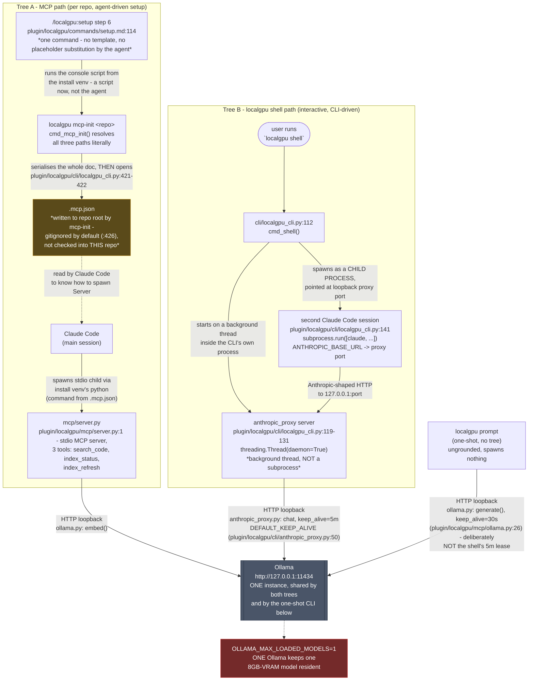
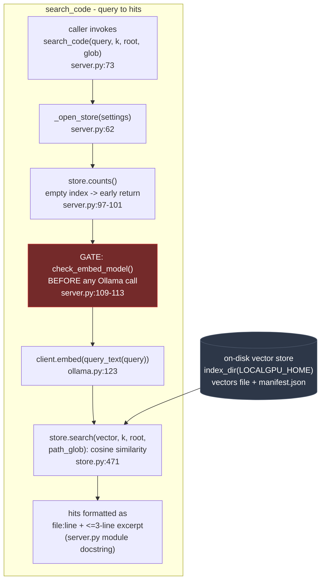
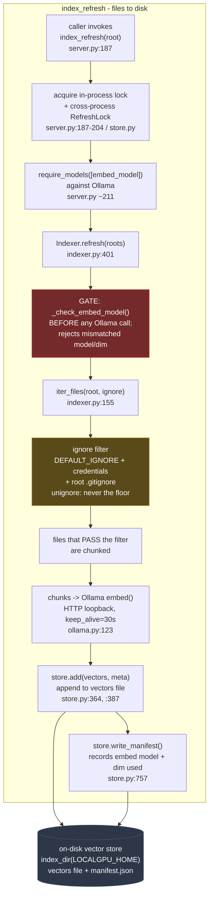
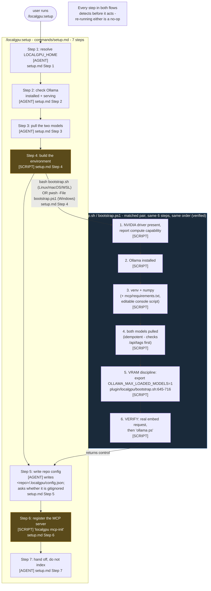

# localgpu

Uses the GPU already in your machine as a code search and Q&A sidecar. A local
Ollama instance embeds the repository into an on-disk vector index; three MCP
tools read from it and answer with `file:line` plus a three-line excerpt. Nothing
here calls a hosted API, and nothing here reviews your code.

It is a **retrieval** plugin with a chat model attached, not a local replacement
for the model you are talking to. The honest boundary is written down in
`/localgpu:crew` and repeated below, because the tempting thing to do with a local
model is exactly the thing that breaks a review gate.

It has two halves. The MCP tools put local retrieval inside the session you are
already in. The `localgpu` command puts a **separate** session on the local chat
model, through a proxy that translates the Anthropic Messages API into Ollama's
`/api/chat`. The second half never touches the first, and neither one edits crew's
config.

## Install

```bash
claude plugin install localgpu@useful-claude-add-ons
```

Then, once per repository:

```
/localgpu:setup     # venv, models, config, MCP registration
/localgpu:index     # first build of the index
```

`localgpu` registers **no hooks**. Nothing starts running when you enable it —
the commands run when you type them, and the MCP server spawns only in
repositories where `/localgpu:setup` wrote a `.mcp.json` entry and you approved it
via `/mcp`.

## Requirements

| Thing | Why |
|---|---|
| [Ollama](https://ollama.com) on `127.0.0.1:11434` | Serves both models. Install it yourself; it registers a background service |
| ~5 GB of disk for models | `nomic-embed-text` (~270 MB) plus `qwen2.5-coder:7b-instruct-q4_K_M` (~4.7 GB) |
| A GPU with ~6 GB free VRAM | Runs on CPU, slowly. See the VRAM section |
| Python 3.10+ | `/localgpu:setup` builds an isolated venv; nothing installs into your system Python |

Windows, Linux, macOS and WSL. Under WSL, keep the repo on the Linux filesystem —
indexing a `/mnt/c` path is roughly an order of magnitude slower, and that shows up
as "this repo is big" rather than as a configuration problem.

## Commands

| Command | Does |
|---|---|
| `/localgpu:setup` | Detects Ollama, pulls the models, builds the venv, writes `.localgpu/config.json`, registers the MCP server |
| `/localgpu:doctor` | Seven checks across Ollama, models, the venv and the `localgpu` CLI in it, config provenance, index freshness, MCP registration, VRAM settings |
| `/localgpu:index` | Builds or refreshes the index. `--full` rebuilds; incremental is the default |
| `/localgpu:search` | Semantic search, `file:line` plus a three-line excerpt |
| `/localgpu:ask` | Puts a question to the local chat model, grounded in retrieved excerpts |
| `/localgpu:crew` | What crew work a local 7B can and cannot take over — and what this plugin refuses to do about it |

Two more are shell commands rather than slash commands, because they start a
process of their own:

| Command | Does |
|---|---|
| `localgpu shell` | A separate Claude Code session on the local chat model |
| `localgpu proxy` | The translating proxy in the foreground, for debugging it or for a non-Claude client |

The bundled `localgpu` skill is the reference behind all six slash commands and
both shell ones. It fires on its own when a conversation is about Ollama, local
models, or searching this repo by meaning, so the commands are an entry point
rather than the only path in.

## The MCP tools

Exactly three, registered per repository:

| Tool | Signature |
|---|---|
| `search_code` | `search_code(query, k=10, root=None, path_glob=None)` |
| `index_status` | `index_status()` |
| `index_refresh` | `index_refresh(root=None)` |

`search_code` returns a location and **at most three lines** of context, never a
file. That is deliberate and it is the whole economics of the plugin: a location
plus enough text to judge it costs a few hundred tokens, and you then `Read` only
the range you decided you needed. A tool that returned files would spend more
context than it saved. `crew:explorer` follows the same rule for the same reason.

Embedding search finds *ideas*. An exact symbol, a magic string or an error code is
a `Grep` job and always will be — `search_code` is for when you do not know what
the code calls the thing you are looking for.

## The `localgpu` command

The other half of the plugin is a console script, installed into
`$LOCALGPU_HOME/venv` by the bootstrap that `/localgpu:setup` runs.

| Command | Does |
|---|---|
| `localgpu shell [args for claude]` | Starts the proxy on a loopback port, then launches a **separate** `claude` process with `ANTHROPIC_BASE_URL` pointed at it. Everything after the flags is passed straight through to `claude` |
| `localgpu proxy` | Runs the same proxy in the foreground and prints the URL. For debugging it, or for pointing something other than Claude Code at the local model |

| Flag | `shell` | `proxy` | Does |
|---|---|---|---|
| `--model` | yes | yes | Overrides the configured `chat_model` for this run only. Nothing is written |
| `--port` | yes, default a free port | yes, default `8817` | Where the proxy listens |
| `--host` | — | yes, default `127.0.0.1` | Bind address |
| `--keep-alive` | yes | yes | How long Ollama holds the chat model between turns. Default `5m` — see the VRAM section |
| `--verbose` | yes | always on | Log every proxied request |

Both subcommands fail before they start anything if Ollama is not answering or the
chat model is not pulled, and `shell` also fails if `claude` is not on `PATH` —
`localgpu proxy` is the fallback for that case, since any client that speaks the
Anthropic Messages API can be pointed at the printed URL.

The bootstrap installs the script **editable** (`pip install -e`), because
`localgpu_cli.py` finds its sibling `mcp/` directory relative to its own
`__file__`; a copied install puts that `__file__` in `site-packages`, where `mcp/`
does not exist. The CLI says so by name if it ever happens.

Nothing puts the venv on your `PATH`, so a bare `localgpu` works only if you added
that directory yourself. The full paths always work:

```
"$LOCALGPU_HOME/venv/bin/localgpu" shell                        # bash
& "$env:LOCALAPPDATA\localgpu\venv\Scripts\localgpu.exe" shell  # PowerShell
```

### What the proxy carries, and what it does not

`ANTHROPIC_BASE_URL` does not mean "any OpenAI-compatible server". Claude Code
POSTs `/v1/messages` in the Anthropic Messages wire format; Ollama's
OpenAI-compatible surface is `/v1/chat/completions` with a different body, so
pointing one straight at the other 404s on every request. `cli/anthropic_proxy.py`
is the translation:

```
Claude Code --POST /v1/messages--> localgpu proxy --POST /api/chat--> Ollama
```

Crossing intact: system prompts, multi-turn text, tool definitions, tool calls,
tool results, stop sequences, temperature, and both streaming and non-streaming
replies.

Not crossing — reported rather than faked, which is the difference between a
limitation and a bug:

| Not carried | What happens instead |
|---|---|
| Images | A 7B coder model has no vision. An image block becomes a visible placeholder, so the turn still makes sense, rather than being silently dropped |
| Thinking blocks | No local model emits them, and none are synthesised |
| Prompt caching | `cache_control` is accepted and ignored; the usage numbers report zero cache hits rather than inventing them |
| Token counts | Ollama's own prompt and eval counts are passed through. They are not Anthropic's tokenizer and will not match it |

One translation in the middle is not cosmetic. The shipped
`qwen2.5-coder:7b-instruct-q4_K_M` answers a tools request by writing the call into
`content` as JSON text and leaving `tool_calls` empty; Claude Code reads that as
prose, the tool never runs, and nothing errors. The proxy promotes it to a real
`tool_use` block — and refuses to invent a tool the request did not offer. Without
that recovery the shell cannot drive a single tool, which is most of what Claude
Code does. `cli/_test/` holds the tests and the sabotage log for it.

### The catch, said on every launch

*Everything* in a `localgpu shell` session is the 7B, including any `/crew:*`
command run inside it. Your current session and crew's config are untouched, which
is the point — but a `/crew:review` run in there is a 7B review labelled exactly
like a real one, and nothing enforces the difference. Use it for exploring and
drafting. `/localgpu:crew` is where that boundary is written down.

## Where things live

| Thing | Path |
|---|---|
| Install root (`$LOCALGPU_HOME`), Windows (incl. Git Bash/MSYS) | `%LOCALAPPDATA%\localgpu` |
| Install root, real POSIX (Linux/macOS) | `~/.local/share/localgpu` |
| Python environment | `$LOCALGPU_HOME/venv` |
| `localgpu` console script | `$LOCALGPU_HOME/venv/bin/localgpu`, or `$LOCALGPU_HOME\venv\Scripts\localgpu.exe` |
| Index | `$LOCALGPU_HOME/index/{vectors.f16,meta.sqlite,manifest.json}` |
| Repo config | `<repo>/.localgpu/config.json` |
| Machine config | `$LOCALGPU_HOME/config.json` |

The index is per **machine**, not per repo — one `vectors.f16` holds every root the
config lists, and `meta.sqlite` separates them. That is why `search_code` takes a
`root` argument, and why you want to pass it once a second project is indexed.

The index is not in the repository, and should not be. Whether `.localgpu/` itself
is committed is a decision `/localgpu:setup` asks you to make once, rather than
letting it drift.

## Configuration

`<repo>/.localgpu/config.json` wins, falling back to `$LOCALGPU_HOME/config.json`
**per key** — a repo config setting only `roots` still inherits the machine's model
choices.

```json
{
  "roots": ["."],
  "ignore": [".git", "node_modules", "venv", ".venv", "dist", "build", "__pycache__"],
  "embed_model": "nomic-embed-text",
  "chat_model": "qwen2.5-coder:7b-instruct-q4_K_M",
  "ollama_url": "http://127.0.0.1:11434"
}
```

Every key is a path, a model name, or a loopback URL. There is nothing here to
authenticate to, so nothing here is a secret.

`ignore` is the exception to "the repo wins": it is the **union** of the built-in
defaults and every layer's entries, so a repo config can add exclusions and cannot
remove them. If you need `dist/` indexed, that is a change to the shipped defaults,
not to your config file.

**Changing `embed_model` invalidates the index.** Vectors from two embedding models
are not comparable, and nothing in the file format stops you mixing them — search
just quietly gets worse. `/localgpu:index --full` is the only fix, and it is on you
to run it: `manifest.json` records the vector width (`dim`), not the model's name,
so a replacement of a different width is refused at open time with an error that
names the fix, and a replacement of the same width is caught by nothing.

## VRAM on an 8 GB card

The design target is 8 GB **with a display attached**, so the desktop and browser
are already holding a slice. The 4.7 GB chat model and the embed model both fit
individually; they do not fit alongside a long index run.

```bash
OLLAMA_MAX_LOADED_MODELS=1
OLLAMA_KEEP_ALIVE=30s        # or send "keep_alive": "30s" per request
```

`OLLAMA_MAX_LOADED_MODELS=1` alone is not enough: Ollama still holds the last model
for five minutes by default, which is long enough for the next command to fight it
for memory. Both settings, or neither works.

When this is wrong the symptom is not an error. It is an index run that slows by an
order of magnitude partway through, or `cuda malloc` in the `ollama serve` log, or
the display driver resetting. `curl -s http://127.0.0.1:11434/api/ps` settles it —
it names every resident model and its size.

### Two keep-alives, and why they differ

Both halves of the plugin send `keep_alive` explicitly on every request rather
than relying on the server's default — and they send **different values**, which
looks like an inconsistency and is not:

| Client | Default | Model it holds | Why that number |
|---|---|---|---|
| Indexing and search, `mcp/ollama.py` | `30s` | `nomic-embed-text`, ~270 MB | Thousands of sequential `/api/embed` calls, back to back. It only has to survive the gap between two calls, and reloading it costs well under a second. A longer lease buys nothing and blocks the 4.7 GB chat model |
| The chat proxy, `cli/anthropic_proxy.py` | `5m` | `qwen2.5-coder:7b-instruct-q4_K_M`, ~4.7 GB | An interactive session thinks between turns. At 30s the model unloads while you read the last answer, and every turn opens by paying the cold load again — roughly ten seconds of nothing, every time |

The asymmetry is the reload cost, not a difference of opinion about VRAM. The
model that is cheap to reload gets the short lease; the model that is expensive to
reload gets the long one, and pays for it by being the one that must not be
resident during an index run.

That is the price of the 5-minute lease, and it is worth stating plainly: with
`OLLAMA_MAX_LOADED_MODELS=1`, a chat turn keeps the embed model out for up to five
minutes afterwards. Finish the index run, then open the shell — or launch it with
`--keep-alive 30s` when you genuinely need both in the same few minutes.

## What this does not do, and will not

The local model is `qwen2.5-coder:7b-instruct-q4_K_M`: 7 billion parameters at 4-bit
quantization. It is fast, free and private, and it is several tiers below the model
you are talking to. Use it to narrow what an expensive model has to look at. Do not
use it for anything where being wrong is expensive, because its failures are fluent
and survive a skim.

**It is not a crew provider, and this plugin will not pretend otherwise.** crew's
provider set is closed — `default_config()` in
`plugin/crew/hooks/scripts/crew_config.py` hardcodes `qa.order` as
`["codex", "copilot", "claude"]` and `dev.provider` as `claude`, and `/crew:model`
validates against exactly those three names. Adding a fourth means editing crew,
which is out of scope here.

So `localgpu` will not:

- write `"provider": "localgpu"` into `.crew/config.json`, or add it to `qa.order`.
  crew fails **open** on an unknown provider name: selection falls through to the
  `qa-reviewer` fallback while the config file still claims a reviewer is
  configured. That is a silently degraded review gate;
- shadow the `codex` or `copilot` binaries on `PATH`. A wrapper by those names makes
  every crew probe pass and every review return, and the gate reports green forever
  while a 7B writes the reviews.

The supported route is a separate session: `localgpu shell` launches a second
`claude` process with `ANTHROPIC_BASE_URL` pointed at the translating proxy this
plugin ships (`cli/anthropic_proxy.py`) — Anthropic Messages API on the front,
Ollama's `/api/chat` on the back. A plain OpenAI-compatible endpoint will not do:
`ANTHROPIC_BASE_URL` makes the client POST `/v1/messages`, and Ollama's OpenAI
surface is `/v1/chat/completions` with a different body, so the two 404 at each
other. Your current session is unaffected and crew's config is untouched — but
*everything* in that session is the 7B, including any `/crew:*` command run inside
it, so use it for exploring and drafting and not for gates. Nothing enforces that.
`/localgpu:crew` is where it is written down, and "The `localgpu` command" above
has the flags and the list of what the proxy will not carry.

The useful thing a local GPU does for crew is **retrieval, not judgement**. The MCP
tools save real context on every task without touching a single gate.

## Tests

```bash
./run-tests.sh                          # POSIX, and Git Bash on Windows
pwsh -NoProfile -File run-tests.ps1     # Windows
```

One pytest invocation over both `mcp/_test` and `cli/_test`, using the
interpreter the bootstrap built. `--mcp` and `--cli` narrow a red run; they are
not the run that decides whether it is green, for the reason each suite's own
README gives. Nothing in either suite needs Ollama, a GPU, or a network.

## Troubleshooting

| Symptom | Cause | Fix |
|---|---|---|
| `connection refused` on 11434 | `ollama serve` is not running | Start it; on Windows the tray app owns it |
| `model 'x' not found` | Pulled under a different tag | Tags are exact: `qwen2.5-coder:7b` is not `...:7b-instruct-q4_K_M` |
| Index run reports 0 chunks | `ignore` matched everything, or `roots` points at nothing | `/localgpu:doctor` prints the effective config and where each key came from |
| Search misses a file you can see | Index is stale, or the file was added after the last build | `/localgpu:index` |
| Search results are all near-misses | The question was lexical | Use `Grep` |
| The MCP tools do not exist | `.mcp.json` unapproved, or a placeholder was left unexpanded | `/mcp` to approve; `/localgpu:doctor` check 6 catches the placeholder |
| Index run gets much slower partway | Two models resident | See the VRAM section |
| `localgpu: command not found` | The venv is not on `PATH`, and nothing here puts it there | Run it by full path, or add `$LOCALGPU_HOME/venv/bin` (`...\venv\Scripts`) to `PATH` yourself |
| `localgpu: cannot find <plugin>/mcp` | Installed non-editable, so `localgpu_cli.py` sits in `site-packages` with no sibling `mcp/` | `"$LOCALGPU_HOME/venv/bin/python" -m pip install -e <plugin>/localgpu`, or re-run the bootstrap |
| `localgpu shell` says `claude` is not on `PATH` | Claude Code itself is missing from that shell | Install it, or use `localgpu proxy` and point your own client at the printed URL |
| Every request 404s from a client you pointed at Ollama | `/v1/messages` against Ollama's `/v1/chat/completions` | That is what `localgpu proxy` exists for; point the client at the proxy, not at Ollama |
| Tool calls come back as prose | The 7B writes them as JSON text | Expected from the model, and the proxy recovers it — so this is a symptom of bypassing the proxy, not of using it |
| A review from inside `localgpu shell` looks like any other | It is a 7B review with a normal label | Nothing enforces this. Do not run gate commands in that session |

When in doubt, `/localgpu:doctor`. It reports every layer including the healthy
ones, and it names which file each config value actually came from — which is the
answer to most of the confusing cases above.

<!-- crew-diagrams:begin -->
<!-- generated by crew_diagrams.py embed from docs/diagrams: edit the .mmd sources there, then run it again; text between these markers is replaced -->
## Diagrams

### Architecture

localgpu: two independent process trees, plus a one-shot CLI, sharing one Ollama. Verified against source on 2026-09-06; see comments for path:line. Tree A redrawn at ac93221d: setup step 6 no longer hand-substitutes



Source: [`docs/diagrams/architecture.mmd`](../../docs/diagrams/architecture.mmd)

### Data flow search

How search_code turns a query into hits read from the on-disk vector store. How that store is filled, index_refresh, is data-flow.mmd.



Source: [`docs/diagrams/data-flow-search.mmd`](../../docs/diagrams/data-flow-search.mmd)

### Data flow

How index_refresh turns files on disk into vectors and a manifest in the on-disk store. The query side, search_code reading that store, is data-flow-search.mmd.



Source: [`docs/diagrams/data-flow.mmd`](../../docs/diagrams/data-flow.mmd)

### Process

localgpu: /localgpu:setup (7 steps, agent-driven) calls bootstrap.{sh,ps1} (6 steps, script-driven). NOTE: ground truth handed to this lane said "six-step" setup flow; commands/setup.md actually says "Seven steps, in order" (plugin/localgpu/commands/setup.md:7) - corrected here, see report.



Source: [`docs/diagrams/process.mmd`](../../docs/diagrams/process.mmd)
<!-- crew-diagrams:end -->
