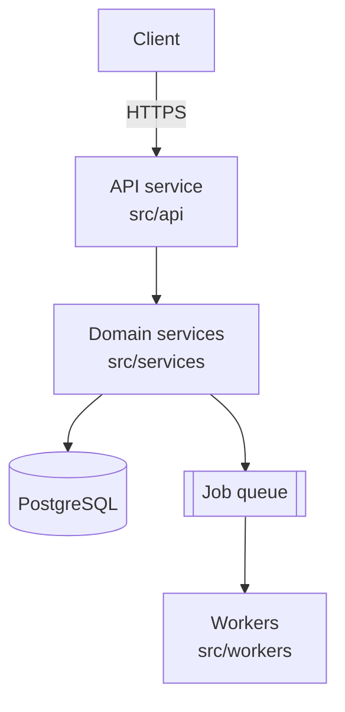

# Artifact templates

Contents:
1. [CLAUDE.md](#1-claudemd)
2. [Root README.md](#2-root-readmemd)
3. [Per-directory README.md](#3-per-directory-readmemd)
4. [docs/API.md](#4-docsapimd)
5. [docs/ARCHITECTURE.md](#5-docsarchitecturemd)
6. [TODO.md](#6-todomd)
7. [SECURITY.md](#7-securitymd)
8. [CHANGELOG.md](#8-changelogmd)
9. [docs/HANDOFF.md](#9-docshandoffmd)
10. [Managed block conventions](#10-managed-block-conventions)

These are shapes, not straitjackets. Drop sections that do not apply to the repo rather
than filling them with "N/A" — a document full of empty headings trains people to stop
reading it. Match the existing house style if the repo has one.

---

## 1. CLAUDE.md

Goes at repo root. Aim for 40–120 lines. It is instructions, not description.

```markdown
# CLAUDE.md

Guidance for Claude Code when working in this repository.

## What this is
[Two sentences. What the app does and what stack it is.]

## Commands
| Task | Command |
|---|---|
| Install | `...` |
| Run locally | `...` |
| Test | `...` |
| Test a single file | `...` |
| Lint / format | `...` |
| Build | `...` |
| Migrate DB | `...` |

Only list commands verified to exist in package.json / Makefile / pyproject.toml / justfile.

## Layout
[5–15 lines. One line per top-level directory: what it holds and when you'd touch it.]

## Conventions
- [Things not obvious from reading a single file: naming, error handling, where new
  routes/models/tests go, import style, what is generated vs hand-written.]

## Gotchas
- [The traps. Services that must run first, tests that need a fixture, files that are
  generated and will be overwritten, the module everything imports that must not gain
  new dependencies, the migration that must be run before the test suite passes.]

## Out of bounds
- [Generated/vendored paths not to edit by hand; anything requiring human sign-off.]
```

The Gotchas section is the highest-value part. If you learned something the hard way
during this session, it belongs there.

---

## 2. Root README.md

Written for a human who has never seen the repo. Time-to-first-successful-run is the
metric to optimize.

```markdown
# <Project name>

<One-sentence description. What it does, for whom.>

<Optional: badges, only if CI/coverage actually exist.>

## Overview
<2–4 paragraphs: the problem, the approach, the shape of the system. Link to
docs/ARCHITECTURE.md for depth.>

## Requirements
<Language versions, services, accounts, OS constraints. Be exact: "Python 3.11+",
not "recent Python".>

## Quickstart
```bash
<clone / install / configure / run — verified commands only>
```
<What success looks like: "server on http://localhost:3000, GET /health returns 200".>

## Configuration
| Variable | Required | Default | Description |
|---|---|---|---|
<Env vars and config keys. Names and purposes only. Never values.>

## Usage
<The two or three things a user most commonly does, with real commands or requests.>

## Project layout
<Table or list of top-level directories, each linking to its own README.>

## Testing
<How to run the suite, how to run one test, what CI checks.>

## Documentation
- [Architecture](docs/ARCHITECTURE.md)
- [API reference](docs/API.md)
- [Security](SECURITY.md)
- [Changelog](CHANGELOG.md)
- [Handoff notes](docs/HANDOFF.md)
- [TODO](TODO.md)

## License
<Only what the LICENSE file actually says. If absent, say it is absent.>
```

---

## 3. Per-directory README.md

Short — 15–50 lines. The purpose is orientation: someone landed here from a stack trace
or a grep and needs to know where they are.

```markdown
# <directory name>

<One or two sentences: the responsibility of this directory.>

## Contents
| File | Purpose |
|---|---|
| `foo.py` | <one line> |
| `bar/` | <one line, links to bar/README.md> |

## How it fits
<How this directory is called and what it calls. Name the actual modules.
"Invoked by `api/routes.py`; reads from `db/models.py`; emits events consumed by
`workers/`.">

## Notes
<Only if there is something worth knowing: invariants, why an odd design choice exists,
what breaks if you change the interface, generated files.>
```

Skip directories that are: vendored (`node_modules`, `vendor`, `.venv`), build output
(`dist`, `build`, `target`, `__pycache__`), fully generated (protobuf output, migrations),
or trivially self-evident with fewer than three files. Do not put a README in `.git`.

---

## 4. docs/API.md

Covers the application's public surfaces. Include whichever apply: HTTP endpoints, CLI
commands, exported library functions, GraphQL operations, message/queue events, webhooks,
scheduled jobs.

```markdown
# API Reference

<Base URL, versioning scheme, auth mechanism in one paragraph. Note generation date and
the commit it reflects.>

## Authentication
<Scheme, where the credential goes, how it is validated, and the code that does it.>

## Conventions
<Content types, pagination, error envelope, status codes, rate limits — if they exist.>

## Endpoints

### `POST /api/v1/widgets`
Creates a widget.
`src/api/widgets.py:48`

**Auth:** required (bearer token)

**Request body**
| Field | Type | Required | Description |
|---|---|---|---|
| `name` | string | yes | Display name, max 120 chars |

**Responses**
| Status | Body | When |
|---|---|---|
| 201 | `Widget` | Created |
| 422 | `Error` | Validation failed |

**Example**
```bash
curl -X POST "$BASE_URL/api/v1/widgets" \
  -H "Authorization: Bearer $TOKEN" \
  -H "Content-Type: application/json" \
  -d '{"name":"example"}'
```

## Functions
<For libraries, or internal modules worth documenting. Group by module.>

### `parse_config(path: str, *, strict: bool = False) -> Config`
`src/config.py:12`
<What it does, what it raises, side effects, and a caller example.>

## Events / Jobs
| Name | Trigger | Payload | Handler |
|---|---|---|---|

## Data models
<Only the shapes referenced above. Link to schema files rather than duplicating them.>
```

Rules: signatures copied exactly from source, never paraphrased. Every entry carries a
`file:line`. Mark deprecated items explicitly. If the project already generates reference
docs (OpenAPI, Sphinx, TypeDoc, godoc), link to that instead of hand-maintaining a
duplicate that will rot — and say where the generator config lives.

---

## 5. docs/ARCHITECTURE.md

```markdown
# Architecture

## Purpose and scope
<What the system does and what it deliberately does not do.>

## Context
<Who/what talks to this system: users, upstream callers, third-party services, databases.
A Mermaid C4-context-ish diagram is good here.>

## Components
| Component | Responsibility | Location | Key dependencies |
|---|---|---|---|

<Then a paragraph per component for anything non-obvious.>

## Diagram

<Keep Mermaid simple: flowchart, sequenceDiagram, or erDiagram. Verify it parses.>

## Key flows
<2–4 numbered walkthroughs of the important paths — a request, a job, a login — naming
the real modules at each step. This is the section people actually read.>

## Data
<Stores, main entities and relationships, migration approach, retention.>

## Cross-cutting concerns
<Configuration, logging, error handling, auth, caching, feature flags, observability —
whichever exist, with pointers to where they are implemented.>

## Deployment
<Environments, build artifacts, how it ships, infra-as-code location, CI/CD.>

## Design decisions
| Decision | Rationale | Trade-off | Date/source |
|---|---|---|---|
<Only decisions with evidence: an ADR, a commit message, a code comment, or the user
telling you. Do not reverse-engineer motives you cannot support.>

## Known limitations
<Scaling limits, single points of failure, tech debt with real consequences. Cross-link
to TODO.md and SECURITY.md rather than duplicating.>
```

---

## 6. TODO.md

Every item needs a source, otherwise the list becomes wishes.

```markdown
# TODO

Last updated: YYYY-MM-DD (commit `abc1234`)

## Now
- [ ] **<Short imperative title>** — <why it matters, one line>
  Source: `src/foo.py:88` (`# TODO: ...`) · Effort: S/M/L

## Next
- [ ] ...

## Later
- [ ] ...

## Open questions
- <Things needing a human decision, with who or what would resolve them.>

## Done
- [x] <item> — completed YYYY-MM-DD
```

Sources to sweep: `TODO`/`FIXME`/`HACK`/`XXX` comments (`repo_survey.py` collects these),
failing or skipped tests, unimplemented stubs and `NotImplementedError`, empty exception
handlers, deprecation warnings in dependencies, gaps you found while writing the other
docs, and anything the user mentioned in conversation. Prioritize by consequence, not by
ease. Never invent work to pad the list.

---

## 7. SECURITY.md

```markdown
# Security

## Reporting a vulnerability
<Contact and expected response time. If unknown, write a placeholder and flag it to the
user rather than inventing an address.>

## Supported versions
| Version | Supported |
|---|---|

## Trust boundaries
<Where untrusted input enters, what crosses each boundary, what is trusted. A short list
beats prose here.>

## Authentication and authorization
<Mechanisms, where enforced (`file:line`), what is intentionally public.>

## Secrets and configuration
<How secrets are supplied and loaded, what must never be committed, where the ignore rules
are, rotation process if any. Names only — never values.>

## Data handling
<What sensitive data exists, where it is stored, encryption at rest/in transit, logging
policy for sensitive fields, retention and deletion.>

## Dependencies
<Manifest and lockfile locations, update policy, scanning in CI if present.>

## Findings
| ID | Severity | Area | Description | Suggested fix | Status |
|---|---|---|---|---|---|
| S-1 | High | `routes/admin.py:31` | No authorization check on admin routes | Add the existing `require_admin` dependency | Open |

<Describe the weakness and the fix. Do not write exploitation steps. Anything looking
seriously exploitable goes to the user in conversation first.>

## Out of scope
<What this document does not cover — e.g. infrastructure hardening owned by another team.>
```

If you found a committed live credential: do not put it in this file. Tell the user
immediately, record it as a finding referencing the file and line, and recommend rotation
plus history scrubbing.

---

## 8. CHANGELOG.md

[Keep a Changelog](https://keepachangelog.com/en/1.1.0/) format, semantic versioning.

```markdown
# Changelog

All notable changes to this project are documented here.
Format: [Keep a Changelog](https://keepachangelog.com/en/1.1.0/).
Versioning: [Semantic Versioning](https://semver.org/spec/v2.0.0.html).

## [Unreleased]
### Added
### Changed
### Deprecated
### Removed
### Fixed
### Security

## [1.2.0] - 2026-03-14
### Added
- Bulk widget import from CSV.
...

[Unreleased]: https://github.com/org/repo/compare/v1.2.0...HEAD
[1.2.0]: https://github.com/org/repo/compare/v1.1.0...v1.2.0
```

Entries are user-facing, past tense, one line, no commit hashes in the body. Omit empty
category headings in released sections. Never edit a released section — corrections go in
`[Unreleased]`. Mark breaking changes explicitly with `**BREAKING:**`.

---

## 9. docs/HANDOFF.md

The document someone reads at 9am on their first day owning this. Write it for a competent
stranger, not for yourself in a week.

```markdown
# Handoff Notes

**As of:** YYYY-MM-DD · **Branch:** `main` · **Commit:** `abc1234`
**Prepared by:** <name or "Claude session">

## TL;DR
<Three to five bullets: where the project stands and the single most important next thing.>

## Current state
<What works today, what is half-built, what is stubbed. Be blunt about the half-built
parts — that is the whole point of this document.>

## In flight
| Item | Status | Where | Next step |
|---|---|---|---|
<Open branches, draft PRs, uncommitted work, experiments left in place.>

## Recent changes
<What changed in this session or since the last handoff, and why. Link commits.>

## How to get running
<The shortest verified path from clone to running, including credentials/access the new
owner must obtain and from whom.>

## Environment and access
<Accounts, secrets sources, deploy permissions, dashboards, on-call, who to ask.
Names and locations only.>

## Gotchas
<Everything that cost time to learn. The flaky test, the service that must start first,
the undocumented required header, the config that differs in staging.>

## Decisions and rationale
<Choices made recently and why, so the next person does not relitigate or unknowingly
undo them.>

## Open questions and risks
<What is unresolved, what could bite, what you would look at first.>

## Next steps
1. <Ordered, concrete, each doable in a sitting.>

## Key contacts and references
<People, channels, dashboards, related repos, external docs.>
```

When refreshing, move the previous "Recent changes" content into a `## History` section at
the bottom rather than deleting it — the trail of what happened when is often the most
valuable part of the file after a few months.

---

## 10. Managed block conventions

```markdown
<!-- repo-docs:begin id=<stable-id> hash=<sha256-first-8-of-content> -->
generated content
<!-- repo-docs:end id=<stable-id> -->
```

- `id` is stable across runs so blocks can be matched and replaced: `overview`,
  `layout`, `api-endpoints`, `dir-contents`, `changelog-unreleased`, and so on.
- `hash` is over the generated content only, excluding the marker lines. Recompute on write.
- On update: locate by `id`, compare the current content's hash to the recorded one. Equal
  means untouched — safe to replace. Different means a human edited it — preserve their
  version and append yours beneath a `> Note: generated update, prior text preserved above`
  line, then report it.
- Record every block's `id` and `hash` in `docs/.repo-docs.json`:

```json
{
  "version": 1,
  "last_run": "2026-07-30T14:02:11Z",
  "commit": "abc1234",
  "artifacts": {
    "README.md": {"blocks": {"overview": "a1b2c3d4", "layout": "e5f6a7b8"}},
    "docs/API.md": {"blocks": {"api-endpoints": "99aabbcc"}}
  },
  "skipped": ["node_modules", "dist"],
  "notes": ["per-dir READMEs limited to depth 2 at user request"]
}
```
